# 目录

[TOC]

[cppreference.com](https://zh.cppreference.com/w/首页)

[Light-City/CPlusPlusThings: C++那些事 (github.com)](https://github.com/Light-City/CPlusPlusThings/tree/master)

一些有用的：

[【转】stringstream(sstream)常用用法介绍_stringstream常用函数-CSDN博客](https://blog.csdn.net/weixin_44338712/article/details/108052691)

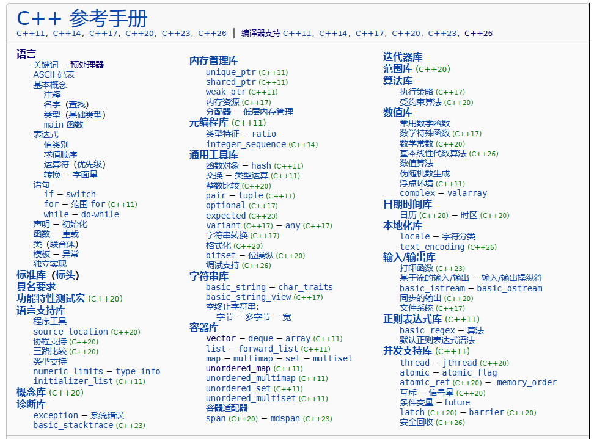


# 0. 基本数据类型

查资料：

[变量 - OI Wiki (oi-wiki.org)](https://oi-wiki.org/lang/var/)

[int、long、long int、long long、uint64_t字节长度-CSDN博客](https://blog.csdn.net/u012351051/article/details/122031100)


**基本类型：**

- 整数：int
- 布尔：bool
- 字符：char
- 浮点：float，double
- 无类型：void
- 空指针：NULL（C），nullptr（C++11）

还有一些关键字**修饰符**，例如signed（有符号位），unsigned（无符号位），long（长），long long（长长）

除此之外还有一些**复合类型**。

C++11还提供**定宽整数**，例如：

- intN_t：宽度 恰为 N 位的有符号整数类型，如 int32_t

- int_fastN_t：宽度 至少 有 N 位的 最快的 有符号整数类型，如 int_fast32_t

- int_leastN_t：宽度 至少 有 N 位的 最小的 有符号整数类型，如 int_least32_t

- 无符号版本只需在有符号版本前加一个字母 u 即可，如 uint32_t，uint_least8_t

**宏变量**：实现了对应类型的情况下，C++ 标准规定必须实现表示对应类型的最大值、最小值、位宽的宏常量，格式为将类型名末尾的 `_t` 去掉后转大写并添加后缀：

- `_MAX` 表示最大值，如 `INT32_MAX` 即为 `int32_t` 的最大值。
- `_MIN` 表示最小值，如 `INT32_MIN` 即为 `int32_t` 的最小值。


### 区别

**int**：

- **定义**: `int` 是一种**有符号整数**类型，可以表示正数、负数和零。是 C 和 C++ 中最常用的基本数据类型之一。
- **用途**: `int` 可用于任何需要整数的地方，包括计数、索引、循环等。
- **范围**: `int` 的范围也与平台相关。标准规定 `int` 至少为16位，但在现代计算机上，通常是32位有符号整数。
- **有符号**: `int` 是有符号类型，可以表示正数、负数和零。用于通用的整数运算，可以表示负数。

- `int` 的范围也取决于平台和编译器，但与架构（即上面的系统）无关，但通常是32位有符号整数。


**size_t**：

- **定义**: `size_t` 是一种**无符号整数**类型，只能表示非负整数。通常定义在 `<stddef.h>` 或 `<stdio.h>` 中。
- **用途**: `size_t` 通常用于表示内存大小、数组索引和其他需要非负整数的地方。它是由 C 和 C++ 标准库函数（如 `sizeof` 运算符）返回的类型。
- **范围**: `size_t` 是平台相关的，其范围取决于编译器和平台的位数， 通常与指针的大小相同。例如，在32位系统上，`size_t` 通常是32位无符号整数，而在64位系统上，它通常是64位无符号整数。（在32位系统上为32位，在64位系统上为64位）
- **无符号**: 由于 `size_t` 是无符号类型，它只能表示非负整数。
- 主要用于表示大小和数组索引，因为这些场景通常不需要负数，并且用无符号类型可以表示更大的正整数范围。


使用 size_t 而不是 int，是因为使用size_t可能会提高代码的可移植性、有效性或者可读性。（适配多种架构）


**uint32_t**：

- **定义**: `uint32_t` 是一种**固定宽度的无符号整数**类型，定义在 `<stdint.h>` 中。
- **用途**: `uint32_t` 用于需要精确32位宽度的整数运算。这在网络协议、文件格式、硬件接口等需要特定位宽的场景中特别有用。
- **平台无关**: `uint32_t` 总是32位宽，无论平台或编译器如何。这确保了跨平台的一致性。


uint 和 int 的区别

以32位整型数据举例子：`uint32_t` 和 `int32_t` 是 C/C++ 语言中固定大小整数类型的表示方式，它们之间的区别主要在于其表示的数据范围和符号性质。

- **无符号 vs 有符号**：`uint32_t` 只能存储非负整数，表示范围为 0 到 2^32 - 1；而 `int32_t` 可以存储正整数、负整数和零，表示范围为 -2^31 到 2^31 - 1。。
- **数值范围**：`uint32_t` 的数值范围比 `int32_t` 大，因为 `uint32_t` 不需要用一位来表示符号，可以使用全部的 32 位来表示数值，而 `int32_t` 中的一位用于表示正负号。


### 注：

1. C++区分数据类型首先是为了编程方便，因为不同数据类型在内存占用、表示方式、操作规则和数值范围等方面都有不同。
2. 不同的数据类型能够帮助编译器进行更好的优化和错误检查，也能够反映变量的用途和含义。
3. 在C语言中，`char` 虽然底层上是一个整型，但语义上通常表示字符数据。
4. 此外，枚举类型（`enum`）也是一种特殊的整数类型，每个枚举值对应一个整数，但它有独立的语义和用途。

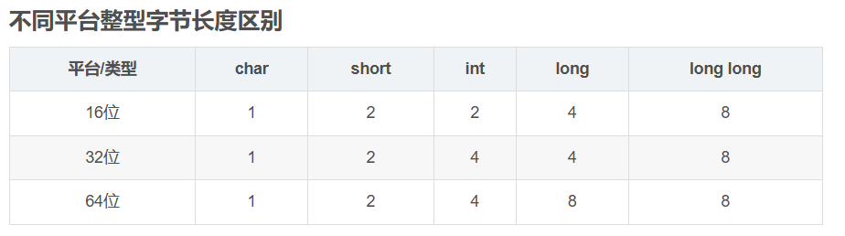

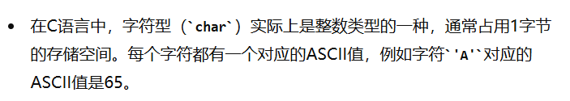

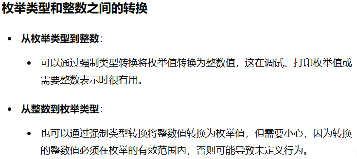


## 快速判断数据类型

在C++中，可以使用C++标准库中的头文件 `<cctype>` 提供的一系列函数来快速判断字符的类型。

`std::isalpha(int c)`：判断字符是否是字母（包括大写和小写）。

`std::isdigit(int c)`：判断字符是否是数字。

`std::isalnum(int c)`：判断字符是否是字母或数字。

`std::islower(int c)`：判断字符是否是小写字母。

`std::isupper(int c)`：判断字符是否是大写字母。

`std::isspace(int c)`：判断字符是否是空白字符（如空格、制表符等）。

`std::ispunct(int c)`：判断字符是否是标点符号。

`std::isxdigit(int c)`：判断字符是否是十六进制数字（0-9, A-F, a-f）。


注意：

函数中的 `isalpha(c)` 仅检查字母字符。如果字符是大写字母，它会转换为0到25的范围。

在进行字母和16进制转换的时候，输入字符串中的字符 'A' 需要转换为其十六进制值 10（0xA）。（A-F对应10-15，a-f也对应10-15）。

示例代码如下：

```c++
int char2int(char c) {
    int result = -1;
    if(isdigit(c)) result = c - '0';
    if(isalpha(c)) {
        if(isupper(c)) return c - 'A' + 10;
        if(islower(c)) return c - 'a' + 10;
    }

    return result;
}
```


## 不同类型互换

int 与 vector

我以前的方法：

```c++
// 分离数字的各个数位
while(m > 0) {
    vec.push_back(m % 10);
    m /= 10;
}
再把vec翻转一下
```

int 与 string

下面是一些常见的转换方式和相应的函数或方法：

**整数转换为字符串**

1. **使用 `std::to_string` 函数：**

   ```cpp
   int num = 123;
   std::string str = std::to_string(num);
   ```

   这会将整数 `123` 转换为字符串 `"123"`。

2. **使用流操作符 `stringstream`：**

   ```cpp
   #include <sstream>
   #include <string>
   
   int num = 456;
   std::stringstream ss;
   ss << num;
   std::string str = ss.str();
   ```

   这种方法利用了流操作符 `<<` 将整数转换为字符串。

**字符串转换为整数**

1. **使用 `std::stoi` 函数：**

   ```cpp
   std::string str = "789";
   int num = std::stoi(str);
   ```

   这会将字符串 `"789"` 转换为整数 `789`。

2. **使用 `std::stringstream`：**

   ```cpp
   #include <sstream>
   #include <string>
   
   std::string str = "101";
   std::stringstream ss(str);
   int num;
   ss >> num;
   ```

   这种方法利用了流操作符 `>>` 将字符串转换为整数。

vector 与 string

1. **字符串转换为字符数组（C风格字符串）：**

   ```cpp
   #include <cstring>
   #include <string>
   
   std::string str = "hello";
   char char_array[6]; // Make sure it's large enough to hold the string and null terminator
   
   strcpy(char_array, str.c_str());
   ```

   这里使用了 `strcpy` 函数将 `std::string` 转换为 C 风格的字符数组。

2. **字符数组（C风格字符串）转换为 `std::string`：**

   ```cpp
   #include <cstring>
   #include <string>
   
   char char_array[] = "world";
   std::string str(char_array);
   ```

   在这里，直接将字符数组初始化为 `std::string` 对象，利用 `std::string` 的构造函数实现转换。

这些方法在日常的C++编程中非常有用，能够方便地进行不同类型之间的转换操作。

string 与 int

[https://blog.csdn.net/albertsh/article/details/113765130]

 (atoi)


# 1. cpp编译程序的四个阶段

[C语言文件编译过程_c语言编译的四个过程-CSDN博客](https://blog.csdn.net/m0_49927539/article/details/131482320?utm_medium=distribute.pc_relevant.none-task-blog-2~default~baidujs_baidulandingword~default-1-131482320-blog-122114554.235^v43^pc_blog_bottom_relevance_base2&spm=1001.2101.3001.4242.2&utm_relevant_index=4)


[一个程序从编译到运行的全过程 - 知乎 (zhihu.com)](https://zhuanlan.zhihu.com/p/547559531)

在程序的编译和运行过程中，整个流程通常分为四个主要阶段：预处理、编译、汇编和链接。`.obj` 文件（在 Windows 上，或者 `.o` 文件在 Unix-like 系统上）是其中某一个阶段的产物。具体来说，它是在汇编阶段产生的。下面是每个阶段的详细解释：

### 1. 预处理（Preprocessing）

- **过程：**
  - 处理所有的预处理指令（如 `#include`、`#define`、`#ifdef` 等）。
  - 生成一个纯文本的扩展源代码文件。
  
- **产物：**
  - 扩展的源代码文件（通常没有保存为单独的文件，而是直接传递给编译阶段）。

### 2. 编译（Compilation）

- **过程：**
  - 将扩展的源代码文件转换为中间的汇编代码。
  - 主要工作是将高级语言代码（如 C/C++）转换为汇编语言。

- **产物：**
  - 汇编代码文件（扩展名通常为 `.s` 或 `.asm`，但大多数情况下不会显式保存）。

### 3. 汇编（Assembly）

- **过程：**
  - 将汇编代码转换为目标代码（机器代码），这就是 `.obj` 或 `.o` 文件。
  - 这些目标文件是二进制格式，包含了机器指令以及数据。

- **产物：**
  - 目标文件（扩展名为 `.obj` 在 Windows 上，`.o` 在 Unix-like 系统上）。

### 4. 链接（Linking）

- **过程：**
  - 将一个或多个目标文件（`.obj` 或 `.o`）以及库文件链接在一起，生成可执行文件。
  - 解决外部符号和地址的引用，最终生成一个完整的可执行程序。

- **产物：**
  - 可执行文件（扩展名为 `.exe` 在 Windows 上，通常没有扩展名或者为 `.out` 在 Unix-like 系统上）。

### 总结

`.obj` 文件是在 **汇编阶段** 产生的，它是将汇编代码转换为机器代码的产物。汇编器（Assembler）将编译器生成的汇编代码转换为目标文件，这些目标文件在最终的链接阶段会被合并成一个可执行文件。


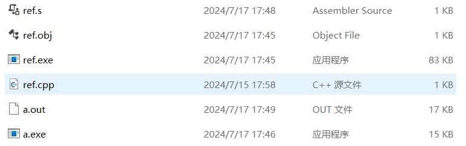


# C++ 语言特性


## 面向对象


当然可以！下面是C++中关于封装、继承和多态的示例代码。每个示例都会详细说明相应的概念如何在C++中实现。

**1. 封装（Encapsulation）**

在C++中，封装通过使用访问修饰符（`private`、`protected`、`public`）来控制类成员的访问权限。我们通常使用`private`来隐藏类的内部数据，并通过`public`的`getter`和`setter`方法来访问或修改这些数据。

C++示例：

```cpp
#include <iostream>
#include <string>

class Person {
private:
    std::string name;
    int age;

public:
    // 设置name的setter方法
    void setName(const std::string &n) {
        name = n;
    }

    // 获取name的getter方法
    std::string getName() const {
        return name;
    }

    // 设置age的setter方法
    void setAge(int a) {
        if (a > 0) {
            age = a;
        } else {
            std::cout << "年龄不能为负数！" << std::endl;
        }
    }

    // 获取age的getter方法
    int getAge() const {
        return age;
    }
};

int main() {
    Person person;
    person.setName("John");
    person.setAge(30);

    std::cout << "Name: " << person.getName() << std::endl; // 输出: Name: John
    std::cout << "Age: " << person.getAge() << std::endl;   // 输出: Age: 30

    return 0;
}
```

**2. 继承（Inheritance）**

C++中的继承通过使用`public`、`protected`或`private`继承符号来实现，表示子类如何继承父类的属性和方法。子类可以重用父类的代码，并可以根据需要重写（覆盖）父类的方法。

C++示例：

```cpp
#include <iostream>

// 基类（父类）
class Animal {
public:
    void makeSound() const {
        std::cout << "动物发出声音" << std::endl;
    }
};

// 派生类（子类）
class Dog : public Animal {
public:
    // 重写基类的方法
    void makeSound() const {
        std::cout << "狗叫: 汪汪" << std::endl;
    }
};

int main() {
    Dog dog;
    dog.makeSound(); // 输出: 狗叫: 汪汪

    return 0;
}
```

**3. 多态（Polymorphism）**

在C++中，多态可以通过**函数重载**（编译时多态）和**虚函数**（运行时多态）实现。虚函数允许基类的指针或引用调用派生类中的重写方法。

C++示例：

- **编译时多态**（函数重载）：函数重载是 C++ 编程的一个特性，它允许我们有多个具有相同名称但不同参数列表的函数

```cpp
#include <iostream>

class MathOperation {
public:
    // 两个整数相加
    int add(int a, int b) {
        return a + b;
    }

    // 三个整数相加
    int add(int a, int b, int c) {
        return a + b + c;
    }
};

int main() {
    MathOperation math;
    std::cout << "2 + 3 = " << math.add(2, 3) << std::endl;           // 输出: 2 + 3 = 5
    std::cout << "2 + 3 + 4 = " << math.add(2, 3, 4) << std::endl;    // 输出: 2 + 3 + 4 = 9

    return 0;
}
```

- **运行时多态**（虚函数）：虚函数允许被子类重写，而纯虚函数则必须在子类中实现这个函数

```cpp
#include <iostream>

// 基类（父类）
class Animal {
public:
    // 虚函数
    virtual void makeSound() const {
        std::cout << "动物发出声音" << std::endl;
    }
};

// 派生类（子类）
class Cat : public Animal {
public:
    // 重写基类的虚函数
    void makeSound() const override {
    // override关键字并不是必须的,但为了明确意图和编译器检查，建议写上
        std::cout << "猫叫: 喵喵" << std::endl;
    }
};

int main() {
    Animal* myAnimal = new Cat();
    myAnimal->makeSound(); // 输出: 猫叫: 喵喵

    delete myAnimal;
    return 0;
}
```

总结

- **封装**：通过访问修饰符和`getter`、`setter`方法来实现数据隐藏和保护。
- **继承**：通过`public`、`protected`、`private`继承符号实现类的继承，并可以在子类中重写父类的方法。
- **多态**：通过**函数重载实现编译时多态**，通过**虚函数实现运行时多态**，使得不同对象可以有不同的行为。


注：

在C++中，`override`关键字并不是必须的，但强烈推荐使用。当你在派生类中重写基类的虚函数时，使用 `override` 关键字可以确保以下几点：

**明确意图**：使用 `override` 明确表示该函数是重写基类的虚函数，这样代码的意图更加清晰。

**编译器检查**：如果函数签名与基类中的虚函数不匹配，编译器会报错。例如，如果你不小心改变了参数类型或忘记了某个参数，编译器会提示你，这可以防止潜在的bug。

没有使用 `override`：

```cpp
#include <iostream>

class Base {
public:
    virtual void show() const {
        std::cout << "Base show" << std::endl;
    }
};

class Derived : public Base {
public:
    // 忘记正确匹配基类函数签名，导致编译器认为这是一个新函数
    void show(int x) const {
        std::cout << "Derived show with int" << std::endl;
    }
};

int main() {
    Base* b = new Derived();
    b->show();  // 输出: Base show

    delete b;
    return 0;
}
```

在上面的例子中，派生类的 `show(int x)` 函数并没有真正重写基类的 `show()` 函数。由于没有使用 `override`，编译器不会捕捉到这个错误，导致调用 `show()` 时仍然调用的是基类的版本。

使用 `override`：

```cpp
#include <iostream>

class Base {
public:
    virtual void show() const {
        std::cout << "Base show" << std::endl;
    }
};

class Derived : public Base {
public:
    // 正确使用override
    void show() const override {
        std::cout << "Derived show" << std::endl;
    }
};

int main() {
    Base* b = new Derived();
    b->show();  // 输出: Derived show

    delete b;
    return 0;
}
```

在这个例子中，`Derived` 类中的 `show()` 函数成功地覆盖了 `Base` 类中的虚函数。使用 `override` 关键字，可以防止因为函数签名错误而引发的问题。


# 基本数据结构

**容器**和**容器适配器**提供了经典数据结构（如数组、链表、栈、队列、树和哈希表）在 C++ 中的具体实现，因此在应用层面上，它们可以视为数据结构的实例。


# 2. STL（标准模板库）

[STL 容器简介 - OI Wiki (oi-wiki.org)](https://oi-wiki.org/lang/csl/container/)

STL是标准模板库，使用的是泛型编程，所有的容器都是模板类，声明容器时都是`容器名<类型名> 名字`的形式，模板参数的个数和形式都会根据具体容器而变。


## 序列式容器

vector：动态数组（扩容时msvc是1.5倍，g++是2倍）

array：静态数组

deque：双端队列

list：双向链表

forward_list：单向链表

注意：

- C++中vector和array的区别一定要弄清楚，**vector的底层实现是array**，封装后使用更友好。


## 关联式容器

set：元素集合

- [关联式容器 - OI Wiki (oi-wiki.org)](https://oi-wiki.org/lang/csl/associative-container/)

multiset：允许重复元素的集合

map：映射

multimap：允许重复键的映射

无序的关联式容器：unordered_set、unordered_multiset、unordered_map、unordered_multimap（**C++11**，均可以看做是哈希表的视线，提供快速的查找性能）

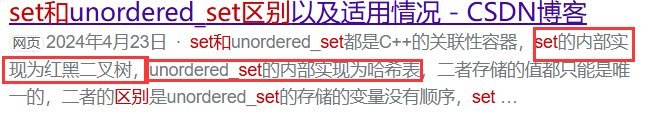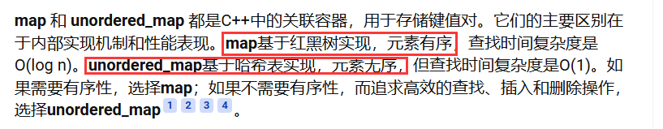


## 容器适配器

容器适配器是对基础容器进行封装，使它们模拟某些数据结构的行为。

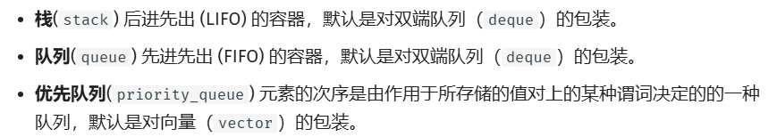

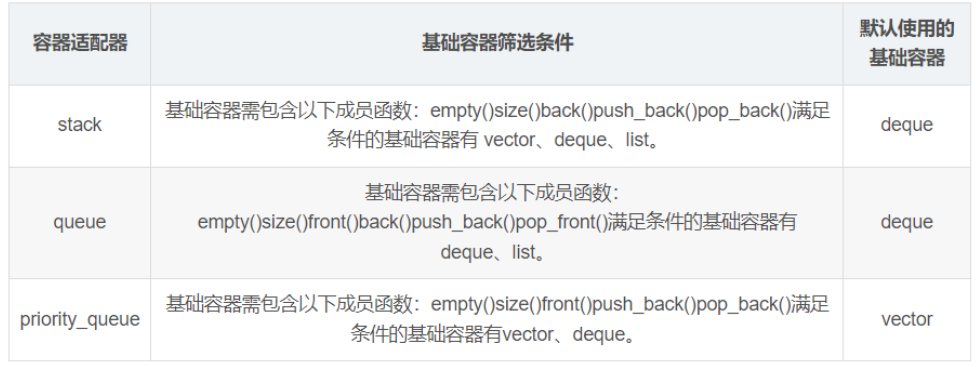

注意：

- [STL](http://c.biancheng.net/stl/) 中的容器适配器，其内部使用的基础容器并不是固定的，用户可以在满足特定条件的多个基础容器中自由选择。
- 例如：栈是**容器适配器**，底层容器使用不同的容器，导致栈内数据在内存中不一定是连续分布的

- 栈提供push 和 pop 等等接口，所有元素必须符合先进后出规则，所以栈不提供走访功能，也不提供迭代器(iterator)。 不像是set 或者map 提供迭代器iterator来遍历所有元素。

#### 用队列实现栈


## 迭代器


STL主要包括三部分内容：容器和算法，还有融合这二者的迭代器。


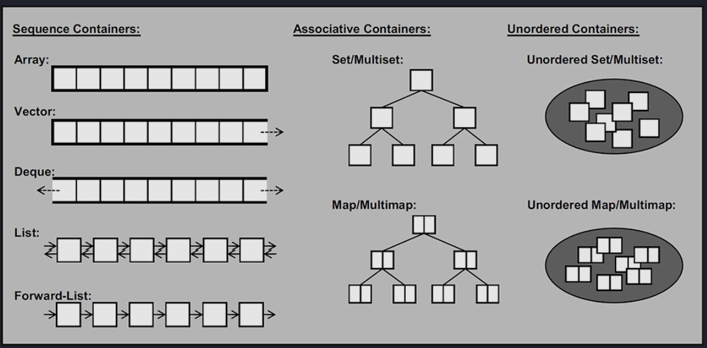

除了常见的容器，还可以看一下迭代器：[(9条消息) c++标准模板库-map的常见用法_map_林福流的博客-CSDN博客](https://blog.csdn.net/xhrlmbhfrxldll/article/details/108929766?spm=1001.2101.3001.6650.3&utm_medium=distribute.pc_relevant.none-task-blog-2~default~CTRLIST~Rate-3-108929766-blog-76375685.pc_relevant_3mothn_strategy_recovery&depth_1-utm_source=distribute.pc_relevant.none-task-blog-2~default~CTRLIST~Rate-3-108929766-blog-76375685.pc_relevant_3mothn_strategy_recovery&utm_relevant_index=4)]

迭代器是STL的精髓，我们这样描述它：迭代器提供了一种方法，使它能够按照顺序访问某个容器所含的各个元素，但无需暴露该容器的内部结构。它将容器和算法分开，好让这二者独立设计。


## 访问

1. 用迭代器访问：map<key,value>::iterator it;
   1. it->first 访问键
   2. it->second 访问值


## pair


```c++
// 自定义hash函数
struct pair_hash {
    template <class T1, class T2>
    size_t operator() (const pair<T1, T2> &p) const {
        auto hash1 = hash<T1>{}(p.first);
        auto hash2 = hash<T2>{}(p.second);
        return hash1 ^ hash2;
    }
};
```


# 特殊函数


## 内联函数

见小鹏老师视频

## 回调函数

回调函数（Callback Function）是指通过函数指针、函数对象或lambda表达式等方式，把一个函数传递给另一个函数，并在特定事件或条件发生时，由后者调用这个函数

**回调函数的核心概念**

1. **传递函数作为参数**：
   - 回调函数通常是被传递给另一个函数的参数。在C/C++中，这种传递方式通常是通过函数指针实现的。
2. **延迟执行**：
   - 回调函数通常不会立即执行，而是由接收它的函数在某些条件或事件发生时调用。
3. **灵活性**：
   - 通过使用回调函数，可以将特定的行为与通用的操作分离开，使得代码更加灵活和可复用。

**回调函数的应用场景**

- **事件处理**：在GUI编程中，用户点击按钮、输入文字等事件通常会触发回调函数。
- **异步操作**：例如网络请求完成时，通过回调函数处理返回的数据。
- **排序和查找**：标准库函数如 `qsort` 可以通过回调函数自定义比较规则。

示例：

**C语言中的回调函数示例**

下面是一个使用回调函数的简单示例。假设我们有一个数组，我们想要对这个数组进行排序，但排序的方式是可变的，比如可以按升序或降序排序。我们可以使用回调函数来定义不同的排序规则。

```
c复制代码#include <stdio.h>
#include <stdlib.h>

// 比较函数：用于升序排序
int compareAscending(const void* a, const void* b) {
    return (*(int*)a - *(int*)b);
}

// 比较函数：用于降序排序
int compareDescending(const void* a, const void* b) {
    return (*(int*)b - *(int*)a);
}

// 打印数组
void printArray(int arr[], int size) {
    for (int i = 0; i < size; i++) {
        printf("%d ", arr[i]);
    }
    printf("\n");
}

int main() {
    int arr[] = {5, 2, 9, 1, 5, 6};
    int size = sizeof(arr) / sizeof(arr[0]);

    // 使用 qsort 排序，传递回调函数定义排序规则
    qsort(arr, size, sizeof(int), compareAscending);
    printf("升序排序：");
    printArray(arr, size);

    qsort(arr, size, sizeof(int), compareDescending);
    printf("降序排序：");
    printArray(arr, size);

    return 0;
}
```

在这个例子中，`qsort` 是C标准库中的一个排序函数，它接受一个比较函数作为参数。我们定义了两个不同的比较函数 `compareAscending` 和 `compareDescending`，并将它们作为回调函数传递给 `qsort`，从而实现不同的排序方式。

**C++中的回调函数示例**

在C++中，可以通过函数指针、函数对象或lambda表达式来实现回调函数。以下是使用lambda表达式的示例：

```c++
cpp复制代码#include <iostream>
#include <vector>
#include <algorithm>

int main() {
    std::vector<int> vec = {5, 2, 9, 1, 5, 6};

    // 使用 lambda 表达式作为回调函数，进行升序排序
    std::sort(vec.begin(), vec.end(), [](int a, int b) {
        return a < b;
    });
    std::cout << "升序排序：";
    for (int n : vec) std::cout << n << " ";
    std::cout << std::endl;

    // 使用 lambda 表达式作为回调函数，进行降序排序
    std::sort(vec.begin(), vec.end(), [](int a, int b) {
        return a > b;
    });
    std::cout << "降序排序：";
    for (int n : vec) std::cout << n << " ";
    std::cout << std::endl;

    return 0;
}
```


**总结**

- **回调函数**是指将一个函数作为参数传递给另一个函数，并在适当时机调用。
- 它为代码的灵活性和可复用性提供了很大的便利，尤其在事件驱动和异步编程中。
- C和C++都有多种方式实现回调函数，常见的方法包括函数指针、函数对象和lambda表达式。

注：

**接口设计**：**并不是所有的函数都可以使用回调函数**。要使用回调函数，**函数的接口必须设计成能够接受函数指针作为参数，并且回调函数的签名必须与预期匹配**。例如，`qsort` 设计上就是为了接受回调函数来进行排序比较。

**通用设计**：回调函数通常用于那些需要高度定制行为的函数。比如排序、搜索、处理事件等。这些函数的接口通常会包含一个回调函数参数，以允许用户自定义行为。

例如：

```c++
#include <stdio.h>

// 自定义函数，接受一个回调函数处理数组元素
void processArray(int *arr, size_t size, void (*func)(int *)) {
    for (size_t i = 0; i < size; i++) {
        func(&arr[i]);  // 调用回调函数处理每个元素
    }
}

// 示例回调函数：打印元素
void printElement(int *element) {
    printf("%d ", *element);
}

// 示例回调函数：将元素加倍
void doubleElement(int *element) {
    *element *= 2;
}

int main() {
    int arr[] = {1, 2, 3, 4, 5};
    size_t size = sizeof(arr) / sizeof(arr[0]);

    printf("原始数组：");
    processArray(arr, size, printElement);
    printf("\n");

    processArray(arr, size, doubleElement);
    
    printf("处理后的数组：");
    processArray(arr, size, printElement);
    printf("\n");

    return 0;
}
```


# 6. 指针和引用

[CPlusPlusThings/basic_content/pointer_refer at master · Light-City/CPlusPlusThings (github.com)](https://github.com/Light-City/CPlusPlusThings/tree/master/basic_content/pointer_refer)


## 右值引用

[C++11中的右值引用和移动语义 - 简书 (jianshu.com)](https://www.jianshu.com/p/61ea80fcf943)

[C++11 中的左值、右值和将亡值 (qq.com)](https://mp.weixin.qq.com/s?__biz=MzkxNzQzNDM2Ng==&mid=2247493147&idx=2&sn=4bd41e67ffe3cf970bbfb76a09cb8275&source=41#wechat_redirect)


# 5. 流程控制语句

主要就是分支和循环

[分支 - OI Wiki (oi-wiki.org)](https://oi-wiki.org/lang/branch/)

[循环 - OI Wiki (oi-wiki.org)](https://oi-wiki.org/lang/loop/)

分支：

if, else, case

循环：

for, while, do while

退出：

break, continue


# 4. cin 、cin.get()  、cin.getline() 区别 

[https://www.cnblogs.com/cthon/p/9198686.html]

## 1. cin的基本用法

- 结束条件：[enter],[space],[tab]
- 处理方法：cin遇到缓冲区中的[enter],[space],[tab]会结束当前输入，并舍弃[enter],[space],[tab]，继续下一项输入，当有连续[space],[enter,[tab]会全部舍弃。

综上：cin的输入很简单，整体的看输入，遇到[enter],[space],[tab]表示当前输入结束，下一个输入从非[enter],[sapce],[tab]开始，两输入间无线多个[space][]enter[tab]都是无效的。

## 2. cin.get()基本用法

### （1）一参数

- 用法：a = cin.get()  或者  cin.get(a)
- 结束条件：输入**字符**足够后回车
- 说明：这个是**单字符**的输入，用途是输入一个字符，把它的ASCALL码存入到a中
- 处理方法：与cin不同，cin.get()在缓冲区遇到[enter]，[space]，[tab]不会作为舍弃，而是继续留在缓冲区中

测试程序：

```C++
#include<iostream>  
using namespace std;

int main()
{
	char a, b, c, d;
	a = cin.get();
	b = cin.get();
	c = cin.get();
	d = cin.get();
	cout << int(a) << ',' << int(b) << ',' << int(c) << ',' << int(d) << endl;
}//[space]的ASCLL码是32，此处输入字符取前4个
```

注：一参数的 cin.get() 当输入字符足够后回车结束输入，把回车[enter],空格[space]也看成字符，在缓冲区中遇到不舍弃。当输入过多时，取前几个。

### （2）二参数

用法：cin.get(arrayname,size)  把字符输入到arrayname中，长度不超过size

注释：arrayname必须是char[]类型，即char数组类型，不可以为string类型；size是指输入长度，即允许输入的最大长度。

处理方法：假设把数据输入到 char a[arraylength],数组长度为arraylength。cin.get(a,size)---size,arraylength不同可以分为四类：

1. 输入串长<size，输入串长>arraylength，会自动扩张arrayname大小，使能保存所有数据。
2. 类2：输入串长<size，输入串长<arraylength，把串全部输入，后面补‘\0’
3. 类3：输入串长>size，先截取size个字符，若还是大于arraylength，则输入前arraylength-1个字符，最后补充‘\0’
4. 类4：输入串长>size，先截取size个字符，若小于arraylength，则把截取串放入数组中，最后补充‘\0’


综上：当把大于数组长度的字符串放出char a[arraylength]中，系统自动扩张数组a的长度使a能放得下，但是这么做容易产生运行错误。

### （3）三参数

用法：cin.get(arrayname,size,s)  把数据输入到arrayname字符数组中，当到达长度size时结束或者遇到字符s时结束

注释：a必须是字符数组，即char a[]l类型，不可为string类型；size为最大的输入长度；s为控制，遇到s则当前输入结束缓存区里的s将被舍弃。

```C++
#include<iostream>  
using namespace std;  
  
int main()  
{  
    int i;  
    char a[10];  
    cin.get(a,10,'.');  
    cout<<a;  
}  
//输入：abc.123  输出：abc    遇到  ’.‘ 输入结束
```

## 3.cin.getline()基本用法

cin.getline()的用法和cin.get()用法大致相同，没有一参数用法，只有二参数，三参数两类

cin.gerline(arrayname,size)

cin.getline(arrayname,size,s)用法与cin.get()效果大致相同，但也有些区别


一段例子代码：

```c++
#include <vector>
#include <iostream>
#include <sstream>
int main() {
    std::vector<int> list;
    std::string input;
    
    // 读取一行输入
    std::getline(std::cin, input);
    std::stringstream ss(input);
    std::string temp;
    
    // 使用逗号分隔输入
    while (std::getline(ss, temp, ',')) {
        list.push_back(std::stoi(temp));
    }
}
```


# 5. C++函数模板和宏

使用**宏**或**模板**来定义函数能够减少重复代码，但函数需要匹配适当的签名

## 函数模板

定义函数模板：

```C++
template <typename T>
T func(T arg1, T arg2, ...)
{
    // 函数体
}
```

例子：使用函数模板实现返回两数之间的最大值

```C++
#include <iostream>

template <typename T>
T max(T a, T b) {
    return a > b ? a : b;
}

/**
 * template关键字表示接下来的代码是一个函数模板的定义
 * T是一种类型参数的通用名字
 * max即函数模板的名称。
 * 上述函数模板接受两个参数 a,b
 * 参数和函数返回值的数据类型均为 T
 * 函数体为比较大小，返回两个参数中的最大值
 * 使用函数模板时，用指定的类型替换函数模板中的模板参数即可
*/

int main() {
    int a = max(2, 1); 
    //max(2,1)为函数模板实例化，这里采用编译器自动推导T的数据类型
    double b = max<double>(5.5, 1.2);
    //这里为显式指定
    std::cout << a << std::endl << b;
    // int a = max(2.1, 1); 
    // 传入的参数类型不同，会出现编译错误，因为模板无法确定参数的通用类型。
    return 0;
}
```

1. 函数模板调用时，如果利用自动类型推导，不会发生隐式类型转换
2. 如果利用显示指定类型的方式，可以发生隐式类型转换
3. 自动类型推导，必须推导出一致的数据类型T，才可以使用


## 宏

[CPlusPlusThings/basic_content/macro at master · Light-City/CPlusPlusThings (github.com)](https://github.com/Light-City/CPlusPlusThings/tree/master/basic_content/macro)

在C++源程序中允许用一个标识符来代表一个字符文本,称为宏,标识符为宏名。

宏是由宏定义命令事先定义的。预处理时,对程序中所有后续的宏名实例(称为宏引用),预处理器都用字符文本去替换,称为宏替换或宏展开。

宏定义通常用于定义程序中的符号常量,类型别名,运算式代换和语句代换等,其命令为#define,分为不带参数的宏定义和带参数的宏定义。

**即在预编译时，将宏定义的 *宏名* 查找替换为 *字符文本*。**  

不带参的宏定义语法为：`#define  宏名  字符串`

带参数的宏定义的命令形式为： `#define 宏名(参数表) 字符文本`，例如`#define max(a,b) (((a) >(b))?(a) : (b))`

带参数的宏的引用形式为：`宏名(引用参数表)`，例如`L=max(x-y,x+y)`

- 宏定义必须写在函数之外，其作用域为宏定义命令起到源程序结束
- 一个宏的作用范围是从定义位置开始到#undef命令结束


贴一段代码作为示例：

```C++
#include <iostream>

// 定义模板函数 SelectFunc
template <typename T, typename Func>
void SelectFunc(const T& a, const T& b, T& out, Func func) {
    out = func(a, b);
}

// 定义 MaxFunc 函数对象
struct MaxFunc {
    template <typename T>
    T operator()(const T& a, const T& b) const{
        return a > b ? a : b;
    }
};

// 定义 MinFunc 函数对象
struct MinFunc {
    template <typename T>
    T operator()(const T& a, const T& b) const{
        return a < b ? a : b;
    }
};

// 宏定义生成具体函数
#define SELECT_FUNC(name, Func) \
template <typename T> \
void name(const T& a, const T& b, T& out) { \
    SelectFunc(a, b, out, Func()); \
}

// 使用宏定义生成 max 和 min 函数
SELECT_FUNC(max, MaxFunc)
SELECT_FUNC(min, MinFunc)

// 取消宏定义
#undef SELECT_FUNC

//测试
int main() {
    int a = 10, b = 20, out_max, out_min;
    max(a, b, out_max);
    min(a, b, out_min);
    std::cout << "Max: " << out_max << "\n";
    std::cout << "Min: " << out_min << "\n";
    return 0;
}
```

https://blog.csdn.net/jax_ton/article/details/130852872

http://www.tup.tsinghua.edu.cn/upload/books/yz/098776-01.pdf


# 7. 赋值类


## iota

iota函数对一个范围数据进行赋值，用于产生连续的值。


## 产生随机数

[C++产生随机数的几种方法_c++生成随机数-CSDN博客](https://blog.csdn.net/onion23/article/details/118558454)


   


# 8. C++11

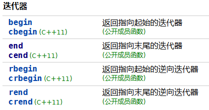


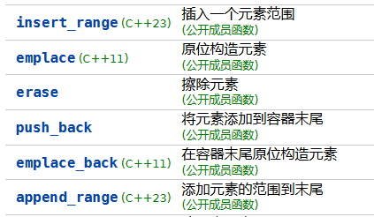


## auto 关键字


## Lambda 表达式

构造闭包，能够捕获作用域中的变量的无名函数对象[[Lambda 表达式 (C++11 起) - cppreference.com](https://zh.cppreference.com/w/cpp/language/lambda)]

[ 捕获 ] ( 形参 ) lambda说明符 约束(可选) { 函数体 }


## explicit 关键字

C++提供了关键字explicit，可以阻止不应该允许的经过转换[构造函数](https://so.csdn.net/so/search?q=构造函数&spm=1001.2101.3001.7020)进行的隐式转换的发生，声明为explicit的构造函数不能在隐式转换中使用。


## volatile 关键字

作用： 作为指令关键字，确保本条指令不会受到编译器的优化而省略，而且要求每次直接读值。

volatile关键字是一种类型修饰符，用它声明的类型变量表示可以被某些编译器未知的因素更改，比如：操作系统、硬件或者其它线程等。遇到这个关键字声明的变量，编译器对访问该变量的代码就不再进行优化，从而可以提供对特殊地址的稳定访问。


[C++11 volatile 类型-CSDN博客](https://blog.csdn.net/heshaai6843/article/details/81058724)


## override 关键字

用于指示一个成员函数是在派生类中重写基类中的虚函数。

**编译时检查**：使用`override`可以让编译器检查所重写的函数是否确实在基类中存在。如果基类中没有相应的虚函数，编译器会产生错误。这可以防止因函数签名不匹配或拼写错误而导致的潜在问题。

**代码可读性**：`override`使得代码更易于阅读和理解，表明这个函数的意图是重写基类中的虚函数，有助于维护代码。

**避免潜在错误**：使用`override`可以避免因修改基类而引入的错误。例如，如果基类中虚函数的参数类型或返回类型发生了变化，`override`会确保派生类中的重写函数不会再被视为重写。


##  constexpr

[常值 - OI Wiki (oi-wiki.org)](https://oi-wiki.org/lang/const/)

const 关键字的作用，与constexpr(常表达式)


const 是类型限定符，既可以修饰变量， 又可以修饰表达式。用于确保某个变量或对象不能被修改。

const的使用场景有很多，简单总结一下：

```c++
const int x = 10;  // 尝试修改x的值，编译器会报错，
// 这里的const表示int类型的变量x在定义后不可以被修改
// 这里直接声明x, const int x;也是一样的,因为默认初始化为0了
x = 20; // 错误，


const int* p = &x; // 指针p指向的内容即x的值不能修改，但指针p可以改变指向，例如：
int y = 20;
p = &y; // 正确
*p = 20; // 错误

int* const p = &x; // const修饰p, 表示指针p自身是个常量，即不可以改变指向，但可以改变指向的内容
*p = 20 // 正确
y = 20; p = &y; // 错误

const int* const p = &x; // p的指向和p指向的内容都不可以改变

void 
```


# 9. C++23


# 10. 重要概念


## 宏


预处理器宏和预定义宏是C/C++编程中的重要概念。

预处理器宏（Preprocessor Macros）：预处理器宏是在编译之前由**C/C++预处理器处理**的宏。它们通常用于定义常量、函数样式的代码片段以及条件编译。预处理器宏通过 `#define` 指令定义。 主要有：

- 常量宏
- 函数样式宏
- 条件编译

预定义宏（Predefined Macros）：预定义宏是由**编译器自动提供**的宏，用于获取编译相关的信息。常见的预定义宏包括文件名、行号、日期和时间等。

常见的预定义宏：

- `__FILE__`：当前文件名。
- `__LINE__`：当前行号。
- `__DATE__`：编译日期。
- `__TIME__`：编译时间。
- `__FUNCTION__`：当前函数名。


注意：宏展开没有类型检查和作用域规则，需要特别小心括号的使用。


## 一些比较有用的宏定义

[常见技巧 - OI Wiki (oi-wiki.org)](https://oi-wiki.org/contest/common-tricks/)


# 乱七八糟


## max_element

头文件：`#include <algorithm>`

用来来查询最大值所在的第一个位置。

假设 `result` 是一个标准容器（如 `std::vector<int>`），你可以使用如下代码来找到最大值的迭代器：

`auto max_iter = std::max_element(result.begin(), result.end());`

然后，如果你想要获取最大值本身，你可以解引用这个迭代器：

`int max_value = *max_iter;`


使用示例：

```c++
class Solution {
public:
    int lengthOfLIS(vector<int>& nums) {
        if(nums.empty()) return 0;

        int n = nums.size();
        vector<int> dp(n, 1);

        for(int i = 1; i < n; i++) {
            for(int j = 0; j < i; j++) {
                if(nums[i] > nums[j]) {
                    dp[i] = max(dp[i], dp[j] + 1);
                }
            }
        }
        return *max_element(dp.begin(), dp.end());
    }
};
```

- [300. 最长递增子序列 - 力扣（LeetCode）](https://leetcode.cn/problems/longest-increasing-subsequence/description/?envType=study-plan-v2&envId=top-100-liked)


# C++创建动态二维数组+memset()函数初始化

https://blog.csdn.net/CSDN131137/article/details/103016793?spm=1001.2101.3001.6650.7&utm_medium=distribute.pc_relevant.none-task-blog-2%7Edefault%7EBlogCommendFromBaidu%7ERate-7-103016793-blog-50849352.235%5Ev26%5Epc_relevant_3mothn_strategy_recovery&depth_1-utm_source=distribute.pc_relevant.none-task-blog-2%7Edefault%7EBlogCommendFromBaidu%7ERate-7-103016793-blog-50849352.235%5Ev26%5Epc_relevant_3mothn_strategy_recovery&utm_relevant_index=8


cout 可以接受任何基本类型或者C++内置类型。


# 滚动哈希 (Rolling Hash)


# **substring()的作用就是截取父字符串的某一部分** 

public String substring(int beginIndex, int endIndex)

第一个参数int为开始的索引，对应String数字中的开始位置，

第二个参数是截止的索引位置，对应String中的结束位置

1、取得的字符串长度为：endIndex - beginIndex;

2、从beginIndex开始取，到endIndex结束，从0开始数，其中不包括endIndex位置的字符


# 编译时多态（静态多态）与运行时多态


- **编译时多态（静态多态）**：也称为静态多态性或早期绑定。这种多态性在编译阶段就可以确定调用的具体函数或方法。编译器根据调用函数的名称、参数类型和个数来决定调用哪个具体的函数实现。例如，C++ 中的函数重载就是一种编译时多态性的体现。通常通过**函数重载和模板**实现，适用于在**编译时确定**调用的场景，提高了代码的灵活性和可读性。
- **运行时多态（动态多态）**：也称为动态多态性或晚期绑定。这种多态性发生在程序运行时，具体调用的函数实现是在运行时根据对象的实际类型来决定的。**运行时多态性通过虚函数和继承**来实现。在运行时多态中，通过基类的指针或引用调用虚函数，实际执行的是对象的实际类型的虚函数实现。允许在程序**运行时根据对象的实际类型动态地选择调用的函数实现**，非常适合需要根据运行时信息决定调用函数的场景，实现了面向对象编程中的多态性。


编译时多态因为在编译时已经确定了调用的具体函数，因此执行效率较高，但灵活性相对较低，无法处理某些需要在运行时决定的场景。

运行时多态虽然在运行时决定函数调用带来了一些性能开销（虚函数表查找等），但它极大地增强了代码的灵活性和可扩展性，特别是在面向对象设计中，通过继承和多态可以更容易地实现代码的复用和扩展。


# C++函数返回值

## 如何返回多个值

总的来说