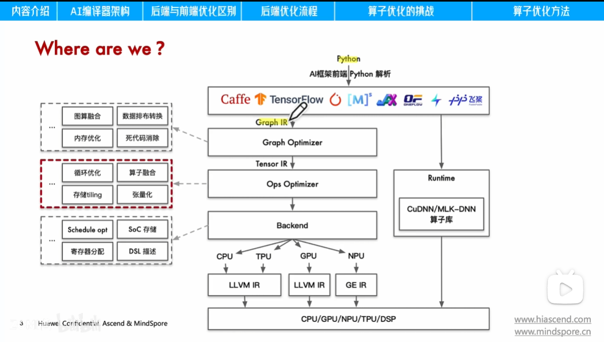
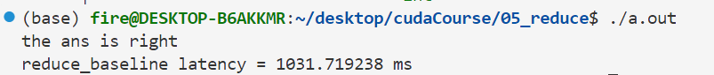
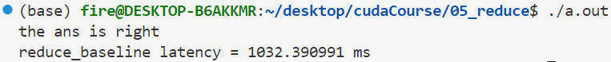
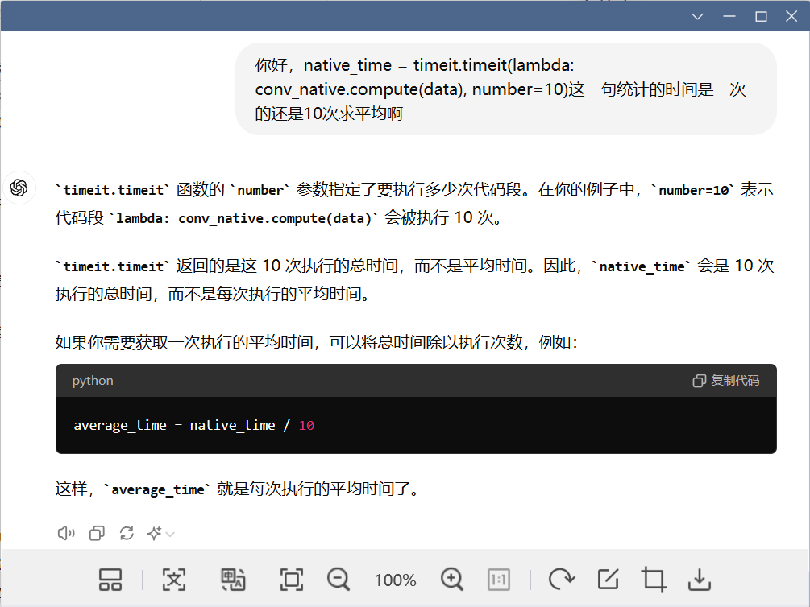
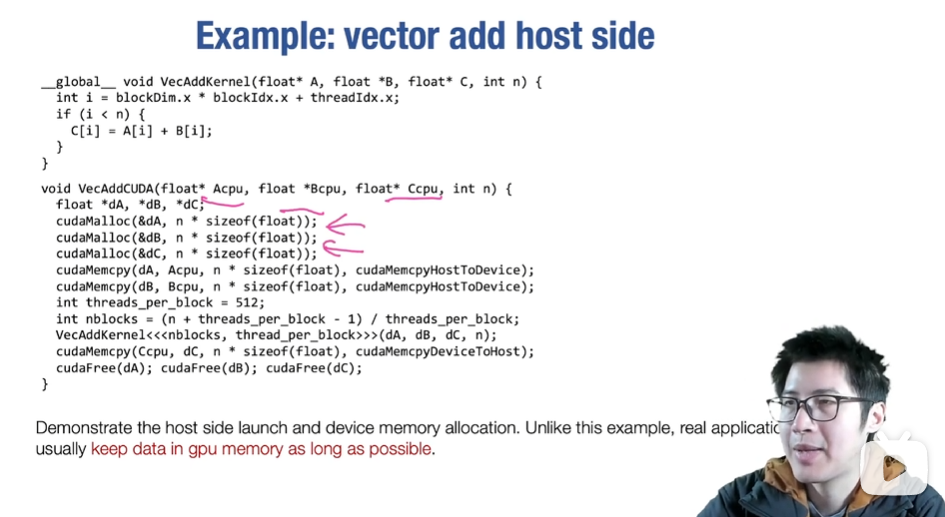
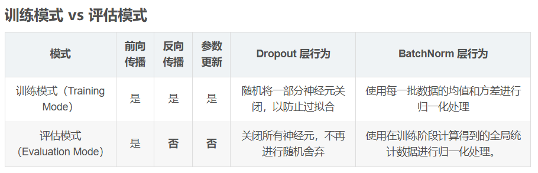

# 目录


[TOC]

# CPU 架构

查资料：

[CPU 架构大揭秘：从指令集到微架构 - 系统极客 (sysgeek.cn)](https://www.sysgeek.cn/whst-is-cpu-architecture/)

[用大白话带你理解CPU指令集_指令集通俗理解-CSDN博客](https://blog.csdn.net/zyhse/article/details/108196593)

常见的 CPU 架构包括：

- x86：由 Intel 和 AMD 共同拥有，主要用于个人电脑、服务器、游戏主机等。
- ARM：由 Arm 所有，但授权给其他公司如 Apple 和 Samsung 使用，主要用于移动设备、嵌入式系统等。
- RISC-V：一种开放标准的 CPU 架构，可用于个人电脑、服务器、嵌入式系统等。

未来 CPU 架构将呈现多个关键趋势，包括：

- 多核和并行处理：随着任务复杂性的增加，多核和并行处理将会是重要发展方向。
- 异构计算：异构计算将成为主流，通过集成不同类型的处理单元，如 CPU、GPU、AI 加速器等，以支持更广泛的应用。
- 对能效的更高要求：随着性能的提高，对能效的要求也将越来越高。


## CPU 指令集

[Linux查看CPU支持的指令集_linux 查看cpu指令集-CSDN博客](https://blog.csdn.net/qq_41565459/article/details/82991691)


CPU 指令集架构可以分为两大类，精简指令集和复杂指令集：CISC 和 RISC。CISC 指令集包含大量复杂的指令，可以执行多种操作。RISC 指令集包含较少的简单指令，但执行速度更快。


**CPU指令集是描述CPU能实现什么功能的一个集合，就是描述"CPU能使用哪些机器码"的集合**

**只有CPU指令集范围内的指令可以被成功的译码，并送往CPU流水线后端去执行**

**CPU不需要任何形式的存储介质去存储指令集，因为"译码"这个步骤就是在对指令集里规范的机器码做解码。**

**硬件上， 译码这件事需要庞大数目的逻辑门阵列来实现**


Linux查看CPU支持的指令集

```bash
gcc -march=native -Q --help=target|grep march
 
或者
cat /proc/cpuinfo
```


官网查看：

[如何知道我的英特尔处理器采用了哪种英特尔®指令集扩展技术？ (intel.cn)](https://www.intel.cn/content/www/cn/zh/support/articles/000057621/processors.html)


# 大模型整体架构

[AI大模型技术的四大核心架构演进之路（非常详细）零基础入门到精通，收藏这一篇就够了_大模型技术架构-CSDN博客](https://blog.csdn.net/Javachichi/article/details/140117170)

主要有四种：纯粹Prompt提示词法、Agent + Function Calling机制、RAG（检索增强生成）以及Fine-tuning微调技术，揭示它们的特性和应用场景。


# 模型训练

**多卡训练**：在单个服务器上使用多块GPU进行训练。

**分布式训练**：在多台服务器上进行训练，可能每台服务器有多个GPU。

**分布式集群**：是一组互联的服务器资源，可以支持分布式训练。

[通俗易懂的讲解CPU/GPU/TPU/NPU/XPU/…_gpgpu npu dpu-CSDN博客](https://blog.csdn.net/enweitech/article/details/122579953)

# AI 框架

[ZOMI酱的个人空间-ZOMI酱个人主页-哔哩哔哩视频 (bilibili.com)](https://space.bilibili.com/517221395/channel/collectiondetail?sid=760692)

基本概念


## AI框架和推理加速框架

**AI框架（AI Framework）**

AI框架主要用于**模型的开发、训练和测试**，包括从数据预处理、模型定义、训练到验证的完整流程。AI框架通常提供高层次的API和工具，帮助开发者构建和训练深度学习模型。

- **常见的AI框架**:
  - **TensorFlow**：由Google开发，支持多种机器学习任务，尤其在深度学习领域应用广泛。
  - **PyTorch**：由Facebook AI Research开发，易于使用，广泛用于研究和生产环境。
  - **MXNet**：Apache项目之一，支持多种编程语言，擅长于大规模训练。
  - **Keras**：高层次神经网络API，能够运行在TensorFlow、CNTK和Theano之上。

- **主要功能**：
  - **模型构建**：提供用于定义神经网络结构的API。
  - **模型训练**：支持梯度下降、反向传播等训练算法。
  - **模型评估**：提供各种评估指标和工具。
  - **数据处理**：通常包括数据加载、预处理等功能。

 **推理加速框架（Inference Acceleration Framework）**

推理加速框架专注于**模型的部署和推理过程的优化**，目的是提高已经训练好的模型在实际应用中的推理速度和效率。它们通过利用硬件加速、模型压缩、量化、优化计算图等方法来减少推理时间和资源消耗。

- **常见的推理加速框架**:
  - **TensorRT**：由NVIDIA开发，专为NVIDIA GPU优化，提供了模型量化、内存优化和计算图优化等功能。
  - **OpenVINO**：由Intel开发，支持Intel的CPU、GPU、FPGA，主要用于计算机视觉应用。
  - **ONNX Runtime**：由微软开发，支持多种硬件平台，特别是针对ONNX格式模型的推理。
  - **TVM**：一个深度学习编译器框架，能够为各种硬件目标优化模型。

- **主要功能**：
  - **模型优化**：包括量化、剪枝、图融合等技术，以减少模型复杂度。
  - **硬件加速**：利用GPU、FPGA、TPU等硬件设备的并行计算能力。
  - **跨平台支持**：支持在不同硬件平台上高效运行。
  - **低延迟推理**：优化推理过程，减少模型在部署时的响应时间。

**总结**

- **AI框架**：专注于模型开发和训练阶段，提供了从数据处理到模型验证的完整工具链。
- **推理加速框架**：专注于模型部署和推理阶段，目标是优化模型的执行效率，尤其是在资源受限的环境中。

两者在AI项目的生命周期中通常会结合使用：先使用AI框架进行模型开发和训练，然后使用推理加速框架进行模型的部署优化。


# 推理加速框架

https://blog.csdn.net/llptyy/article/details/138257048

部署量化

闭源：tensorRT的自动量化，

开源：cpu中的openvino等等


[Pytorch量化+部署_pytorch 中的量化方法-CSDN博客](https://blog.csdn.net/u013250861/article/details/139880728?spm=1001.2101.3001.6650.4&utm_medium=distribute.pc_relevant.none-task-blog-2~default~YuanLiJiHua~Position-4-139880728-blog-131412993.235^v43^pc_blog_bottom_relevance_base7&depth_1-utm_source=distribute.pc_relevant.none-task-blog-2~default~YuanLiJiHua~Position-4-139880728-blog-131412993.235^v43^pc_blog_bottom_relevance_base7)

[RKNN3588——YOLOv8的PT模型转RKNN模型_yolov8pose 到处 rknn-CSDN博客](https://blog.csdn.net/weixin_49824703/article/details/140180413?spm=1001.2101.3001.6650.16&utm_medium=distribute.pc_relevant.none-task-blog-2~default~baidujs_baidulandingword~Ctr-16-140180413-blog-140098361.235^v43^pc_blog_bottom_relevance_base7&depth_1-utm_source=distribute.pc_relevant.none-task-blog-2~default~baidujs_baidulandingword~Ctr-16-140180413-blog-140098361.235^v43^pc_blog_bottom_relevance_base7)

[AI框架知多少 | AidLux小课堂-CSDN博客](https://blog.csdn.net/AidLux/article/details/124836580)


**PyTorch --> ONNX --> TensorRT(NVIDIA)，适用于Nvidia GPU上的部署**

**PyTorch--> ONNX --> OpenVINO(Intel)，适用于Intel CPU上部署**

**移动端部署：NCNN，TNN，MNN**

**嵌入式平台：**TensorFlow Lite， **NVIDIA TensorRT**，**OpenVINO**，Arm NN，**ONNX Runtime**，**TVM**，EdgeTPU（标黑的比较常用）

大模型推理加速：FasterTransformer（NVIDIA），TurboTransformers（Tecent）

**手机端：**

NCNN是腾讯优图实验室于2017年推出的首个开源项目，它是为手机端优化的神经网络前向计算框架，也是业界首个为移动端优化的开源神经网络推断库。它支持caffe、mxnet等模型的转换。


TNN作为腾讯优图实验室新一代的深度学习推理框架（2020年6月提出），支持移动端、服务端、桌面端，适配CPU、GPU、NPU等底层硬件，能实现人工智能在多个平台的轻量部署落地。


MNN（全称Mobile Neural Network）是一个阿里巴巴开源用于端侧加载深度神经网络模型进行推理预测的轻量级深度神经网络推理引擎，主要用于解决目前端智能在底层硬件、操作系统碎片化和机器学习框架复杂化这两个方面的痛点。（2020年8月提出，2022年7月更新2.0版本）


# AI编译器


**前端优化：**针对计算图进行优化


**后端优化：**针对具体的单个算子进行优化



# CUDA相关

[CUDA——SM中warp调度器调度机制&&访存延迟隐藏_cuda 隐藏延迟-CSDN博客](https://blog.csdn.net/weixin_44444450/article/details/118058031)

[CUDA01 - 硬件架构、warp调度、指令流水线和cuda并发流 - 猫猫子 - 博客园 (cnblogs.com)](https://www.cnblogs.com/maomaozi/p/15939275.html)

[CUDA：低占用率下的更好性能（一）_计算隐藏延迟-CSDN博客](https://blog.csdn.net/u013443737/article/details/23422925?utm_medium=distribute.pc_relevant.none-task-blog-2~default~baidujs_baidulandingword~default-5-23422925-blog-118058031.235^v43^pc_blog_bottom_relevance_base2&spm=1001.2101.3001.4242.4&utm_relevant_index=8)


CUDA 并行编程：[CUDA 编程手册系列第一章：CUDA 简介 - NVIDIA 技术博客](https://developer.nvidia.com/zh-cn/blog/cuda-intro-cn/)

其核心是三个关键抽象——线程组的层次结构、共享内存和屏障同步。


# GPU 架构

共享内存是每个线程块（block）中的线程可以共同访问的内存。它的访问速度比全局内存（global memory）快得多，非常适合线程间的数据共享和协作。


共享内存适用于需要高效并行处理的数据交换操作，尤其是在需要不同线程之间快速共享数据的情况下。例如，在一个线程块中，有多个线程都需要访问一些共同的数据，这些数据存储在共享内存中可以减少访问全局内存的开销，进而提升程序的执行效率。


# CUDA编程

详细的内容去看CUDA官方给的教程，这里只记录一下常用的。


首先要明确，GPU并不能独立运行，因此GPU是作为CPU的协处理器来进行并行计算的。这是一种异构计算架构：主机端（host）为CPU，设备端（device）为GPU，通过**PCIe总线**连接在一起。

典型的CUDA程序的执行流程如下：

1. 分配host内存，并进行数据初始化；
2. 分配device内存，并从host将数据拷贝到device上；
3. 调用CUDA的核函数在device上完成指定的运算；
4. 将device上的运算结果拷贝到host上，并验证结果；
5. 释放device和host上分配的内存。

了解设备的属性对于优化 CUDA 程序非常重要，因为它们决定了可以在设备上配置和运行内核的方式。例如，知道每个块的最大线程数（1024）和共享内存大小（48 KB），可以帮助你合理地划分任务和管理资源。

在 CUDA 程序中设置设备和获取设备属性，可以参考以下完整的示例代码：

```c++
#include <cuda_runtime.h>
#include <cstdio>

int main() {
    cudaSetDevice(0);  // 设置设备为0

    cudaDeviceProp deviceProp;
    cudaGetDeviceProperties(&deviceProp, 0);  // 获取设备属性

    // 打印设备属性
    printf("Device Name: %s\n", deviceProp.name);
    printf("Total Global Memory: %zu bytes\n", deviceProp.totalGlobalMem);
    printf("Shared Memory per Block: %zu bytes\n", deviceProp.sharedMemPerBlock);
    printf("Registers per Block: %d\n", deviceProp.regsPerBlock);
    printf("Warp Size: %d\n", deviceProp.warpSize);
    printf("Max Threads per Block: %d\n", deviceProp.maxThreadsPerBlock);
    printf("Max Grid Size: [%d, %d, %d]\n", deviceProp.maxGridSize[0], deviceProp.maxGridSize[1], deviceProp.maxGridSize[2]);
    printf("Max Threads Dim: [%d, %d, %d]\n", deviceProp.maxThreadsDim[0], deviceProp.maxThreadsDim[1], deviceProp.maxThreadsDim[2]);
    
    return 0;

}
```






加上之后时间变长了。。。


## 内核函数和设备函数

https://zhuanlan.zhihu.com/p/691777081

### 内核函数

内核函数使用`__global__`关键字进行声明，表示该函数可以在GPU上并行执行。内核函数由主机（Host）代码调用，并在GPU的线程中执行。内核函数不能返回值，只能通过参数传递数据。

内核函数使用特殊的语法进行调用，称为“配置执行参数（execution configuration）”。配置执行参数包含网格和块的维度：`<<<gridDim, blockDim>>>`

- gridDim: 网格的维度，即有多少个块（block）
- blockDim: 每个块中的线程数。
- 例如，`myKernel<<<1, 256>>>` 启动了一个块，每个块有 256 个线程。

内核函数通常用于执行大规模的并行计算任务，例如图像处理、物理模拟和机器学习算法等。它们可以访问共享内存（Shared Memory）和全局内存（Global Memory），并可以通过线程索引（Thread Index）来访问特定的数据。

在内核函数中，每个线程都有唯一的线程索引，这些索引帮助线程确定自己应该处理的数据。CUDA 提供了一些内置变量来获取线程和块的索引：

- `threadIdx`: 线程在块内的索引。
- `blockIdx`: 块在网格中的索引。
- `blockDim`: 每个块中的线程数。
- `gridDim`: 网格中的块数。

使用这些索引可以计算全局线程索引：`int idx = blockIdx.x * blockDim.x + threadIdx.x;`，其中x表示在x方向上（第一维度），通常有 x、y、z 三个方向，每个方向有不同个块。

### 设备函数

设备函数是另一种在CUDA编程中使用的函数类型，它们也是在GPU设备上执行的函数。与内核函数不同，设备函数使用`__device__`关键字进行声明，表示该函数只能在GPU设备上执行，并且只能被其他设备函数或内核函数调用。


## 关于CUDA编程接口（API）

具体去查 NVIDIA 技术文档，这里列一点常用的。


## 常用的CUDA变量


### **cudaEvent_t**


### dim3


## 常用的CUDA限定词

限定词（Reserved words）指的是被编程语言预留**用于特定目的的关键字或标识符**。


```c++
__devide__
    
__constant__
    
__shared__
//一般用了共享内存就要 __syncthreads

extern __shared__
```


### \_\_shared\_\_

`__shared__`：这是CUDA中的一个关键字，用于声明变量存储在共享内存（shared memory）中。

这种声明方式声明的内存为**静态共享内存**（Static Shared Memory），静态共享内存是指在编译期就确定了大小的共享内存。它的**大小在编译时由编译器分配**，程序运行时不再更改。

相比之下，动态共享内存（Dynamic Shared Memory）的大小是在运行时确定的，而不是编译时。

在 CUDA 中，动态共享内存的大小通常在核函数调用时通过第三个参数指定，如 `myKernel<<<gridSize, blockSize, sharedMemSize>>>` 中的 `sharedMemSize`。

```c++
__global__ void myKernel(float *data) {
    extern __shared__ float smem[]; // 动态共享内存
    // 核函数内容
    
    // 涉及到对shared memory的读写最好都加上__syncthreads
    __syncthreads();
}
```


## 常用的CUDA函数


### cudaDeviceSynchronize()

作用：

- **同步操作**：它会阻塞主机（CPU）的执行，直到设备（GPU）上所有的之前发起的任务（如内核执行、内存拷贝等）都完成。

- **错误检测**：由于它会等待所有的 GPU 操作完成，它还可以用来检测之前的操作是否有错误发生。如果在执行 GPU 操作时发生了错误，`cudaDeviceSynchronize()` 会返回一个相应的错误代码。

- 示例代码：

  ```c++
  #include <cuda_runtime.h>
  #include <iostream>
  
  __global__ void simpleKernel() {
      printf("Hello from GPU!\n");
  }
  
  int main() {
      // 启动 GPU 内核
      simpleKernel<<<1, 1>>>();
      
      // 同步设备和主机
      cudaError_t err = cudaDeviceSynchronize();
      
      if (err != cudaSuccess) {
          std::cerr << "CUDA error: " << cudaGetErrorString(err) << std::endl;
          return -1;
      }
  
      std::cout << "GPU kernel execution complete and synchronized." << std::endl;
      
      return 0;
  }
  ```


### cudaMalloc()


### cudaMemcpy()


### cudaFree()


### **cudaGetLastError**()

```c++
cudaError_t e = cudaGetLastError();
```

返回最后一个CUDA运行时API调用的错误代码。如果没有错误发生，它返回 `cudaSuccess`。


### cudaGetErrorString()

```c++
printf("CUDA Error %s:%d: %s\n", __FILE__, __LINE__, cudaGetErrorString(e));
```

- `__FILE__` 和 `__LINE__` 是预处理器宏，分别表示当前文件名和行号。这样可以知道错误发生在哪个文件和哪一行。

- `cudaGetErrorString(e)` 将错误代码转换为人类可读的错误信息字符串。


### **cudaEventCreate**()


### **cudaEventRecord**()


### **cudaEventElapsedTime()**


### cudaMemcpyHostToDevice


## CUDA错误检查

用于错误检查的便利宏，专门用于检测CUDA API调用之后是否发生错误，并在发生错误时打印相关信息并退出程序。

```bash
// 错误检查宏
#define cudaCheckError() {                                      \
    cudaError_t e = cudaGetLastError();                         \
    if (e != cudaSuccess) {                                     \
        printf("CUDA Error %s:%d: %s\n", __FILE__, __LINE__,    \
                cudaGetErrorString(e));                         \
        exit(EXIT_FAILURE);                                     \
    }                                                           \
}
```

- `exit(EXIT_FAILURE)` 终止程序执行，并返回失败状态。`EXIT_FAILURE` 是标准库常量，表示程序以失败状态退出。


## 分析性能

在 CUDA 编程中，`cudaEvent_t` 是用于测量 GPU 代码执行时间的事件对象。通过记录事件（event）来测量内核函数的执行时间，可以帮助开发者评估和优化 CUDA 程序的性能。

以下是一个完整的示例代码，展示了如何使用 `cudaEvent_t` 记录并测量 CUDA 内核函数的执行时间。

```c++
#include <cuda_runtime.h>
#include <cstdio>

// 内核函数示例
__global__ void reduce_baseline(int *d_a, int *d_out, int size) {
    int idx = blockIdx.x * blockDim.x + threadIdx.x;
    if (idx < size) {
        // 简单的示例操作，例如复制数据
        d_out[idx] = d_a[idx];
    }
}

int main() {
    int size = 1024;
    int dataSize = size * sizeof(int);

    // 分配主机内存
    int *h_a = (int *)malloc(dataSize);
    int *h_out = (int *)malloc(dataSize);

    // 初始化主机数据
    for (int i = 0; i < size; ++i) {
        h_a[i] = i;
    }

    // 分配设备内存
    int *d_a, *d_out;
    cudaMalloc(&d_a, dataSize);
    cudaMalloc(&d_out, dataSize);

    // 将数据从主机复制到设备
    cudaMemcpy(d_a, h_a, dataSize, cudaMemcpyHostToDevice);

    // 定义网格和块的大小
    int blockSize = 256;
    int gridSize = (size + blockSize - 1) / blockSize;
    dim3 Grid(gridSize);
    dim3 Block(blockSize);

    // 创建事件对象
    cudaEvent_t start, stop;
    cudaEventCreate(&start);
    cudaEventCreate(&stop);

    // 记录起始事件
    cudaEventRecord(start);

    // 启动内核函数
    reduce_baseline<<<Grid, Block>>>(d_a, d_out, size);

    // 记录结束事件
    cudaEventRecord(stop);
    cudaEventSynchronize(stop);

    // 计算执行时间
    float milliseconds = 0;
    cudaEventElapsedTime(&milliseconds, start, stop);

    // 输出执行时间
    printf("Kernel execution time: %f milliseconds\n", milliseconds);

    // 将结果从设备复制回主机
    cudaMemcpy(h_out, d_out, dataSize, cudaMemcpyDeviceToHost);

    // 验证结果
    bool success = true;
    for (int i = 0; i < size; ++i) {
        if (h_out[i] != h_a[i]) {
            success = false;
            printf("Error at index %d: %d != %d\n", i, h_out[i], h_a[i]);
            break;
        }
    }

    if (success) {
        printf("Result is correct.\n");
    }

    // 释放内存
    free(h_a);
    free(h_out);
    cudaFree(d_a);
    cudaFree(d_out);

    // 销毁事件对象
    cudaEventDestroy(start);
    cudaEventDestroy(stop);

    return 0;
}

```


c中的：

```c
clock_t s, e;
s = clock();
vec_add_cpu(hx, hy, hz_cpu_res, N);
e = clock();
double milliseconds_cpu = ((double) (e - s)) / CLOCKS_PER_SEC;
```


python 中的：

```python
import timeit

```




## python


1. 实现将从python调用的基本函数
2. 以及实际执行计算的相应cuda内核

基本流程如下：


使用pybind11对函数进行封装，然后用cmake编译产生python可以调用的.so动态库

Torch 使用CUDA 算子 主要分为三个步骤：

- 先编写CUDA算子和对应的调用函数。
- 然后编写torch cpp函数建立PyTorch和CUDA之间的联系，用pybind11封装。
- 最后用PyTorch的cpp扩展库进行编译和调用。




一个例子：

```c++
/**
 * 计算当前线程的唯一索引
 * blockIdx.x 表示当前线程所在的线程块（block）的索引，
 * blockDim.x 表示线程块的大小（每个线程块中包含的线程数量），
 * threadIdx.x 表示当前线程在线程块中的索引。
 * 通过这个计算，可以确保每个线程都在处理不同的元素。
*/
__global__ void EwiseMulKernel(const scalar_t* a, const scalar_t* b, scalar_t* out, size_t size) {
  size_t gid = blockIdx.x * blockDim.x + threadIdx.x;
  if(gid < size) out[gid] = a[gid] * b[gid];
}

void EwiseMul(const CudaArray& a, const CudaArray& b, CudaArray* out) {
  CudaDims dim = CudaOneDim(out->size);
  EwiseMulKernel<<<dim.grid, dim.block>>>(a.ptr, b.ptr, out->ptr, out->size);
}

//函数签名
m.def("scalar_mul", ScalarMul);
```


# 关于model




# inline 内联函数

```
inline void AlignedDot(const float* __restrict__ a,
                       const float* __restrict__ b,
                       float* __restrict__ out) {}
             	
                
```

`__restrict__`：这是一个C99标准中的关键字，告诉编译器该指针所指向的内存区域不会与其他指针重叠。这有助于编译器进行优化，例如向量化操作。

`__builtin_assume_aligned`：这个内置函数告诉编译器指针指向的数据是对齐的，这有助于生成更高效的向量化代码。


# 10. CPP内联汇编

https://cloud.tencent.com/developer/article/1434865

https://cloud.tencent.com/developer/article/2160871  

[GNU C 9条扩展语法_gnu::const-CSDN博客](https://blog.csdn.net/shangzh/article/details/39398577)

[Windows下使用Visual Studio自带的MSVC，命令行编译C/C++程序_msvc 编译c++ 命令-CSDN博客](https://blog.csdn.net/zhangpeterx/article/details/86602394)

**GNU 扩展语法**：GNU 扩展语法（GNU Extended Asm）是 GCC 提供的一种功能强大的内联汇编语法，使得在 C 和 C++ 代码中可以嵌入汇编指令，并且能够灵活地指定操作数、约束和被破坏的寄存器。它的目的是在嵌入汇编代码时，提供更好的可读性和控制。

在 MSVC 中，内联汇编使用的是 Microsoft 特有的汇编语法。能够直接将汇编代码嵌入到 C 或 C++ 代码中。与 GCC 的内联汇编相比，MSVC 的内联汇编更直观，因为它直接在代码中写汇编指令，不需要特别的语法来指定输入输出操作数。顺便说一下怎么在命令行使用MSVC编译器来编译程序：使用VStudio自带的Prompt，输入命令即可。


在 C++ 代码中嵌入汇编指令，从而在需要的地方优化性能或实现特定功能。

在使用内联汇编时，应该使用 `__asm__ ( );` （GCC）或 `__asm { }` （MSVC）关键字


Windows下VS套件自带的编译程序有以下这些：

- cl.exe：编译程序
- link.exe：链接程序
- lib.exe：加载lib库的程序
- nmake.exe：用Makefile进行构建、编译的工具


## Hello World

先来问个好。

```c++
#include <stdio.h>
#include <Windows.h>

const char *s1="Hello, World\n",*s2="pause";
int main(){
 printf(s1);
 system(s2);
 
 return 0;
}
打印结果
Hello, World
```

内联汇编的版本：

```C++
#include <stdio.h>
#include<Windows.h>

const char* s1 = "Hello, World\n", * s2 = "pause";
int main() {
	__asm {
		mov eax, dword ptr[s1]
		push eax
		call dword ptr[printf]
		add esp, 4
		mov eax, dword ptr[s2]
		push eax
		call dword ptr[system]
		add esp, 4
	}

		return 0;
}
打印结果
Hello, World
```


**例子2**

```c++
/**
 * MSVC编译
 */
#include <stdio.h>

int main()
{
	int a = 0, b = 0, c = 0;

	__asm
	{
		/*push eax s*/
		mov a, 1000
		mov b, 200
		mov c, 1
		/*mov eax, a
		add eax, b
		sub eax, c
		mov a, eax */
		/*pop eax*/
	}
	/*__asm mov a,1000*/

	printf("a=%d\nb=%d\nc=%d\n", a, b, c);

	return 0;
}
打印结果
a=1000
b=200
c=1
```


```c++
/**
 * GCC编译
 */
#include <cstdio>

int main() {
    int a = 0, b = 0, c = 0;
    __asm__ (
        "movl $100, %0\n"
        "movl $200, %1\n"
        "movl $1, %2\n"
        : "=r" (a), "=r" (b), "=r" (c) // output operands
        :                              // input operands
        :                              // clobbered registers
    );

    printf("a = %d\nb = %d\nc = %d\n", a, b, c);
    return 0;
}
打印结果
a = 100
b = 200
c = 1
```

- 使用 `__asm__` 关键字来编写内联汇编代码。

- 使用 `movl` 指令将立即数赋值给寄存器，并通过约束将其映射到 C++ 变量 `a`, `b`, `c`。


在 C++ 代码中嵌入汇编主要有两种方法：

1. **使用 GCC 的内联汇编**（GNU Assembler，GAS）。
2. **使用 MSVC 的内联汇编**（Microsoft Inline Assembler）。

## 使用 GCC 的内联汇编

GCC 提供了一个强大的内联汇编功能，可以在 C++ 代码中嵌入汇编指令。基本的语法如下：

```cpp
__asm__ (
    "assembly code"
    : output operands
    : input operands
    : clobbered registers
);
```


下面是一个简单的示例，展示如何使用 GCC 内联汇编将两个整数相加：

```cpp
#include <cstdio>

int main() {
    int a = 10, b = 20, sum;

    __asm__ (
        "addl %%ebx, %%eax;"  // 汇编指令：将 ebx 加到 eax 上
        : "=a" (sum)          // 输出操作数：将 eax 的值赋给 sum
        : "a" (a), "b" (b)    // 输入操作数：将 a 和 b 分别赋给 eax 和 ebx
        :                     // 无 clobbered 寄存器
    );

    printf("Sum = %d\n", sum);
    return 0;
}
打印结果
Sum = 30
```

- **汇编指令部分**：在双引号内编写标准的汇编指令。
- **输出操作数**：用 `:` 分隔输出操作数部分，格式为 `"=r"(变量)`，其中 `r` 表示寄存器操作，`变量`表示输出变量。
- **输入操作数**：用 `:` 分隔输入操作数部分，格式为 `"r"(变量)`，`变量`表示输入变量。
- **被破坏的寄存器**：用 `:` 分隔寄存器部分，列出在汇编代码中会被修改的所有寄存器。


## 使用 MSVC 的内联汇编

MSVC 允许在 `__asm` 块中嵌入汇编代码。与 GCC 的内联汇编相比，MSVC 的内联汇编更直观，因为它直接在代码中写汇编指令，不需要特别的语法来指定输入输出操作数。

下面是一个使用 MSVC 的内联汇编示例，将两个整数相加：

```cpp
#include <cstdio>

int main() {
    int a = 10, b = 20, sum;

    __asm {
        mov eax, a    // 将 a 赋值给 eax
        add eax, b    // 将 b 加到 eax 上
        mov sum, eax  // 将 eax 的值赋给 sum
    }

    printf("Sum = %d\n", sum);
    return 0;
}
打印结果
Sum = 30
```

- **汇编指令**：直接在 `__asm` 块中写标准的汇编指令。
- **变量与寄存器的交互**：直接使用变量名，编译器会处理变量与寄存器之间的交互。


## 主要区别

1. **语法形式**：
   - **MSVC**：直接使用 `__asm` 关键字嵌入汇编代码，语法简单直接。
   - **GCC**：使用 `__asm__` 关键字，并且需要指定输入输出操作数和被破坏的寄存器。
2. **可读性和复杂性**：
   - **MSVC**：由于语法更接近于直接的汇编代码，通常更易读和编写。
   - **GCC**：需要掌握更多的约束和语法规则，但提供了更大的灵活性。
3. **平台和编译器支持**：
   - **MSVC**：仅支持 Windows 平台。
   - **GCC**：跨平台支持，包括 Windows、Linux 和 macOS。


# 11. GNU 扩展语法

GNU 扩展语法（GNU Extended Asm）是 GCC 提供的一种功能强大的内联汇编语法，使得在 C 和 C++ 代码中可以嵌入汇编指令，并且能够灵活地指定操作数、约束和被破坏的寄存器。它的目的是在嵌入汇编代码时，提供更好的可读性和控制。

## 基本语法

GNU 扩展语法的基本形式如下：

```c++
cpp复制代码__asm__ (
    "assembly code"
    : output operands      // 输出操作数
    : input operands       // 输入操作数
    : clobbered registers  // 被破坏的寄存器
);
```

## 各部分详细解释

### 汇编代码

汇编代码部分是实际的汇编指令，可以包括多行指令，并且可以使用 `\n\t` 来分隔不同的指令。

### 输出操作数

输出操作数部分指定了汇编代码的输出，格式为：

```c++
mathematica
复制代码
: "constraint" (C variable)
```

- `"constraint"`：描述变量如何映射到寄存器或内存。例如，`=r` 表示任意寄存器。
- `C variable`：对应的 C 语言变量。

### 输入操作数

输入操作数部分指定了汇编代码的输入，格式为：

```c++
mathematica
复制代码
: "constraint" (C variable)
```

- `"constraint"`：描述变量如何映射到寄存器或内存。例如，`r` 表示任意寄存器。
- `C variable`：对应的 C 语言变量。

### 被破坏的寄存器

被破坏的寄存器部分列出了在汇编代码执行过程中可能被修改的寄存器。例如：

```c++
arduino
复制代码
: "eax", "ebx"
```

## 示例

下面是一个使用 GNU 扩展语法的示例，展示如何使用汇编将两个整数相加：

```c++
#include <cstdio>

int main() {
    int a = 10, b = 20, sum;

    __asm__ (
        "addl %2, %0"        // 汇编指令：将 %2 (b) 加到 %0 (sum) 上
        : "=r" (sum)         // 输出操作数：sum 被分配到寄存器，并存储最终结果
        : "0" (a), "r" (b)   // 输入操作数：%0 重新使用 sum 的寄存器，%2 是 b
        :                    // 无 clobbered 寄存器
    );

    printf("Sum = %d\n", sum);
    return 0;
}
打印结果
Sum = 30
```

## 约束说明

- `"r"`：表示寄存器约束，允许 GCC 将变量分配到任意寄存器。
- `"m"`：表示内存约束，表示变量应存储在内存中。
- `"0"`：表示重新使用前面的输出操作数的寄存器。

## 复杂示例

下面是一个更复杂的示例，展示了如何使用多条汇编指令并处理多个操作数：

```c++
#include <cstdio>

int main() {
    int a = 10, b = 20, result;

    __asm__ (
        "movl %1, %%eax;\n"  // 将 a 移动到 eax
        "movl %2, %%ebx;\n"  // 将 b 移动到 ebx
        "addl %%ebx, %%eax;\n" // 将 ebx 加到 eax
        "movl %%eax, %0;"    // 将 eax 的值移动到 result
        : "=r" (result)      // 输出操作数
        : "r" (a), "r" (b)   // 输入操作数
        : "%eax", "%ebx"     // 被破坏的寄存器
    );

    printf("Result = %d\n", result);
    return 0;
}
打印结果
Result = 30
```


# 12. asm汇编

汇编语言是一种**低级程序设计语言**，它直接使用计算机的**指令集**架构来编写程序。与高级语言不同，汇编语言更接近计算机硬件的操作方式，使用简单的符号代表特定的机器指令。


## 主要特点和结构：

1. **指令集依赖性**：汇编语言的语法和指令集结构与特定的计算机体系结构紧密相关。每种计算机体系结构（如x86, ARM）都有自己的汇编语言。
2. **直接映射到机器指令**：汇编语言中的每条指令通常对应一条特定的机器指令，这些指令直接操作计算机的硬件和寄存器。
3. **符号和标号**：汇编语言使用符号（如`MOV`、`ADD`等）和标号（用于标记内存位置或程序的跳转点）来组织程序结构。
4. **低级别控制**：因为汇编语言直接操作底层硬件，所以程序员可以更细致地控制计算机的每个操作，包括内存管理、寄存器操作等。
5. **直接地址访问**：汇编语言允许直接访问内存地址和寄存器，没有高级语言中的抽象和封装。


## hello world

```bash
# 使用 GCC 编译和链接
# 示例汇编代码：打印 Hello World 到控制台

.section .data
msg:
    .ascii "Hello, world!\n"

.section .text
.globl _start

_start:
    # 输出 Hello World 到控制台
    mov $4, %eax         # syscall number for sys_write
    mov $1, %ebx         # file descriptor (1 is stdout)
    mov $msg, %ecx       # pointer to the message
    mov $14, %edx        # message length

    int $0x80            # make syscall

    # 退出程序
    mov $1, %eax         # syscall number for sys_exit
    xor %ebx, %ebx       # exit status (0 for success)
    int $0x80            # make syscall

```


编译命令：

```sh
as -o hello.o hello.asm
ld -o hello hello.o
rm hello.o
./hello
```


## 举例说明：

以下是一个简单的x86汇编语言程序段，展示了将两个数相加并存储结果的过程：

```assembly
section .data
    num1 dd 10        ; 定义一个双字节整数num1，值为10
    num2 dd 20        ; 定义一个双字节整数num2，值为20
    result dd 0       ; 定义一个双字节整数result，初始值为0

section .text
    global _start

_start:
    mov eax, [num1]   ; 将num1的值加载到寄存器eax中
    add eax, [num2]   ; 将num2的值加到eax中
    mov [result], eax ; 将eax中的值存储到result中

    ; 退出程序
    mov eax, 1         ; 系统调用号1表示退出程序
    xor ebx, ebx       ; 返回值为0
    int 0x80           ; 调用Linux系统中断

```

在这个例子中，程序使用了汇编语言的基本指令来进行加法运算和结果存储，最后通过系统调用退出程序。

编译指令

```bash
as -o example.o example.asm
ld -o example example.o
./example
```


## 汇编指令

以下是一些常见的汇编指令，这些指令在不同的体系结构和汇编语言中可能会略有不同，这里主要基于x86架构的指令：


**数据传输指令**

- **mov**: 将数据从一个地方移动到另一个地方，如寄存器之间、寄存器与内存之间的数据传输。
  ```assembly
  mov $4, %eax     ; 将立即数4传送到寄存器eax
  mov (%ebx), %edx ; 将ebx寄存器中的内存地址处的值传送到edx寄存器
  ```

**算术指令**

- **add, sub, mul, div**: 加法、减法、乘法、除法等算术运算指令。
  ```assembly
  add %ebx, %eax   ; 将ebx寄存器中的值加到eax寄存器中
  sub $10, %edx    ; edx寄存器中的值减去立即数10
  ```

**控制转移指令**

- **jmp**: 无条件跳转指令，直接跳转到指定的代码地址。
  ```assembly
  jmp label       ; 无条件跳转到标签label处
  ```
- **cmp, je, jne, jl, jg, jle, jge**: 比较运算和条件跳转指令，用于根据比较结果选择跳转或不跳转。
  ```assembly
  cmp %ebx, %eax  ; 比较ebx寄存器和eax寄存器中的值
  je equal_label  ; 如果相等则跳转到equal_label标签处
  ```

**函数调用与返回指令**

- **call, ret**: 函数调用和返回指令，用于实现函数间的跳转和返回。
  ```assembly
  call function   ; 调用名为function的函数
  ret             ; 返回到调用函数的位置
  ```

**I/O指令**

- **syscall**: 在Linux环境下用于进行系统调用，实现输入输出和其他系统级操作。
  ```assembly
  mov $4, %eax     ; syscall number for sys_write
  mov $1, %ebx     ; file descriptor (1 is stdout)
  mov $msg, %ecx   ; pointer to the message
  mov $14, %edx    ; message length
  int $0x80        ; make syscall
  ```

**数据访问指令**

- **load, store**: 从内存中加载数据到寄存器或者将寄存器中的数据存储到内存中。
  ```assembly
  mov (%eax), %ebx   ; 将eax寄存器中的地址处的值加载到ebx寄存器中
  mov %ecx, (%edx)   ; 将ecx寄存器中的值存储到edx寄存器中的地址处
  ```


## 特殊符号

在常见的x86汇编语言中，有一些特定的操作符和分隔符，下面简单介绍一下。

在某些汇编语言中，`%` 可以用来表示寄存器。例如，`%eax` 表示寄存器eax，`%ebx` 表示寄存器ebx。

`%` 也可以用来表示操作数，特别是在使用AT&T格式的汇编语法中，它用来区分寄存器和操作数。

`$` 通常用来表示立即数（即直接的数值或常量）。

`$` 也可以用来表示立即数地址，尤其是在AT&T格式中。

`[]`方括号用来表示内存地址，或者用来间接寻址。在某些汇编语言中，例如x86汇编中，方括号用于内存寻址。

`,`逗号用于分隔指令的不同操作数或操作符。

 `\`在某些汇编语言中，反斜杠用来转义特殊字符，使其成为字面上的字符。

`:`冒号通常用于标签定义或者作为标识符的一部分。

`"`双引号用来定义字符串或者字符常量。


```asm
mov \$4, %eax     ; 将立即数4传送到寄存器eax

mov $msg, %ecx   ; 将msg的地址传送到寄存器ecx

mov \$10, %edx    ; 将立即数10传送到寄存器edx

lea message, %edi    ; 将message的地址传送到寄存器edi

mov eax, [ebx]     ; 将ebx寄存器中的地址处的值传送到eax寄存器

add eax, ebx       ; 将eax寄存器和ebx寄存器中的值相加

mov \$0x10, %eax    ; 将十六进制数0x10传送到寄存器eax

loop_start:
    mov \$0, %eax   ; 将立即数0传送到寄存器eax
    inc %eax       ; 寄存器eax中的值加1
    cmp \$10, %eax  ; 将立即数10与寄存器eax中的值比较
    jl loop_start  ; 如果寄存器eax中的值小于10，则跳转到loop_start标签处

message db "Hello, world!", 0     ; 定义一个以null结尾的字符串常量
```


## 寄存器相关

寄存器是位于CPU内部的一组小型存储单元，它们可以快速存取数据，用于临时存储和处理程序的数据和地址。

当你学习汇编语言或者计算机体系结构时，寄存器是一个非常重要的概念。寄存器是位于CPU内部的一组小型存储单元，它们可以快速存取数据，用于临时存储和处理程序的数据和地址。

**常见的x86架构寄存器**：

1. **通用寄存器**：
   - **eax, ebx, ecx, edx**: 这些是32位寄存器，在64位系统中也有对应的64位寄存器（如rax, rbx, rcx, rdx）。它们可以用来存储数据、地址或者用作算术运算的操作数。

2. **指针寄存器**：
   - **esp, ebp**: 这些寄存器用于处理函数调用和栈操作。`esp` 是栈指针，用于指向栈顶；`ebp` 是基址指针，用于访问栈中的参数和局部变量。（64位模式中是**rsp**和**rbp**）

3. **索引寄存器**：
   - **esi, edi**: 这些寄存器通常用于字符串和数组操作，作为源索引和目的索引。

4. **段寄存器**：
   - 在保护模式下，有一些专用于段寄存器，如cs、ds、es、fs、gs，它们用于存储段选择子，与内存段相关联。

5. **标志寄存器**：
   - **eflags**: 这是一个特殊的寄存器，用于存储运算结果的状态信息，例如进位、零标志、溢出等。

**寄存器的作用**：

- **临时存储**: 在程序执行期间，寄存器可以用来存储临时变量、计算结果等，比内存访问更快速。
- **数据传递**: 寄存器用于在程序内部和不同指令之间传递数据。
- **地址计算**: 在访问内存时，寄存器可以存储地址或者地址偏移量。

**使用寄存器的注意事项**：

- **寄存器限制**: CPU中的寄存器数量有限，需要在编写汇编代码时合理使用寄存器。
- **保存和恢复**: 在函数调用时，某些寄存器的内容可能会被调用者保存并在函数返回时恢复。

理解这些寄存器及其功能可以帮助你理解汇编语言编写的程序如何在底层进行数据处理和计算。


## 乱七八糟

查询操作系统： 

查询编译器：

as --version


wsl：

No LSB modules are available.
Distributor ID: Ubuntu
Description:    Ubuntu 20.04 LTS
Release:        20.04
Codename:       focal

GNU assembler (GNU Binutils for Ubuntu) 2.34
Copyright (C) 2020 Free Software Foundation, Inc.
This program is free software; you may redistribute it under the terms of
the GNU General Public License version 3 or later.
This program has absolutely no warranty.
This assembler was configured for a target of `x86_64-linux-gnu'.


windows:

主机名:           DESKTOP-B6AKKMR
OS 名称:          Microsoft Windows 11 专业版
OS 版本:          10.0.22631 暂缺 Build 22631
OS 制造商:        Microsoft Corporation
OS 配置:          独立工作站
OS 构建类型:      Multiprocessor Free
注册的所有人:     HP
注册的组织:       
产品 ID:          00330-80000-00000-AA561
初始安装日期:     2022/11/29, 2:00:38
系统启动时间:     2024/6/25, 0:22:46
系统制造商:       HP
系统型号:         HP Z2 Tower G9 Workstation Desktop PC
系统类型:         x64-based PC
处理器:           安装了 1 个处理器。
[01]: Intel64 Family 6 Model 151 Stepping 2 GenuineIntel ~2100 Mhz
BIOS 版本:        HP U50 Ver. 03.02.03, 2024/5/2
Windows 目录:     C:\Windows
系统目录:         C:\Windows\system32
启动设备:         \Device\HarddiskVolume1
系统区域设置:     zh-cn;中文(中国)
输入法区域设置:   zh-cn;中文(中国)
时区:             (UTC+08:00) 北京，重庆，香港特别行政区，乌鲁木齐
物理内存总量:     32,473 MB
可用的物理内存:   6,424 MB
虚拟内存: 最大值: 65,557 MB
虚拟内存: 可用:   11,515 MB
虚拟内存: 使用中: 54,042 MB
页面文件位置:     C:\pagefile.sys
域:               WORKGROUP
登录服务器:       \\DESKTOP-B6AKKMR
修补程序:         安装了 7 个修补程序。

[01]: KB5037591
[02]: KB5039895
[03]: KB5012170
[04]: KB5027397
[05]: KB5040442
[06]: KB5037959
[07]: KB5039338
网卡:             安装了 3 个 NIC。
                  [01]: Intel(R) Ethernet Connection (17) I219-LM
                      连接名:      以太网
                      启用 DHCP:   是
                      DHCP 服务器: 172.17.160.74
                      IP 地址
[01]: 172.17.24.24
[02]: fe80::ed62:699c:6272:2520
​                  [02]: Sangfor SSL VPN CS Support System VNIC
​                      连接名:      以太网 3
​                      状态:        媒体连接已中断
​                  [03]: Bluetooth Device (Personal Area Network)
​                      连接名:      蓝牙网络连接 3
​                      状态:        媒体连接已中断
Hyper-V 要求:     已检测到虚拟机监控程序。将不显示 Hyper-V 所需的功能。


GNU assembler (GNU Binutils) 2.30
Copyright (C) 2018 Free Software Foundation, Inc.
This program is free software; you may redistribute it under the terms of   
the GNU General Public License version 3 or later.
This program has absolutely no warranty.
This assembler was configured for a target of `x86_64-w64-mingw32'.

