# 目录

[TOC]

以一个测试用例来举例子：

```python
@pytest.mark.parametrize("shape, axes", SUMMATION_PARAMETERS)
@pytest.mark.parametrize("device", _DEVICES, ids=["cpu", "cuda"])
def test_logsumexp(shape, axes, device):
    _A = np.random.randn(*shape).astype(np.float32)
    A = ndl.Tensor(nd.array(_A), device=device)
    A_t = torch.Tensor(_A)
    if axes is None:
        t_axes = tuple(list(range(len(shape))))
    else:
        t_axes = axes
    np.testing.assert_allclose(torch.logsumexp(A_t, dim=t_axes).numpy(), ndl.logsumexp(A, axes=axes).numpy(), atol=1e-5, rtol=1e-5)

```


使用 `pytest` 运行这个测试函数时，它会使用所有可能的参数组合来调用 `test_logsumexp` 函数，确保在不同形状、轴和设备上的 `logsumexp` 函数的正确性。比较 PyTorch 的 `logsumexp` 函数与 `ndl` 库中的 `logsumexp` 函数的结果。使用 `np.testing.assert_allclose` 函数确保两个结果在绝对和相对误差范围内相等。


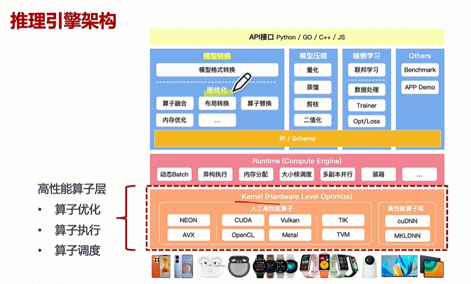

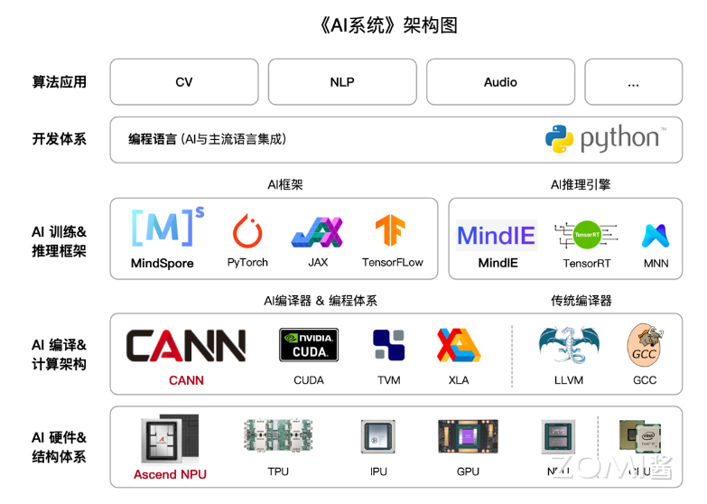

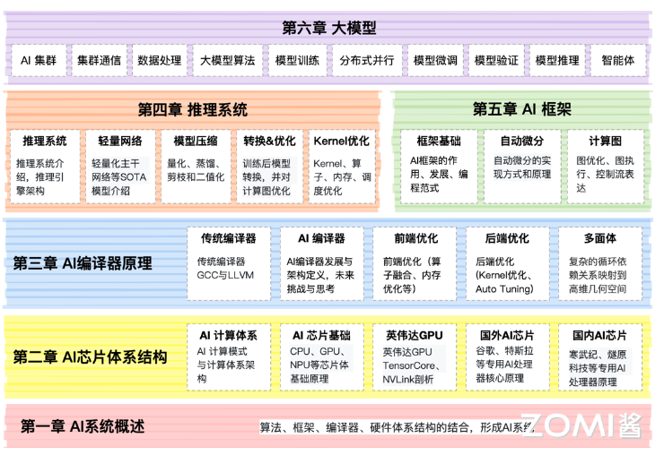

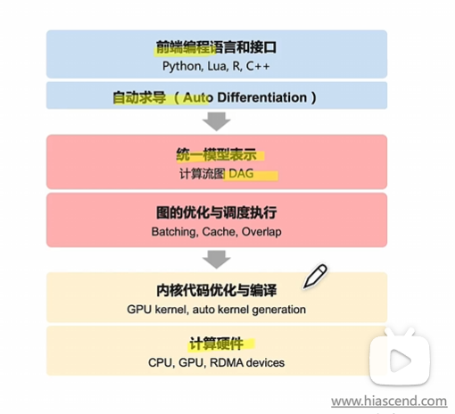

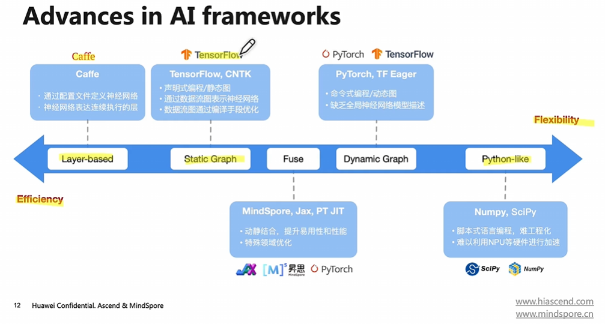


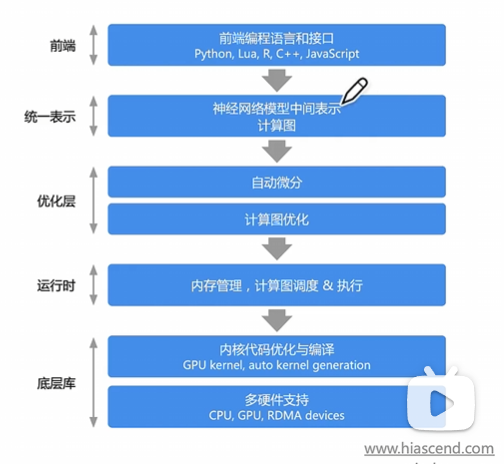

三类：抽象类，损失函数，优化器


# 自动微分（autograd)

一个视频帮助理解：[想了解自动微分吗？自动微分内容介绍！【自动微分】系列第一篇！_哔哩哔哩_bilibili](https://www.bilibili.com/video/BV1FV4y1T7zp/?spm_id_from=333.788&vd_source=025a38870ca80b3c1efed52c90a6a13a)

[前向微分和正向微分怎么理解？微分方式跟反向传播算法啥关系？【自动微分】系列第三篇_哔哩哔哩_bilibili](https://www.bilibili.com/video/BV1zD4y117bL/?p=3&spm_id_from=pageDriver)

这里需要有导数微分等的概念，基本算子的求导计算（数值微分），需要知道雅克比原理（用于表现前向微分和后向微分），链式求导法则，以及需要建立起计算图的概念。

深度学习计算的核心：计算网络模型的参数，并更新其梯度。这里更新梯度的方式就是AI框架的自动微分来完成。

自动微分：原子操作构成的复杂前向计算程序，关注自动生成高效的反向计算程序

自动微分：

- 所有数值计算都由有限的基本运算组成
- 基本运算的导数表达式是已知的
- 通过链式法则将数值计算各部分组合成整体

除了表达式和图，pytorch中使用的比较多的还有操作符重载 OO 和源码转换 AST。

主要有2个类，通过自动微分功能后就会产生表示神经网络的图和算子。

一般有几种，基于表达式的数值微分（使用**有限差分**进行近似）、符号微分（通过**求导法则**指定表达式变换规则）、以及自动微分。

单个算子的后向微分，一般是通过表达式来计算

把函数转换成计算图（有向无环图）

依据计算图和链式求导对函数进行展开

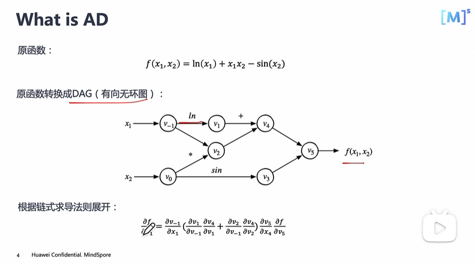


当函数有多个输入，但只有一个输出的时候。就非常适合用Reverse Model了，也就是将输出设为一，倒回去算出输入。


利用计算图进行表达式追踪

例如：

```c++

```


关于雅克比矩阵：


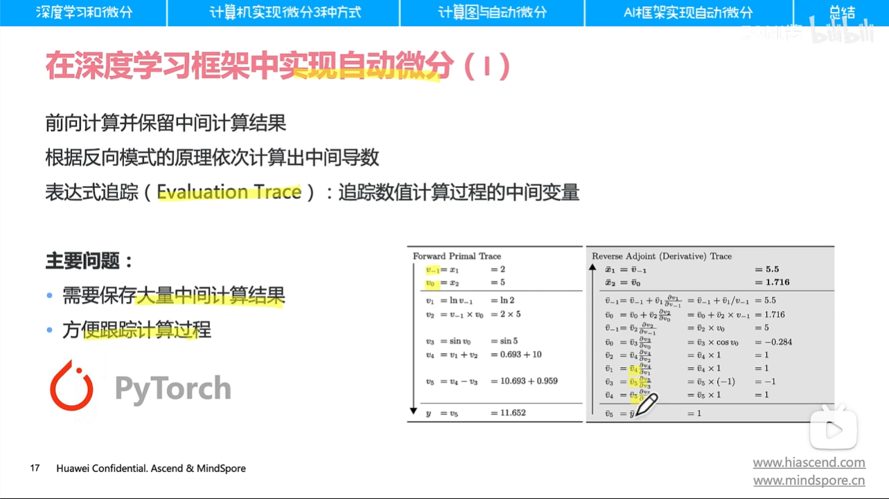


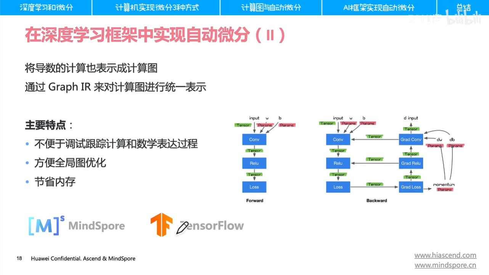

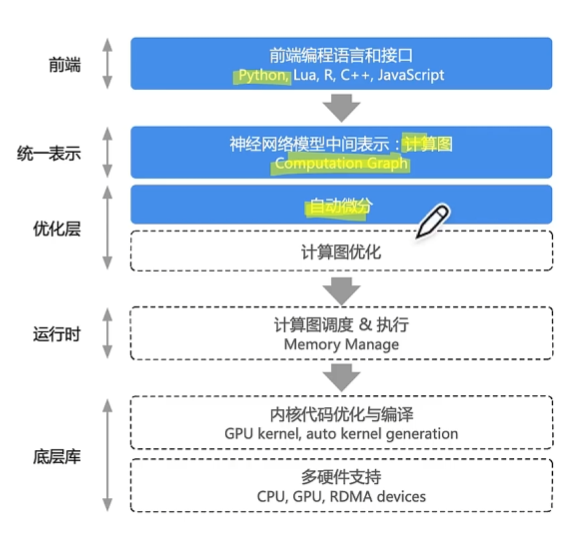


## 计算图

查资料：

[为什么AI框架都用计算图？什么是计算图？到底计算图有什么用？【计算图】系列第二篇_哔哩哔哩_bilibili](https://www.bilibili.com/video/BV1rR4y197HM/?spm_id_from=333.337.search-card.all.click&vd_source=025a38870ca80b3c1efed52c90a6a13a)

数据流图，DAG图等等都一个意思：节点代表operator，边代表value。还有一些特殊的操作和边，例如控制流或节点间依赖关系。

计算图由数据和算子构成，类别pytorch，就是tensor和operator


## 数据


Value（Tensor 张量）：

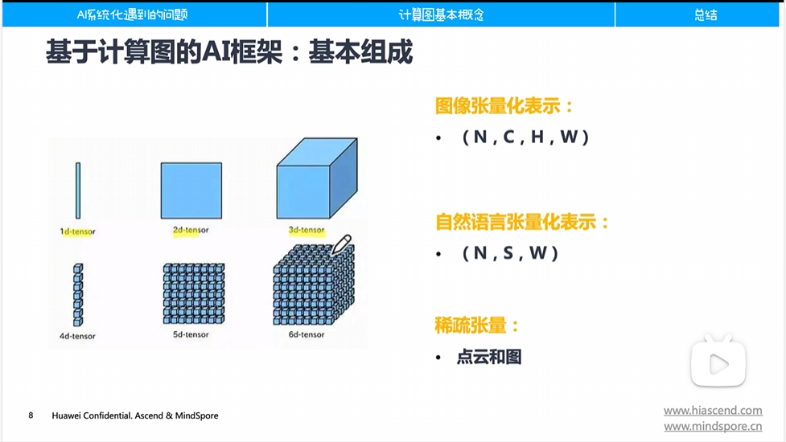


## 算子


operate（OP 算子）：

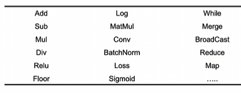

除了加减乘除等基本算子之外

按照优化方式可以将算子分为访存密集型和计算密集型，主要代表为：

- **访存密集型**：主要为Element-Wise类算子，例如 ReLU、Element-Wise Sum等
- **计算密集型**：mutmul，conv
- 融合算子

计算图的优化和执行

一般通过编译器来做：


调度队列：根据依赖关系，依次调度运行代码

流水线：并发执行

还有超标量、乱序执行/指令重排（指令）、向量化操作（数据）、多核并行/超线程（线程）

具体见课程笔记 lesson4

计算图的切分与多设备执行（多张卡，大规模分布式并行）：每个设备有计算图的一部分，涉及到跨设备跨子图的数据传输。

跨设备的边将被自动替换成Send/Recv算子或者是通过通讯原语进行数据传输


核心概念：计算图对控制流的表达，表达方式主要有静态和动态

AI框架如何支持动态控制流 （循环分支语句）：

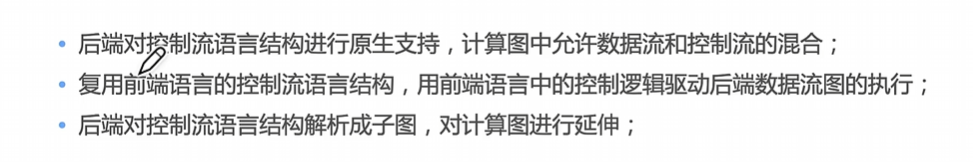

代表框架分别是tensorflow，pytorch，mindspore。

动态图转换为静态图：


 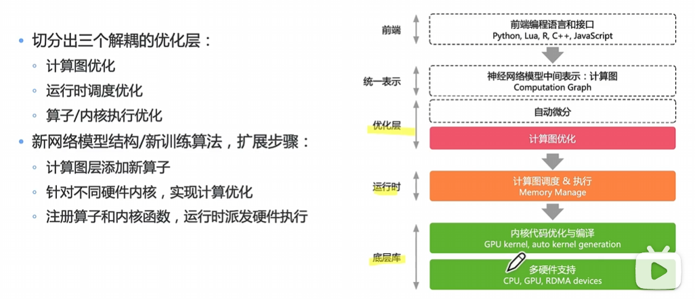


# hw4（Needle）

Needle的整体框架：

autograd.py

|—— Op  -- 用于定义操作符

|		|—— TensorOp(Op)

|		|—— TensorTupleOp(Op)


|—— Value  -- 用于表示计算图中的值

|		|—— TensorTuple(Value)

|		|—— Tensor(Value)


## NDArray

编写ndarray_backend_cpu.cc和ndarray_backend_cuda.cc

用于替代python中的numpy库（python中用于N维数组的相关计算，核心数据机构为ndarray）这里主要是实现其CPU端和GPU端的常用计算指令。


NDArray的底层实现都是直接在一维数组上操作，这里默认所有元素都是分配到了一个连续区域。然而，在经过`strides`和`offset`操作以后，底层的数据不再是连续存储的。例如，如果要对前面`b`做一个加1的操作，如果直接在原数组上执行，那么所有6个元素都会被修改，而不是`b`切片得到的4个元素。因此，需要定义一个`compact`方法：先看`strides`和`shape`是否正常，如果不正常，将对应的数组元素复制到一个连续的区域。在needle中，对逐元素操作，我们总是会对NDArray做一个`compact`操作，但是也可以通过一些其它技术手段在非连续区域做计算，避免对`compact`的频繁调用

首先明白一个定义：**如果一个矩阵以 （行为主） 的形式在内存中按顺序排列，那么它就被认为是紧凑的**。

也可以理解为将 多维数据按照行为先的顺序展开转换成一维数组存储在内存中。这时候对元素的索引就需要通过偏移量（步长）来进行。

例如一个三维数组，形状为（4,3,2）：


## 排列类

这里所有对数组的排列都是通过改变stride和offset来做的

然后基于新的属性去make数据，转换成密集排列compact


# Reduction

Reduction运算的特点是它往往对一个Tensor内的元素做归约操作，比如torch.max找极大值，torch.cumsum计算累加，它还提供了dim参数来指定沿矩阵哪个维度执行操作。

对于 ReduceMax：

通过对'reduce size '连续块取最大值来减少。尽管效率很低，但为了简单起见，您可以在单个CUDA线程中执行每个减少。


### max


### reshape


## flip


## padding


## Op

[pytorch文档](https://pytorch.org/docs/stable/torch.html)

这里主要是定义一些算子，这些算子是用来支持---的，算子底层使用的计算库可以是numpy（numpy是python中常用的基于数组对象的科学计算库），但这里的整个工程中，使用的计算库来自于自己使用CPU和CUDA编程实现的动态库。参考pytorch的架构来做。

**TensorOp(Op)**


### Conv

在**torch**中：

卷积前的尺寸为**(N, C, H, W)** ，卷积后尺寸为(N, F, W_out, H_out)。卷积的weight采用的格式为：**(out_channels, in_channels, kernel_size, kernel_size)**。

- W_n = (W-F+2P)/S + 1 向下取整
- H_n = (H-F+S+2P)/S


针对**needle**来说：

采用的通道默认顺序为 **(N, H, W, C)** ， 与torch不同。卷积的weight采用的格式为：**(kernel_size, kernel_size, in_channels, out_channels)**，与torch不同。


### logsoftmax

字面意思，先做softmax，然后外面套一层log
$$
\log\sigma(x_i)=\log\frac{\exp(x_i)}{\sum_j\exp(x_j)}=x_i-\log(\sum_j\exp(x_j))
$$

```python
class LogSoftmax(TensorOp):
    def compute(self, Z):
        ### BEGIN YOUR SOLUTION
        # raise NotImplementedError()
        return Z - log(sum(exp(Z)))
        ### END YOUR SOLUTION
```


### logsumexp(LSE)

[一文弄懂LogSumExp技巧-CSDN博客](https://blog.csdn.net/yjw123456/article/details/121869249)
$$
\mathrm{LSE}(x_1,\cdots,x_n)=\log\sum_{i=1}^n\exp(x_i)=\log\left(\exp(x_1)+\cdots+\exp(x_n)\right)
$$
输入可以看成是一个n维的向量，输出是一个标量。

原始的softmax：（容易出现溢出的风险）
$$
\mathrm{Softmax}(x_i)=\frac{\exp(x_i)}{\sum_{j=1}^n\exp(x_j)}
$$
归一化softmax：
$$
b=\max_{i=1}^nx_i
$$

$$
\begin{aligned}
\mathrm{Softmax}(x_i)& =\frac{\exp(x_i)}{\sum_{j=1}^n\exp(x_j)} \\
&=\frac{\exp(x_i-b)\cdot\exp(b)}{\sum_{j=1}^n\left(\exp(x_j-b)\cdot\exp(b)\right)} \\
&=\frac{\exp(x_i-b)\cdot\exp(b)}{\exp(b)\cdot\sum_{j=1}^n\exp(x_j-b)} \\
&=\frac{\exp(x_i-b)}{\sum_{j=1}^n\exp(x_j-b)} \\
&=\mathrm{Softmax}(x_i-b)
\end{aligned}
$$

不想记了，看懂了会写代码就行。

这里贴一个前向的代码，尤其要注意里面的shape变化，如果错了可能是里面的小函数有毛病，需要倒回去修改。

```python
class LogSumExp(TensorOp):
    def __init__(self, axes: Optional[tuple] = None):
        self.axes = axes  # 如果为None，则对所有轴都做
        if isinstance(axes, int):
            self.axes = tuple([axes])  # 将整数转换为单元素元组,不然后面走迭代会出错

    def compute(self, Z):
        ### BEGIN YOUR SOLUTION
        # raise NotImplementedError()  # 假设输入的 Z 的 shape 为 (5, 3)。
        Z_max = Z.max(axis=self.axes)  # 在哪个轴上做，就找出哪个轴上的最大值。假设 self.axes 为 0，则 Z_max 的 shape 为 (3,)，因为在第0个轴上找最大值会保留第1个轴的大小。
        Z_shape = list(Z.shape)  # [5, 3]
        
        if self.axes is None:
            Z_max_reshaped = Z_max.reshape(tuple([1 for _ in Z_shape]))  # 这里将Z_max进行reshape是为了后面更好的做减法，[1, 1]
        else:
            for axis in self.axes:
                Z_shape[axis] = 1  # 仅对指定的轴做shape [1, 3]
            Z_max_reshaped = Z_max.reshape(tuple(Z_shape))  # (1, 3)

        # 对Z做归一化避免溢出
        Z_normalized = Z - Z_max_reshaped.broadcast_to(Z.shape)  # (5, 3) - (5, 3)

        # 依次执行logsumexp
        x = array_api.exp(Z_normalized)
        y = array_api.summation(x, axis = self.axes)  # 在第0个轴上求和，y 的 shape 会变为 (3,)，因为在第0个轴上的所有元素都被求和，保留第1个轴。
        z = array_api.log(y)  # (3,)
        # print(z.shape, Z_max_reshaped.shape, Z_max.shape)
        return z + Z_max  # (3,) + (3,) 
        ### END YOUR SOLUTION
```


### summation

这玩意还没解决


### Dilated（扩张）

[Pytorch中dilation（Conv2d）参数详解_conv2d参数解释-CSDN博客](https://blog.csdn.net/weixin_42363544/article/details/123920699)

首先明确一下dilated和padding是两种不同的操作，dilated是在不同点之间增加空隙，值是多少就增加多少。在Pytorch中，dilation = 1等同于没有dilation的标准卷积。

w[0] * x[0] + w[1] * x[1] + w[2] * x[2]。若dilation = 1，过滤器会计算：w[0] * x[0] + w[1] * x[2] + w[2] * x[4]
也就是说，如果要实现上述的膨胀，pytorch中的dilation设置为2？而不是1


## Tensor

            axis = [3,2,1]
            for axis in reversed(sorted(axes)):
            	print(axis)


## nn

### 各种normalization

[详解三种常用标准化 Batch Norm & Layer Norm & RMSNorm_batchnorm layernorm rmsnorm-CSDN博客](https://blog.csdn.net/wxc971231/article/details/139925707)

[一文详解深度学习中的Normalization：BN/LN/WN-腾讯云开发者社区-腾讯云 (tencent.com)](https://cloud.tencent.com/developer/article/1636138)


normalization（标准化）：在深度学习中，归一化是常用的稳定训练的手段，CV 中常用 Batch Norm； Transformer 类模型中常用 layer norm，而 RMSNorm 是近期很流行的 LaMMa 模型使用的标准化方法，它是 Layer Norm 的一个变体。**它描述一种把样本调整到均值为 0，方差为 1 的缩放平移操作**。使用这种方法可以消除输入数据的量纲，有利于随机初始化的网络训练。


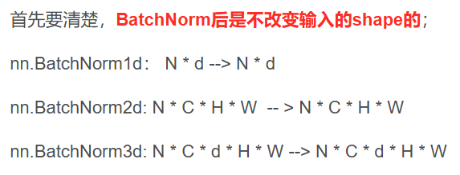

公式：
$$
y=\frac{x-\mathrm{E}[x]}{\sqrt{\mathrm{Var}[x]+\epsilon}}*\gamma+\beta
\\
Var(X)=E[X-E(X)]^2=E(X^2)-[E(X)]^2
$$


#### BatchNorm1d

[nn.BatchNorm讲解，nn.BatchNorm1d, nn.BatchNorm2d代码演示-CSDN博客](https://blog.csdn.net/qq_40671063/article/details/126984314)


## Parameter

一种表示参数的特殊张量


# 下面是关于PyTorch中的相关实现

Tensorflow的通道顺序默认是NHWC，Pytorch和Caffe的通道顺序是NCHW。NCHW 则是 Nvidia cuDNN 默认格式，。

NHWC：针对卷积更快

NCHW：针对batchnorm更快

这里的hw4是用的NHWC


pytorch 手撕everything

[【研1基本功 （真的很简单）注意力机制】手写多头注意力机制_哔哩哔哩_bilibili](https://www.bilibili.com/video/BV1o2421A7Dr/?spm_id_from=333.337.search-card.all.click&vd_source=025a38870ca80b3c1efed52c90a6a13a)

[torch.logsumexp — PyTorch 2.3 documentation](https://pytorch.org/docs/stable/generated/torch.logsumexp.html)


可调用的层和神经网络

我们之前指出过，我们把层对象实例当作一个函数来调用是多么奇怪。

> fc(in_features)
> tensor([30.0261, 40.1404, 49.7643], grad_fn=<AddBackward0>

使这成为可能的是PyTorch模块类实现了另一个特殊的Python函数，称为__call__()。如果一个类实现了__call__()方法，那么只要对象实例被调用，这个特殊的调用方法就会被调用。

这个事实是一个重要的PyTorch概念，因为在我们的层和网络中，__call __()与forward()方法交互的方式是用的。

我们不直接调用forward()方法，而是调用对象实例。在对象实例被调用之后，在底层调用了__ call __方法，然后调用了forward()方法。这适用于所有的PyTorch神经网络模块，即网络和层。


## Linear

[PyTorch中Linear层的原理 | PyTorch系列（十六）-CSDN博客](https://blog.csdn.net/flyfor2013/article/details/106485329)

当**输入特征**被一个Linear 层接收时，它们以一个**展平成一维张量**的形式接收，**然后乘以权重矩阵**。这个矩阵乘法**产生输出特征**。


# 自定义算子

[MindSpore](https://www.mindspore.cn/tutorial/training/zh-CN/r1.1/advanced_use/custom_operator_cpu.html)


