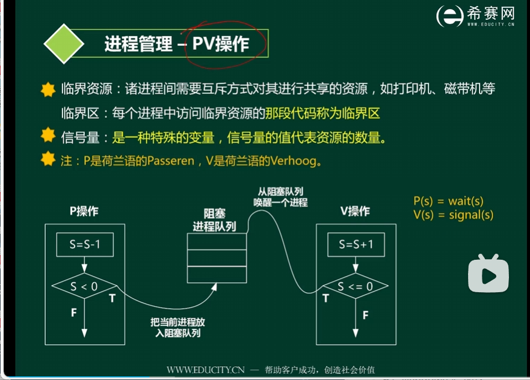

# 设计模式

代码随想录的讲解：[卡码网KamaCoder](https://kamacoder.com/designpattern.php)

B站：[子烁爱学习的个人空间-子烁爱学习个人主页-哔哩哔哩视频 (bilibili.com)](https://space.bilibili.com/59546029/channel/collectiondetail?sid=266320)

除此之外还建议看侯捷的讲解：


[TOC]


# 工厂模式（创建型）

还分成**简单工厂模式**和**抽象工厂模式**两种，还有一种工厂方法模式。

工厂模式，定义一个用于创建对象的接口，让子类决定实例化哪一个类。Factory Method 使一个类的实例化延迟到其子类。

代码实现：

```c++

```


应用场景：

适用于：当一个类不知道它所必须创建的对象的类的时候；当一个类希望由它的子类来指定它所创建的对象的时候；当类将创建对象的职责委托给多个帮助子类中的某一个，并且你希望将哪一个帮助子类是代理者这一信息局部化的时候。


## 观察者模式（行为型）aka 发布-订阅模式

[五分钟学设计模式.07.观察者模式_哔哩哔哩_bilibili](https://www.bilibili.com/video/BV1vg4y1v7V4/?spm_id_from=333.788&vd_source=025a38870ca80b3c1efed52c90a6a13a)

观察者模式（发布-订阅模式）属于⾏为型模式，定义了⼀种**⼀对多**的依赖关系，让多个观察者对象同时**监听**⼀个 主题对象，**当主题对象的状态发⽣变化时，所有依赖于它的观察者都得到通知并被⾃动更新**。


使⽤观察者模式有很多好处，⽐如说观察者模式将主题和观察者之间的关系解耦，主题只需要关注⾃⼰的状态变
化，⽽观察者只需要关注在主题状态变化时需要执⾏的操作，两者互不⼲扰，并且由于观察者和主题是相互独⽴
的，可以轻松的增加和删除观察者，这样实现的系统更容易扩展和维护。


代码实现：

```c++

```


观察者模式特别**适⽤于⼀个对象的状态变化会影响到其他对象，并且希望这些对象在状态变化时能够⾃动更新的情 况**。 ⽐如说在图形⽤户界⾯中，按钮、滑动条等组件的状态变化可能需要通知其他组件更新，这使得观察者模式被 ⼴泛应⽤于GUI框架，⽐如Java的Swing框架。 

此外，观察者模式在前端开发和分布式系统中也有应⽤，⽐较典型的例⼦是前端框架 Vue , 当数据发⽣变化时，视 图会⾃动更新。⽽在分布式系统中，观察者模式可以⽤于实现节点之间的消息通知机制，节点的状态变化将通知其 他相关节点。


观察者模式（Observer Pattern）和发布-订阅模式（Publish-Subscribe Pattern）在某些方面非常相似，但它们并不是完全相同的概念。以下是对它们的对比和解释：

### 观察者模式

1. **定义**：观察者模式是一种行为设计模式，定义了一种一对多的依赖关系，让多个观察者对象同时监听某一个主题对象。当主题对象的状态发生变化时，会通知所有观察者，使它们能够自动更新。

2. 结构

   ：

   - **Subject（主题/被观察者）**：维护观察者列表，提供注册和删除观察者的方法。
   - **Observer（观察者）**：定义一个更新接口，用于接收主题的通知。

3. **实现**：通常通过**直接调用**观察者的更新方法来通知观察者。

4. **用途**：常用于GUI工具包和实时系统中，当一个对象的变化需要通知到其他对象时使用。

### 发布-订阅模式

1. **定义**：发布-订阅模式是一种消息传递模式，发布者（Publisher）和订阅者（Subscriber）之间**通过一个事件通道（Event Channel）进行通信**。发布者发送消息到通道，订阅者通过通道接收消息。
2. 结构：
   - **Publisher（发布者）**：产生消息并发布到事件通道。
   - **Subscriber（订阅者）**：订阅特定类型的消息，从事件通道接收消息。
   - **Event Channel（事件通道）**：中介，负责管理消息的分发。
3. **实现**：通常**通过消息队列或事件总线来实现**，发布者和订阅者**不直接互相引用**。
4. **用途**：常用于分布式系统和异步事件处理系统中，当需要解耦发布者和订阅者时使用。

**相似点**：

- 都涉及对象之间的通信和通知机制。
- 都支持一对多的依赖关系。

**不同点**：

- **耦合度**：观察者模式中，观察者直接与主题对象关联，耦合度较高；而发布-订阅模式通过事件通道解耦发布者和订阅者，耦合度较低。
- **复杂度**：发布-订阅模式通常需要一个中介（如事件通道），实现起来相对复杂。
- **用例**：观察者模式适用于单进程内的通知机制，而发布-订阅模式更适合跨进程、跨网络的通知机制。

**观察者模式示例**：

```
cpp复制代码class Observer {
public:
    virtual void update() = 0;
};

class Subject {
private:
    std::vector<Observer*> observers;
public:
    void attach(Observer* observer) {
        observers.push_back(observer);
    }
    void detach(Observer* observer) {
        observers.erase(std::remove(observers.begin(), observers.end(), observer), observers.end());
    }
    void notify() {
        for (Observer* observer : observers) {
            observer->update();
        }
    }
};
```

**发布-订阅模式示例**：

```
cpp复制代码class EventChannel {
private:
    std::unordered_map<std::string, std::vector<std::function<void()>>> subscribers;
public:
    void subscribe(const std::string& event, std::function<void()> callback) {
        subscribers[event].push_back(callback);
    }
    void publish(const std::string& event) {
        for (const auto& callback : subscribers[event]) {
            callback();
        }
    }
};
```


## 装饰器模式（结构型）

[五分钟学设计模式.05.装饰器模式_哔哩哔哩_bilibili](https://www.bilibili.com/video/BV1hp4y1D7MP/?spm_id_from=333.337.search-card.all.click&vd_source=025a38870ca80b3c1efed52c90a6a13a)

通常情况下，扩展类的功能可以通过继承实现，但是扩展越多，⼦类越多。装饰模式（ Decorator Pattern , 结构型设计模式）可以**在不定义⼦类的情况下动态的给对象添加⼀些额外的功能**。

具体的做法是**将原始对象放⼊包含行为的特殊封装类(装饰类)**，从而为原始对象动态添加新的⾏为，而⽆需修改其代码。


代码实现：


装饰模式通常在以下⼏种情况使⽤： 

- 当需要给⼀个现有类添加附加功能，但由于某些原因不能使⽤继承来⽣成⼦类进⾏扩充时，可以使⽤装饰模 式。 
- 动态的添加和覆盖功能：当对象的功能要求可以动态地添加，也可以再动态地撤销时可以使⽤装饰模式。


## 单例模式（创建型）

[五分钟学设计模式.01.单例模式_哔哩哔哩_bilibili](https://www.bilibili.com/video/BV1af4y1y7sS/?spm_id_from=333.337.search-card.all.click&vd_source=025a38870ca80b3c1efed52c90a6a13a)

核心思想为：**确保一个类只有一个实例，而且自行实例化并向整个系统提供这个实例**。

**单例模式最佳实践是无状态的，比如以工具类的形式提供。**

要求构造方法是private的，并且拥有一个当前类的静态成员变量，一个静态方法用于向外界提供当前类的实例。

一个简单的单例模式如下所示：

```cpp
class Singleton{
private:
    Singleton(){}
    static Singleton singleton;
    
public:
    static Singleton getInstance() {
        return singleton;
    }   
};

/*
	实例化时机：饿汉式、懒汉式
	饿汉式：
	static Singleton singleton = new Singleton();  // 在类进行加载的时候立刻进行实例化
	懒汉式：注意在这里需要进行同步处理。加锁，来防止它被多次实例化
	synchronized static Singleton getInstance() {
		if(singleton = NULL) singleton = new Singleton();
        return singleton;
    }  // 在第一次使用的时候进行实例化

*/
```

懒汉式实例化的双重检查锁实现：

```cpp
package interview.pattern;

public class SingletonPattern {
	public static void main(String[] args){
   
    }
}

class Singleton{
private:
    Singleton(){}
    volatile static Singleton singleton;
    
public:
	synchronized static Singleton getInstance() {
		if(singleton = null) {
            synchronized (Singleton.class) {
				if(singleton == null)
					singleton = new singleton();
        }
        return singleton;
    }
};
```

双重检查锁的实现up评论区有说明：[五分钟学设计模式.01.单例模式_哔哩哔哩_bilibili](https://www.bilibili.com/video/BV1af4y1y7sS/?spm_id_from=333.337.search-card.all.click&vd_source=025a38870ca80b3c1efed52c90a6a13a)

**要加 volatile 修饰**，singleton = new Singleton() 可以拆解为3步：

1、分配内存，

2、初始化对象，

3、指向刚分配的地址，

但是2和3由于cpu的优化，可能会发生重排序。若发生重排序，假设 A 线程执行了1和3，还没有执行2，B线程来到判断 NULL，B线程就会直接返回还没初始化的instance了。`volatile` 可以避免重排序。


那么为什么`volatile`可以避免重排序呢？

在C++中，`volatile`关键字是用来告诉编译器一个变量的值可能会在任何时候被外部因素改变，因此编译器在优化代码时需要特别对待这些变量。具体的可以去搜搜，我就不记下来了。

### 例题

[【设计模式专题之单例模式】1.小明的购物车 (kamacoder.com)](https://kamacoder.com/problempage.php?pid=1074)

```cpp
#include <iostream>
#include <string>
#include <unordered_map>
#include <vector>

class ShoppingCart {
private:
    std::unordered_map<std::string, int> goodlist;  // 购物车信息
    std::vector<std::string> orderlist;  // 商品清单

    // 私有化构造函数和析构函数，确保外部无法直接实例化和销毁对象
    ShoppingCart() {}
    ~ShoppingCart() {}

public:
    // 获取单例实例的静态方法
    static ShoppingCart& getInstance() {
        static ShoppingCart instance;  // 在第一次调用时初始化，确保唯一性
        return instance;
    }

    // 获取购物车信息的方法
    std::unordered_map<std::string, int>& getGoodList() {
        return goodlist;
    }

    // 获取商品清单的方法
    std::vector<std::string>& getOrderList() {
        return orderlist;
    }

    // 添加商品到购物车
    void addGoods(const std::string& good_name, int good_num) {
        goodlist[good_name] = good_num;
        orderlist.push_back(good_name);
    }
};

int main() {
    ShoppingCart& sc = ShoppingCart::getInstance();  // 获取 ShoppingCart 的单例实例

    std::string good_name;
    int good_num;

    // 输入商品信息，直到输入结束
    while (std::cin >> good_name >> good_num) {
        sc.addGoods(good_name, good_num);  // 使用公有成员函数来添加商品到购物车
    }

    // 输出购物车信息
    for (const auto& item : sc.getOrderList()) {
        std::cout << item << " " << sc.getGoodList()[item] << std::endl;
    }

    return 0;
}
```


使用场景

单例模式在线程池创建中的使用

我在项目中碰到一个这样的场景：
1）某个接口的并发请求较大；
2）对收到的数据要进行复杂的验证及数据库相关操作；
3）响应速度不能太慢，至少得2秒内吧；
于是正好可以拿线程池来练练手，下面分享一下我的练手代码（项目实战中根据需求稍作修改即可应用）：


## 生产者消费者模式（并发型）


生产者消费者模式 (Producer-Consumer Pattern) 是一种并发编程模式，**用于解决生产者和消费者之间数据交换的问题**。在这种模式中，生产者生产数据，并将其传递给消费者进行处理。**生产者和消费者是独立的进程或线程，它们通过共享的缓冲区进行通信**。

相关的一些概念：

- **生产者**：负责生成数据并将其放入缓冲区。
- **消费者**：负责从缓冲区取出数据并进行处理。
- **缓冲区**：缓冲区是一个固定大小的存储区，用来在生产者和消费者之间传递数据。缓冲区可以是一个简单的数组、队列或者任何其他适合的数据结构。（本次实现中采用的是队列）


下面有点绕这一部分，不行就gpt辅助理解：

信号量（Semaphore）和条件变量（Condition Variable）在多线程编程中都是用于同步和协调线程的工具，但它们在概念和使用上有一些区别。

### 信号量

生产者-消费者模型中的信号量通常**用来计数资源的数量**，分为计数信号量（Counting Semaphore）和二进制信号量（Binary Semaphore）两种类型。**计数信号量** 可以取任意非负值，用于控制对多个资源的访问。**二进制信号量** 只有0和1两个值，用于实现互斥锁（Mutex），控制对单个资源的访问。

在生产者-消费者模型中，通常使用两个信号量来管理缓冲区的状态：

- **PV操作**：

  - P 操作（Proberen）：wait()，主要使用资源，如果资源不可用，进程会被阻塞，直到资源可用。**P 操作会将信号量的值减一**
  - V 操作（Verhogen）：signal()，主要释放资源，进而允许其他等待该资源的进程继续执行。**V 操作会将信号量的值加一**，表示增加一个可用资源
  - PV操作通常是**成对出现**的

- **示例说明**：

  假设我们有一个缓冲区，其大小为 `BUFFER_SIZE = 5`，初始状态如下：

  - 空位信号量（empty）初始值为5。
  - 满位信号量（full）初始值为0。

**生产者-消费者操作示例**：

  1. **生产者操作**：
     - 生产者在向缓冲区放入一个元素之前，会等待空位信号量（`empty`）大于0。
     - 向缓冲区放入一个元素后，空位信号量减1，满位信号量加1。
  2. **消费者操作**：
     - 消费者在从缓冲区取出一个元素之前，会等待满位信号量（`full`）大于0。
     - 从缓冲区取出一个元素后，满位信号量减1，空位信号量加1。

信号量的变化反映了缓冲区的使用情况，但信号量本身并不是缓冲区的大小。信号量用于协调生产者和消费者对缓冲区的访问，确保线程同步和数据完整性。


### 条件变量

条件变量（Condition Variable）用于**让线程等待某个条件成立**，并在该条件可能改变时被其他线程通知。条件变量本身没有特殊的数值属性，使用**等待和通知机制**来协调多个线程的运行，使线程能够在某个条件满足时被唤醒。条件变量通常与互斥锁一起使用，可以有效地解决复杂的线程同步问题，确保线程安全地访问共享资源。

- 条件变量适用于需要在**某个条件满足时唤醒一个或多个线程的情况**。常用于复杂的同步场景，例如生产者-消费者模型中，当缓冲区**为空或满**时进行等待和通知。
- **相关操作**：
  - `wait` (有时还包括 `timed_wait`)：线程等待条件变量，并自动释放关联的互斥锁。当被唤醒时，线程重新获取互斥锁。
  - `signal` (或 `notify_one`)：唤醒等待在条件变量上的一个线程。
  - `broadcast` (或 `notify_all`)：唤醒等待在条件变量上的所有线程。

**生产者-消费者操作示例**：

1. **生产者线程**：
	- 生产一个数据项。

    - 获取互斥锁。
    - 如果缓冲区满，调用 `pthread_cond_wait(&cond_empty, &mutex)`，等待空位出现，并释放互斥锁。被唤醒后，重新获取互斥锁。
    - 将数据放入缓冲区。
    - 通过 `pthread_cond_signal(&cond_full)` 通知等待在 `cond_full` 条件变量上的消费者。
    - 释放互斥锁。

2. **消费者线程**：
- 获取互斥锁。
    - 如果缓冲区为空，调用 `pthread_cond_wait(&cond_full, &mutex)`，等待数据出现，并释放互斥锁。被唤醒后，重新获取互斥锁。
    - 从缓冲区取出数据。
    - 通过 `pthread_cond_signal(&cond_empty)` 通知等待在 `cond_empty` 条件变量上的生产者。
    - 释放互斥锁。
    - 消费数据。

### 小总结

- **信号量** 更适合简单的计数资源同步，直接控制资源的可用性。
- **条件变量** 更适合复杂的条件同步，需要在特定条件下阻塞和唤醒线程。


### 生产者-消费者模型特点

- 保证生产者不会在缓冲区满的时候继续向缓冲区放入数据，而消费者也不会在缓冲区空的时候，消耗数据
- 当缓冲区满的时候，生产者会进入休眠状态，当下次消费者开始消耗缓冲区的数据时，生产者才会被唤醒，开始往缓冲区中添加数据；当缓冲区空的时候，消费者也会进入休眠状态，直到生产者往缓冲区中添加数据时才会被唤醒
- **优点：解耦合、复用、调整并发数、异步、支持分布式**




下面开始实现：使用阻塞队列

由于C++实现生产者-消费者模型需要依赖：C++11 提供的 thread 库；互斥锁 mutex；条件变量 condition_variable；队列 queue；因此需要引入相关的头文件

先写一个简单的main函数：

```c++
#include <thread>
#include <condition_variable>
#include <mutex>
#include <queue>

#include <cstdio>

class BlockQueue{
    int size_maxnum;  //缓冲区大小，缓冲区中可以存储的最大元素数，这里是vec的最大容量
    std::queue<int> vec;
    
};

void proceducer() {
    printf("pro init \n");

}

void consumer() {
    printf("con init \n");

}

int main() {

    std::thread tp(proceducer);  // 创建一个生产者线程；
    std::thread tc(consumer);  // 创建一个消费者线程

    tp.join();  // 等待线程完成执行
    tc.join();

    printf("hello world \n");  // 主线程会等待这两个线程都完成后才继续执行。
    return 0;
}
```

编译后报错： note: 'std::thread' is defined in header '<thread>'; did you forget to '#include <thread>'?

检查发现头文件已经包含了啊，查资料：[Windows上无法使用thread头文件_thread' was not declared in this scope-CSDN博客](https://blog.csdn.net/yrt19/article/details/108305939)

查看使用的编译器：

`g++ -v`：gcc version 8.1.0 (x86_64-win32-seh-rev0, Built by MinGW-W64 project)

于是换一个这样式儿的：gcc version 9.4.0 (Ubuntu 9.4.0-1ubuntu1~20.04.3)

又报错。。。/tmp/ccU4iMen.o: in function `std::thread::thread<void (&)(), , void>(void (&)())':        
produtor_sumer.cpp:(.text._ZNSt6threadC2IRFvvEJEvEEOT_DpOT0_[_ZNSt6threadC5IRFvvEJEvEEOT_DpOT0_]+0x33): undefined reference to `pthread_create'

gpt给出解决方法：链接错误提示是由于缺少对`pthread`库的链接。在使用`std::thread`时，必须链接到`pthread`库。你可以通过在编译时添加`-lpthread`选项来解决这个问题。

`g++ ProceducerConsumer.cpp -l pthread`，终于通过了。。


**写一个阻塞队列类：**

```c++
template <typename T>
class BlockQueue{

    // 数据类型使用模板指定，与消费者取出的类型一样
    std::queue<T> vec;

    std::condition_variable m_not_Empty;  // 消费者线程条件变量
    std::condition_variable m_not_Full;  // 生产者线程条件变量
    std::mutex m_mtx;  // 互斥锁
    int size_maxnum;  //缓冲区大小，缓冲区中可以存储的最大元素数，这里是vec的最大容量

public:
    BlockQueue(int capacity = 10): size_maxnum(capacity) {}

    T pop(int id) {  // 消费者，意为从vector中pop数据
        std::unique_lock<std::mutex> lock(m_mtx);

        while(vec.empty()) {  // 当容量为空时等待
            m_not_Empty.wait(lock);
        }
        // m_not_Empty.wait(lock, [this]{ return !vec.empty(); });  // lambda表达式等待 

        T val = vec.front();
        vec.pop();
        printf("Queue size after pop: %lu, C-thread[%d]==>Consumed: %d\n", vec.size(), id, val);
        m_not_Full.notify_all();  // 解锁，唤醒生产者线程
        return val;
    }

    void push(const T& val, int id) {  // 生产者，意为向vector中push数据
        std::unique_lock<std::mutex> lock(m_mtx);  // 创建了一个智能锁对象 lock，将互斥量 mtx 锁住。
        
        while(vec.size() >= size_maxnum) {  // 当队列已满时等待
            m_not_Full.wait(lock);
        }
        // m_not_Full.wait(lock, [this]{ return vec.size() < size_maxnum; });

        vec.push(val);
        printf("Queue size after push: %lu, P-thread[%d]==>Produced: %d\n", vec.size(), id, val);
        m_not_Empty.notify_all();  // 解锁，唤醒消费者线程
    }
    
};
```

条件变量 `m_not_Empty` 和 `m_not_Full` 用于管理队列的状态变化，从而确保生产者不会在队列满时继续添加数据，消费者不会在队列空时尝试取数据。这样的实现既保证了线程安全，又提高了资源利用率。


**定义生产者和消费者的操作：**

```c++
void producer(BlockQueue<int>* q, int id) {
    for (int i = 0; i < 5; ++i) {
        q->push(i + id * 100, id);  // 每个线程生产的数据都不同，便于调试
    }
}

void consumer(BlockQueue<int>* q, int id) {
    for (int i = 0; i < 5; ++i) {
        int item = q->pop(id);
    }
}
```


两种测试代码：上面是一个生产者，一个消费者；下面是多个生产和多个消费，均可检查阻塞队列的正确性

```c++
int main() {

    BlockQueue<int> q(2);  // 阻塞队列的初始容量为2

    std::thread tp(producer, &q, 1);  // 创建一个生产者线程；队列对象的指针传递给 producer 函数。
    std::thread tc(consumer, &q, 1);  // 创建一个消费者线程

    tp.join();  // 等待线程完成执行
    tc.join();

    printf("hello world \n");  // 主线程会等待这两个线程都完成后才继续执行。
    // 打印一下看看结果
    return 0;
}

// int main() {
//     BlockQueue<int> q(2); // 阻塞队列的初始容量为2

//     std::thread producers[3] = {
//         std::thread(producer, &q, 1),
//         std::thread(producer, &q, 2),
//         std::thread(producer, &q, 3)
//     };
    
//     std::thread consumers[3] = {
//         std::thread(consumer, &q, 1),
//         std::thread(consumer, &q, 2),
//         std::thread(consumer, &q, 3)
//     };

//     for (auto& p : producers) {
//         p.join(); // 等待生产者线程完成
//     }
    
//     for (auto& c : consumers) {
//         c.join(); // 等待消费者线程完成
//     }

//     printf("hello world\n"); // 主线程等待所有线程完成后继续执行
//     return 0;
// }
```

检查输出：确保

1. 生产的顺序
   - 每个`P-thread`输出应该是按顺序。
   - 每次`push`操作后队列大小增加。
2. 消费的顺序
   - 每个`C-thread`的输出应该是之前生产的数字。
   - 每次`pop`操作后队列大小减少。
3. 同步问题
   - 生产者在队列满时等待。
   - 消费者在队列为空时等待。


中间也是修改了无数次，常见的问题比如元素还没被生产出来就被消费了，很奇怪，也怀疑是打印语句写的位置的问题。。具体也还没搞清楚。下面是完整的正确的程序：

```c++
#include <thread>
#include <condition_variable>
#include <mutex>
#include <queue>

#include<vector>
#include <cstdio>

template <typename T>
class BlockQueue{

    // 数据类型使用模板指定，与消费者取出的类型一样
    std::queue<T> vec;

    std::condition_variable m_not_Empty;  // 消费者线程条件变量
    std::condition_variable m_not_Full;  // 生产者线程条件变量
    std::mutex m_mtx;  // 互斥锁
    int size_maxnum;  //缓冲区大小，缓冲区中可以存储的最大元素数，这里是vec的最大容量

public:
    BlockQueue(int capacity = 10): size_maxnum(capacity) {}

    T pop(int id) {  // 消费者，意为从vector中pop数据
        std::unique_lock<std::mutex> lock(m_mtx);

        while(vec.empty()) {  // 当容量为空时等待
            m_not_Empty.wait(lock);
        }
        // m_not_Empty.wait(lock, [this]{ return !vec.empty(); });  // lambda表达式等待 

        T val = vec.front();
        vec.pop();
        printf("Queue size after pop: %lu, C-thread[%d]==>Consumed: %d\n", vec.size(), id, val);
        m_not_Full.notify_all();  // 解锁，唤醒生产者线程
        return val;
    }

    void push(const T& val, int id) {  // 生产者，意为向vector中push数据
        std::unique_lock<std::mutex> lock(m_mtx);  // 创建了一个智能锁对象 lock，将互斥量 mtx 锁住。
        
        while(vec.size() >= size_maxnum) {  // 当队列已满时等待
            m_not_Full.wait(lock);
        }
        // m_not_Full.wait(lock, [this]{ return vec.size() < size_maxnum; });

        vec.push(val);
        printf("Queue size after push: %lu, P-thread[%d]==>Produced: %d\n", vec.size(), id, val);
        m_not_Empty.notify_all();  // 解锁，唤醒消费者线程
    }
    
};

void producer(BlockQueue<int>* q, int id) {
    for (int i = 0; i < 5; ++i) {
        q->push(i + id * 100, id);  // 每个线程生产的数据都不同，便于调试
    }
}

void consumer(BlockQueue<int>* q, int id) {
    for (int i = 0; i < 5; ++i) {
        int item = q->pop(id);
    }
}

int main() {

    BlockQueue<int> q(2);  // 阻塞队列的初始容量为2

    std::thread tp(producer, &q, 1);  // 创建一个生产者线程；队列对象的指针传递给 producer 函数。
    std::thread tc(consumer, &q, 1);  // 创建一个消费者线程

    tp.join();  // 等待线程完成执行
    tc.join();

    printf("hello world \n");  // 主线程会等待这两个线程都完成后才继续执行。
    // 打印一下看看结果
    return 0;
}


打印结果：
Queue size after push: 1, P-thread[1]==>Produced: 100
Queue size after push: 2, P-thread[1]==>Produced: 101
Queue size after pop: 1, C-thread[1]==>Consumed: 100
Queue size after pop: 0, C-thread[1]==>Consumed: 101
Queue size after pop: 0, C-thread[1]==>Consumed: 101
Queue size after pop: 0, C-thread[1]==>Consumed: 101
Queue size after push: 1, P-thread[1]==>Produced: 102
Queue size after push: 2, P-thread[1]==>Produced: 103
Queue size after pop: 1, C-thread[1]==>Consumed: 102
Queue size after push: 1, P-thread[1]==>Produced: 102
Queue size after push: 2, P-thread[1]==>Produced: 103
Queue size after pop: 1, C-thread[1]==>Consumed: 102
Queue size after pop: 1, C-thread[1]==>Consumed: 102
Queue size after pop: 0, C-thread[1]==>Consumed: 103
Queue size after push: 1, P-thread[1]==>Produced: 104
Queue size after pop: 0, C-thread[1]==>Consumed: 104
hello world
```

从最新的输出结果可以看到，生产和消费操作被正确同步，队列的大小正确更新，所有生产的项目都被唯一标识并且有序消费。这个输出结果表明生产者-消费者问题被正确解决。正确输出的特征包括：

1. **生产和消费顺序**：每个生产者生产的项目在队列中有序地被消费者消费。
2. **队列大小的正确更新**：每次生产和消费操作后，队列的大小正确更新。
3. **唯一标识的生产项目**：每个生产项目都有唯一的标识，确保没有重复生产或消费。


### 参考资料：

[生产者消费者模式 (Producer-Consumer Pattern) | 并发型模式 |《Go 语言设计模式 1.0.0》| Go 技术论坛 (learnku.com)](https://learnku.com/docs/go-patterns/1.0.0/sheng-chan-zhe-xiao-fei-zhe-mo-shi-producer-consumer-pattern/14742)

[如何实现一个生产者消费者模型（面试C++）_c++实现生产者消费者模型-CSDN博客](https://blog.csdn.net/weixin_45670785/article/details/126300859)

[生产者-消费者模型：理论讲解及实现（C++） - HOracle - 博客园 (cnblogs.com)](https://www.cnblogs.com/horacle/p/15425808.html)

[考研操作系统精讲（408）-1.6进程的同步与互斥（生产者消费者问题）_哔哩哔哩_bilibili](https://www.bilibili.com/video/BV1Ei4y1u7qy/?spm_id_from=333.337.search-card.all.click&vd_source=025a38870ca80b3c1efed52c90a6a13a)

[C++ 实现多线程生产者消费者模式-腾讯云开发者社区-腾讯云 (tencent.com)](https://cloud.tencent.com/developer/article/2245102)

[阻塞队列（超详细易懂）-CSDN博客](https://blog.csdn.net/a1302993809/article/details/135980266)

[多线程编程3：C++11 互斥锁和条件变量_如何获取互斥体变量-CSDN博客](https://blog.csdn.net/qq_40253126/article/details/132091678?utm_medium=distribute.pc_relevant.none-task-blog-2~default~baidujs_baidulandingword~default-0-132091678-blog-112430570.235^v43^pc_blog_bottom_relevance_base2&spm=1001.2101.3001.4242.1&utm_relevant_index=3)

推荐阅读：[C++11 多线程操作 (线程控制、互斥锁、条件变量、原子操作、自旋锁)_c++ 带锁 join-CSDN博客](https://blog.csdn.net/weixin_51696091/article/details/124515241?spm=1001.2101.3001.6650.3&utm_medium=distribute.pc_relevant.none-task-blog-2~default~BlogOpenSearchComplete~Rate-3-124515241-blog-132091678.235^v43^pc_blog_bottom_relevance_base2&depth_1-utm_source=distribute.pc_relevant.none-task-blog-2~default~BlogOpenSearchComplete~Rate-3-124515241-blog-132091678.235^v43^pc_blog_bottom_relevance_base2&utm_relevant_index=6)


也是查了相当多的资料。。。