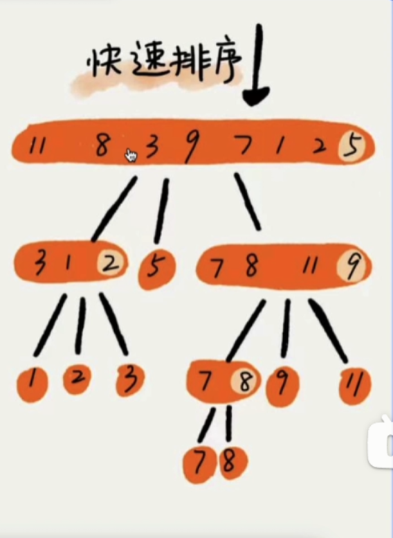

# 目录


[TOC]

<!-- # 前言：

简单记录一下刷Leetcode遇到的常用的数据结构和算法


[聊聊我们刷过的力扣与大厂笔试真题之间的区别！！！_哔哩哔哩_bilibili](https://www.bilibili.com/video/BV1Sp4y1A7nd/?spm_id_from=333.999.0.0&vd_source=025a38870ca80b3c1efed52c90a6a13a)


**笔试和leetcode的区别：**

力扣

题目抽的很干净，都是计算机的表达

只是补充一个函数,实现核心功能

笔试

题目有具体场景，有的题目非常长!

白板编程，需要自己处理输入输出

**笔试经验：**

1. 不要太考虑跟语言特性相关的东西
2. 笔试题一般只考虑时间复杂度

**笔试系统：**

常见错误类型

1. 编译错误(CE)：漏写分号，写错单词
2. 运行时错误(RE)：把0当除数，直接访问没有长度的vector，越界
3. 运行超时(TLE)：死循环

调试方式

1. 学会在关键位置打印变量的值。
2. 函数的入口、出口


时间复杂度：

一般来说，如果你的算法复杂度是

O(n)或O(n log n)，那么数据量可以达到10^5到10^6左右。

O(n^2)，数据量超过10^4就可能需要注意优化，避免超时。

**O(log n)**：通常适用于非常大的数据量，比如10^9以上。


什么时候会溢出： -->


# 1. 数据结构

简单记录一下常用的数据结构和使用的方法

[代码随想录 (programmercarl.com)](https://www.programmercarl.com/哈希表理论基础.html#哈希函数)

变量和基本类型

内置类型有：字符，整型，浮点数

还有自定义类型（各种类）

再就是一些数据结构了


**unsigned 表示无符号，也就是没有符号位，只能存储非负的数字**


## 链表

简单的单向链表写法：

```c++
struct ListNode {
    int val;
    ListNode* next;
    ListNode(int x) : val(x), next(nullptr) {}
};
```


力扣：160


## 字符串


## 哈希表（散列表）

个人理解跟字典挺像的，就是通过键来访问值。


- std::unordered_set（集合）
- std::unordered_map（数组）
- std::multiset（value可重复）
- std::multimap（key可重复）


[37.STL中unordered_map和map的区别和应用场景 - CodeMagicianT - 博客园 (cnblogs.com)](https://www.cnblogs.com/codemagiciant/p/17602301.html)


由值映射到索引的过程被称为**哈希映射**，采用的是哈希函数，哈希函数也就是映射的规则，但有时候不同的值会被映射到相同的索引下，**这一现象叫做哈希碰撞**。

一般哈希碰撞有两种解决方法， 拉链法和线性探测法。

### 拉链法

拉链法就是。将冲突的两个值用链表存储起来，还是跟原来的索引保持映射关系，这样就可以通过索引同时找到两个值。

**拉链法要选择适当的哈希表（也就是映射表）的大小，**这样既不会因为数组（值的存储空间）空值而浪费大量内存，也不会因为链表太长而在查找上浪费太多时间。


### 线性探测法

使用线性探测法，一定要保证索引空间大于值空间。 依靠**哈希表中的空位**来解决碰撞问题。当新的值被映射到的索引已经被使用了，就转而寻找新的空位。


为了更好的应用哈希表，推荐leetcode习题：1， 49， 128


## 字符串

[代码随想录 (programmercarl.com)](https://www.programmercarl.com/字符串总结.html#什么是字符串)

```c++
#include<string>
string s1, s2;
s.size()和s.length()的区别
```

string中的size（）和length（）计算**字符串中真实有意义的字符的长度**，不包括结束符'\0';

sizeof():返回**所占总空间**的字节数，由于在编译时计算，因此sizeof不能用来返回动态分配的内存空间的大小。

[c/c++中sizeof()、strlen()、length()、size()详解和区别_c数组长度函数length-CSDN博客](https://blog.csdn.net/z_qifa/article/details/77744482)


判断字符数字类型

```c++
#include <iostream>
#include <cctype>  // 包含字符处理函数的头文件

void checkCharacterType(char c) {
    if (std::isalpha(c)) {
        std::cout << c << " 是一个字母。" << std::endl;
    } else if (std::isdigit(c)) {
        std::cout << c << " 是一个数字。" << std::endl;
    } else if (std::isspace(c)) {
        std::cout << c << " 是一个空白字符。" << std::endl;
    } else if (std::ispunct(c)) {
        std::cout << c << " 是一个标点符号。" << std::endl;
    } else {
        std::cout << c << " 是其他类型的字符。" << std::endl;
    }
}

int main() {
    char characters[] = {'a', 'Z', '3', ' ', '\t', '!', '@', '#', '\n', 'f'};
    for (char c : characters) {
        checkCharacterType(c);
    }
    return 0;
}

```


[394. 字符串解码 - 力扣（LeetCode）](https://leetcode.cn/problems/decode-string/description/?envType=study-plan-v2&envId=top-100-liked)

KC136. 字符串处理器

[242. 有效的字母异位词 - 力扣（LeetCode）](https://leetcode.cn/problems/valid-anagram/)


## array（C++11）

https://oi-wiki.org/lang/csl/sequence-container/?query=array#arrayc11

`std::array` 是 STL 提供的 **内存连续的**、**固定长度** 的数组数据结构。其本质是对原生数组的直接封装。

`array` 实际上是 STL 对数组的封装。它相比 `vector` 牺牲了动态扩容的特性，但是换来了与原生数组几乎一致的性能（在开满优化的前提下）。因此如果能使用 C++11 特性的情况下，能够使用原生数组的地方几乎都可以直接把定长数组都换成 `array`，而动态分配的数组可以替换为 `vector`。

```c++
// 1. 创建空array，长度为3; 常数复杂度
std::array<int, 3> v0;
// 2. 用指定常数创建array; 常数复杂度
std::array<int, 3> v1{1, 2, 3};

v0.fill(1);  // 填充数组

// 访问数组
for (int i = 0; i != arr.size(); ++i) cout << arr[i] << " ";
```


[242. 有效的字母异位词 - 力扣（LeetCode）](https://leetcode.cn/problems/valid-anagram/)

## 栈

[栈 - OI Wiki (oi-wiki.org)](https://oi-wiki.org/ds/stack/)

[代码随想录 (programmercarl.com)](https://www.programmercarl.com/栈与队列总结.html#栈与队列的理论基础)

可以出一道面试题：栈里面的元素在内存中是连续分布的么？

这个问题有两个陷阱：

- 陷阱1：栈是容器适配器，底层容器使用不同的容器，导致栈内数据在内存中不一定是连续分布的。
- 陷阱2：缺省情况下，默认底层容器是deque，那么deque在内存中的数据分布是什么样的呢？ 答案是：不连续的，下文也会提到deque。

- 栈是一种线性数据结构，但不代表在内存中的数据分布是连续的。

线性数据结构，而非程序运行时的系统栈/栈空间。栈的修改与访问是按照后进先出的原则进行的，因此栈通常被称为是后进先出（last in first out）表，简称 LIFO 表。

栈的栈顶元素用top访问

```c++
#include<stack>

stack<int> st;
st.empty();
st.top()
st.pop()
st.push(data)
```


- 栈是一种常见的严格限制处理顺序的线性表数据结构
- 先进后出
- 常用于深度优先搜索DFS


[155. 最小栈 - 力扣（LeetCode）](https://leetcode.cn/problems/min-stack/?envType=study-plan-v2&envId=top-100-liked)


### 单调栈

[单调栈 - OI Wiki (oi-wiki.org)](https://oi-wiki.org/ds/monotonous-stack/)

顾名思义，单调栈即**满足单调性的栈结构**。与单调队列相比，其只在一端进行进出。


[739. 每日温度 - 力扣（LeetCode）](https://leetcode.cn/problems/daily-temperatures/)


## 堆

[堆简介 - OI Wiki (oi-wiki.org)](https://oi-wiki.org/ds/heap/)

[【从堆的定义到优先队列、堆排序】 10分钟看懂必考的数据结构——堆_哔哩哔哩_bilibili](https://www.bilibili.com/video/BV1AF411G7cA/?spm_id_from=333.337.search-card.all.click&vd_source=025a38870ca80b3c1efed52c90a6a13a)

首先， **堆必须是一个完全二叉树**。根据堆序性，可以把堆分为大根堆和小根堆。因为堆性质很弱，二叉堆并不是唯一的。


由于堆是完全二叉树，所以一个堆可以由一个一维数组来表示。如果**节点下标为i，则左子节点下标为2i+1，右子节点下标为2i+2**。


堆的基本操作有上滤和下滤。**跟结点向下调整**的操作称为**下滤**，上滤同理。

如何建堆？

自顶向下和自下而上，分别对应刚刚讲的两个操作。

自顶向下：将元素一个一个插入到堆内，将新元素放到堆的最后一位，然后对其进行上滤操作。复杂度O(NlogN)

代码实现：

```c++

```


自下而上建堆：（对应的操作为下滤）

对每个父结点进行下滤，从倒数第二排开始，对每一个父节点进行下滤操作，直到根节点，操作完毕。复杂度O(N)

代码实现：

```c++

```


堆的具体应用有：

优先队列：可以用小根堆来实现，弹出和插入的复杂度都是O(logN)


因此，堆排序，只需要将优先队列的元素依次弹出即可。但实际上考虑到空间复杂度，排序的结果会存放到堆空缺的单元里。因此会进行完善，完善后的排序过程如下：

用大根堆来做堆排序，排序完后的序列是正序的，小根堆排完是倒序的。堆排序的复杂度是O(NlogN)...................不是很理解说实话

[61.堆排序的原理_哔哩哔哩_bilibili](https://www.bilibili.com/video/BV1Ur4y1w7tv?p=20&vd_source=025a38870ca80b3c1efed52c90a6a13a)

代码实现：

```c++

```


习惯上，不加限定提到「堆」时往往都指二叉堆。

STL中的priority_queue（优先队列）其实就是一个大根堆。


## 树

[树基础 - OI Wiki (oi-wiki.org)](https://oi-wiki.org/graph/tree-basic/)

每个结点最多只有两个儿子（子结点）的有根树称为二叉树。常常对两个子结点的顺序加以区分，分别称之为左子结点和右子结点。
大多数情况下，**二叉树** 一词均指有根二叉树。


简单写一个二叉树的层序遍历：

```c++

```


**完整二叉树（full/proper binary tree）**：每个结点的子结点数量均为 0 或者 2 的二叉树。换言之，每个结点或者是树叶，或者左右子树均非空。

**完全二叉树（complete binary tree）**：

- 只有最下面两层结点的度数可以小于 2，且最下面一层的结点都集中在该层最左边的连续位置上。

- 完全二叉树只允许最后一行不为满

- 且最后一行必须**从左往右**排序

- 最后一行元素之间**不可以有间隔**

  

**完美二叉树（perfect binary tree）**：所有叶结点的深度均相同，且所有非叶节点的子节点数量均为 2 的二叉树称为完美二叉树。


### 完美二叉树

[完美二叉树、完全二叉树、完满二叉树_完全二叉树,满二叉树,完满二叉树-CSDN博客](https://blog.csdn.net/qq_30650153/article/details/82024648)

一个深度为k(>=-1)且有2^(k+1) - 1个结点的二叉树称为**完美二叉树**
换句话说：树是满的，还是二叉的

**完美二叉树** ：其所有叶子节点都在同一层，每个父节点都有两个子节点。

图是这样的：


### 二叉搜索树

[二叉搜索树 & 平衡树 - OI Wiki (oi-wiki.org)](https://oi-wiki.org/ds/bst/)

[数据结构——二叉搜索树详解-CSDN博客](https://blog.csdn.net/L_T_W_Y/article/details/108407686)


二叉搜索树是一种二叉树的树形数据结构，其定义如下：

1. 非空左子树的**所有键值**小于其根结点的键值。
2. 非空右子树的所有键值大于其根结点的键值。
3. 左、右子树都是二叉搜索树。
4. 空树是二叉搜索树。

二叉搜索树上的基本操作所花费的时间与这棵树的高度成正比。对于一个有 n 个结点的二叉搜索树中，这些操作的最优时间复杂度为 O(log n)，最坏为 O(n)。随机构造这样一棵二叉搜索树的期望高度为 O(log n)。

- 由二叉搜索树的递归定义可得，二叉搜索树的**中序遍历权值的序列为非降的序列**。时间复杂度为 O(n)。
- 由二叉搜索树的性质可得，二叉搜索树上的最小值为二叉搜索树左链的顶点，最大值为二叉搜索树右链的顶点。时间复杂度为 O(h)。


定义二叉搜索树中一个节点的代码实现：

```c++

```

如何生成一个二叉搜索树：

```c++

```


自平衡二叉搜索树：例如AVL树或红黑树


### 平衡二叉搜索树

[二叉搜索树 & 平衡树 - OI Wiki (oi-wiki.org)](https://oi-wiki.org/ds/bst/)

在**最坏情况**下，搜索树有可能退化为链表。想象一棵每个结点只有右孩子的二叉搜索树，那么它的性质就和链表一样，**所有操作（增删改查）的时间是 O(n)**。

可以发现操作的复杂度与树的高度 h 有关。由此引出了平衡树，通过一定操作维持树的高度（平衡性）来降低操作的复杂度。

对于二叉搜索树来说，常见的平衡性的定义是指：以 T 为根节点的树，**每一个结点的左子树和右子树高度差最多为 1**。


#### 平衡的调整过程

[平衡二叉树(AVL树)_哔哩哔哩_bilibili](https://www.bilibili.com/video/BV1tZ421q72h/?buvid=XUCC02AC476B0EFAACC0C5C07570155D92EFA&from_spmid=united.player-video-detail.player-option-episode.0&is_story_h5=false&mid=Bj2Q3eDpNausqi2wPe1TNA%3D%3D&p=1&plat_id=122&share_from=ugc&share_medium=android&share_plat=android&share_session_id=9cee91df-b7d8-46e3-9db6-d02718f9b269&share_source=QQ&share_tag=s_i&spmid=united.player-video-detail.0.0&timestamp=1721490566&unique_k=pOpdaN3&up_id=401399175&vd_source=025a38870ca80b3c1efed52c90a6a13a)

对不满足平衡条件的搜索树进行调整操作，可以使不平衡的搜索树重新具有平衡性。

关于二叉平衡树，平衡的调整操作分为包括 **左旋（Left Rotate 或者 zag）** 和 **右旋（Right Rotate 或者 zig）** 两种。由于二叉平衡树在调整时需要保证中序遍历序列不变。这**两种操作均不改变中序遍历序列**。

先要找到失衡因子（一个点的左子树高度 - 右子树高度 = 这个点的平衡因子，平衡因子的绝对值大于1时，表示这个点就失衡了），然后对失衡节点进行操作。下面是失衡的四种情况


LL型：失衡节点的平衡因子 = 2，失衡节点左孩子平衡因子 = 1

- **右旋**：向右旋转，冲突的**右孩变左孩**

RR型：失衡节点的平衡因子 = -2，失衡节点右孩子平衡因子 = -1

- **左旋**：向左旋转，冲突的**左孩变右孩**（变成旋转的这个点的右孩了，，就是父节点换了）

LR型：失衡因子的平衡因子  = 2， 失衡节点的左孩子平衡因子 =  -1（新插入的位置是在左孩子的右节点上）

- 左旋左孩子，然后右旋

RL型：失衡因子的平衡因子  = -2， 失衡节点的左孩子平衡因子 =  1

- 右旋右孩子，然后左旋

TIPS：

通过平衡因子来判断失衡的形态

**插入结点**后如果导致**多个祖先结点失衡**，只需**调整距离插入结点最近的失衡结点**，其他失衡结点会自然平衡

删除节点后，需要依次对每个祖先检查并调整，如果失衡了就需要调整。


左旋、右旋的具体代码：

```c++
 
```


[108. 将有序数组转换为二叉搜索树 - 力扣（LeetCode）](https://leetcode.cn/problems/convert-sorted-array-to-binary-search-tree/?envType=study-plan-v2&envId=top-100-liked)

[1382. 将二叉搜索树变平衡 - 力扣（LeetCode）](https://leetcode.cn/problems/balance-a-binary-search-tree/description/)


### 红黑树

[数据结构：什么是红黑树？为什么要用红黑树？_红黑树的作用-CSDN博客](https://blog.csdn.net/huo065000/article/details/120101359)

JDK8中的hashmap底层是数组+链表+红黑树实现的

除了具备二叉树的特性，还具备以下特性：

- 每个节点要么是红色，要么是黑色。
- 根节点是黑色。
- 每个叶节点（NIL 节点，空节点）是黑色。
- 如果一个节点是红色，则它的两个子节点必须是黑色（即不存在两个连续的红色节点）。
- 从任一节点到其每个叶子的所有路径都包含相同数目的黑色节点（黑高相同）。

**红黑树其实也是采用的二分法**，相比于二叉查找树，可以避免单一链表，腿脚部分的特殊情况的出现。最坏的情况，时间复杂度也就是接近logn。同样的道理，这也是为何不用数组+链表，而又加入了红黑树的原因，也是为了避免链表过长，降低了效率。那为何不直接用红黑树呢？''还得加上链表？因为红黑树需要进行左旋，右旋操作， 而单链表不需要。

？红黑树和平衡二叉树的区别

红黑树是一种自平衡二叉搜索树，通过染色规则和旋转操作来达到平衡，相比 AVL 树更容易实现和维护。

**红黑树适用于那些插入、删除操作较频繁的场景**，因为其相对宽松的平衡条件使得维护操作更为高效；而 AVL 树则适用于更加严格要求平衡的场景，例如数据库索引等。


### 前缀树（Trie)

[数据结构丨前缀树 - vincent1997 - 博客园 (cnblogs.com)](https://www.cnblogs.com/vincent1997/p/11237389.html)


前缀树是N叉树的一种特殊形式。通常来说，一个前缀树是用来存储字符串的。前缀树的每一个节点代表一个字符串（前缀）。每一个节点会有多个子节点，通往不同子节点的路径上有着不同的字符。子节点代表的字符串是由节点本身的原始字符串，以及通往该子节点路径上所有的字符组成的。


自动补全，拼写检查


[208. 实现 Trie (前缀树) - 力扣（LeetCode）](https://leetcode.cn/problems/implement-trie-prefix-tree/?envType=study-plan-v2&envId=top-100-liked)

1. **Trie的结构**：每个节点都包含一个`map`，用来存储其子节点。键是字符，值是子节点在`trie`向量中的索引。还有一个布尔值`end`，表示该节点是否是一个完整单词的结尾。

2. **构造函数**：初始化`trie`向量，并插入根节点。

3. **插入函数**：递归地将每个字符插入到Trie中。如果字符不存在，则创建一个新节点并更新`next`映射。最后，当插入到字符串末尾时，将当前节点标记为单词的结尾。

4. **搜索函数**：递归地检查每个字符是否存在于Trie中。如果到达字符串末尾，则检查当前节点是否是一个完整单词的结尾。

5. **检查前缀函数**：递归地检查每个字符是否存在于Trie中。如果到达前缀末尾，则返回true。

6. 主函数调用示例：

   ```c++
   Trie* obj = new Trie(); // 创建一个Trie对象。
   obj->insert(word); // 插入一个单词。
   bool param_2 = obj->search(word); // 搜索一个单词。
   bool param_3 = obj->startsWith(prefix); // 检查前缀。
   ```

   这个函数调用的时候为什么不能直接构造，而是要使用new?

   在C++中，直接构造和使用`new`关键字构造对象的区别主要在于内存管理和对象的生命周期。


# 2. 常用算法

记录一下常用的算法概念和模板啥的，主要是我刷 hot100 时遇到的。


## 二分查找

[代码随想录 (programmercarl.com)](https://www.programmercarl.com/0704.二分查找.html#算法公开课)

使用前提：数组为有序，无重复元素

要理清的地方：

1. 边界条件
2. 区间（不变量）：要在二分查找的过程中，保持不变量，就是在while寻找中每一次边界的处理都要坚持根据区间的定义来操作，这就是**循环不变量**规则。
3. 定义左右区间，根据区间的定义来处理边界条件
4. 调整边界的方式有针对性

代码随想录给的例子：

```c++
// 版本一
class Solution {
public:
    int search(vector<int>& nums, int target) {
        int left = 0;
        int right = nums.size() - 1; // 定义target在左闭右闭的区间里，[left, right]
        while (left <= right) { // 当left==right，区间[left, right]依然有效，所以用 <=
            int middle = left + ((right - left) / 2);// 防止溢出 等同于(left + right)/2
            if (nums[middle] > target) {
                right = middle - 1; // target 在左区间，所以[left, middle - 1]
            } else if (nums[middle] < target) {
                left = middle + 1; // target 在右区间，所以[middle + 1, right]
            } else { // nums[middle] == target
                return middle; // 数组中找到目标值，直接返回下标
            }
        }
        // 未找到目标值，这里的left总是指向第一个大于或等于目标值的位置
        return -1;
    }
};
```

疑问？

怎么感觉跟双指针有点像呢，之后再分析一下区别吧。

力扣：35


看一下[69. x 的平方根 - 力扣（LeetCode）](https://leetcode.cn/problems/sqrtx/description/)

[33. 搜索旋转排序数组 - 力扣（LeetCode）](https://leetcode.cn/problems/search-in-rotated-sorted-array/?envType=study-plan-v2&envId=top-100-liked)

跟双指针的区别：

**应用场景**：

- 二分法主要用于**有序数组**中的查找问题。通常需要数组中没有重复元素。
- 双指针广泛应用于数组和字符串中的各种问题，如查找、合并、检测等。

**实现方式**：

- 二分法通过每次将搜索区间一分为二来缩小范围。
- 双指针通过同时移动两个指针来遍历和处理数组或字符串。

**时间复杂度**：

- **二分法的时间复杂度通常是 O(log n)**。
- 双指针的时间复杂度通常是 O(n)。

**特点**：二分法需要数组有序，并通过**中间值**比较来进行搜索。双指针不一定需要有序数组，通过**两个指针的移动**来满足特定条件。


## 双指针


[209. 长度最小的子数组 - 力扣（LeetCode）](https://leetcode.cn/problems/minimum-size-subarray-sum/?envType=study-plan-v2&envId=top-interview-150)

## 滑动窗口

[两分钟搞懂滑动窗口算法，致敬3b1b_哔哩哔哩_bilibili](https://www.bilibili.com/video/BV14Q4y1P7Np/?spm_id_from=333.337.search-card.all.click&vd_source=025a38870ca80b3c1efed52c90a6a13a)

**滑动窗口方法通常适用于处理非负数数组的问题，因为通过调整窗口的左右边界，可以逐步达到目标。而负数会影响窗口和的单调性：**

滑动窗口是一类特殊的双指针。

1. 当不满足条件时，拓展右边界，当满足条件时，缩短左边界，最后得到一个解并暂存
2. 循环第一步，又得到一个解，将其与第一个解相对比，得到最优解并暂存，以此类推。

下面是滑动窗口的伪代码框架：

```cpp
vector<int> nums;
int left = 0, right = 0;

while(left <= right && right < nums.size()) {
    window.add(nums[right]);
    right ++;
    while(window满足条件) {
        res = minlen(res, window);
        window.remove(nums[left]);
        left++；
    }
}
return res;
```


[209. 长度最小的子数组 - 力扣（LeetCode）](https://leetcode.cn/problems/minimum-size-subarray-sum/description/)

[3. 无重复字符的最长子串 - 力扣（LeetCode）](https://leetcode.cn/problems/longest-substring-without-repeating-characters/description/)


## 回溯&递归


###  回溯

[带你学透回溯算法（理论篇）| 回溯法精讲！_哔哩哔哩_bilibili](https://www.bilibili.com/video/BV1cy4y167mM/?vd_source=025a38870ca80b3c1efed52c90a6a13a)

回溯三部曲：

- 回溯函数模板返回值以及参数
- 回溯函数终止条件
- 回溯搜索的遍历过程

回溯能够解决的问题类型：（回溯是递归的副产品，只要有递归就会有回溯。）

- **组合**问题：N个数里面按一定规则找出k个数的集合
- 切割问题：一个字符串按一定规则有几种切割方式
- 子集问题：一个N个数的集合里有多少符合条件的子集
- **排列**问题：N个数按一定规则全排列，有几种排列方式
- 棋盘问题：N皇后，解数独等等


回溯算法模板框架如下：

```c++
void backtracking(参数) {
    if (终止条件) {
        存放结果;
        return;
    }

    for (选择：本层集合中元素（树中节点孩子的数量就是集合的大小）) {
        处理节点;
        backtracking(路径，选择列表); // 递归
        回溯，撤销处理结果 // 没有回溯就是递推啦
    }
}
```

- 如果要求元素不重复，一般增加一个 startIndex


注意一些区别

- **组合问题**：


？？？？什么时候可以把回溯优化成记忆化搜索


这里**选择节点的方式要根据题目来设定**，可以看一下这个题开阔一下思路。

[22. 括号生成 - 力扣（LeetCode）](https://leetcode.cn/problems/generate-parentheses/?envType=study-plan-v2&envId=top-100-liked)

**排列**：


[968. 监控二叉树 - 力扣（LeetCode）](https://leetcode.cn/problems/binary-tree-cameras/)

[40. 组合总和 II - 力扣（LeetCode）](https://leetcode.cn/problems/combination-sum-ii/submissions/545628784/)


### 递归


递归三部曲：

1. **确定递归函数的参数和返回值**：你需要决定函数需要哪些参数来传递状态信息，以及函数应该返回什么类型的值。
2. **确定基准情况**：基准情况是递归终止的条件。通常，这是处理最简单的情况，比如空树、单节点等。
3. **确定递归关系**：这部分是最重要的。你需要确定如何将问题分解为一个或多个子问题，并递归调用函数来解决这些子问题。


常见的递归法能解决的问题有，斐波那契数列、二叉树的各种遍历、组合问


[98. 验证二叉搜索树 - 力扣（LeetCode）](https://leetcode.cn/problems/validate-binary-search-tree/submissions/550379120/?envType=study-plan-v2&envId=top-100-liked)


### 总结：

**递归与回溯的区别**：**回溯是递归的副产品，只要有递归就会有回溯**

1. **目标不同**：
   - **递归**：解决分而治之的问题，通过将问题分解为更小的子问题。
   - **回溯**：寻找满足条件的所有解或最优解，通过尝试所有可能的解决方案，并在发现当前路径不对时回退。
2. **解决问题的方式**：
   - **递归**：通常用于解决可以分解为相同类型的子问题的问题。递归调用会一直深入到最底层，然后逐步返回。
   - **回溯**：不断地尝试不同的选择，并在每一步都验证当前选择是否满足条件。如果不满足条件则回退并尝试其他选择。
3. **应用场景**：
   - **递归**：常用于数学问题（如阶乘、斐波那契数列）、树和图的遍历等。
   - **回溯**：常用于组合问题（如排列、子集、N皇后问题、数独解题）等需要尝试所有可能性的场景。
4. **实现方式**：
   - **递归**：一般直接使用递归调用函数本身。
   - **回溯**：在递归的基础上增加了回退的过程，用于撤销当前选择并尝试其他可能性。


## 贪心算法

[代码随想录 (programmercarl.com)](https://www.programmercarl.com/贪心算法理论基础.html#算法公开课)

[贪心 - OI Wiki (oi-wiki.org)](https://oi-wiki.org/basic/greedy/)


策略：**通过找到每个阶段的局部最优，从而找到全局最优**

贪心无方法论，也就是总结不出来套路。。全靠见得多

想清楚每个阶段的局部最优解是什么，考虑这个局部最优能否推出全局最优就行（**常识性推导**）

**一般解题步骤**（可以参考一下，也不一定有用）

- 将问题分解为若干个子问题
- 找出适合的贪心策略
- 求解每一个子问题的最优解
- 将局部最优解堆叠成全局最优解


[121. 买卖股票的最佳时机 - 力扣（LeetCode）](https://leetcode.cn/problems/best-time-to-buy-and-sell-stock/description/)

[134. 加油站 - 力扣（LeetCode）](https://leetcode.cn/problems/gas-station/description/)

[45. 跳跃游戏 II - 力扣（LeetCode）](https://leetcode.cn/problems/jump-game-ii/?envType=study-plan-v2&envId=top-100-liked)

[763. 划分字母区间 - 力扣（LeetCode）](https://leetcode.cn/problems/partition-labels/description/?envType=study-plan-v2&envId=top-100-liked)

## 动态规划（Dynamic Programming）

[代码随想录 (programmercarl.com)](https://www.programmercarl.com/动态规划理论基础.html#算法公开课)

[本周小结！（动态规划系列二） | 代码随想录 (programmercarl.com)](https://www.programmercarl.com/周总结/20210114动规周末总结.html)

[分享丨【题单】动态规划（入门/背包/状态机/划分/区间/状压/数位/树形/数据结构优化） - 力扣（LeetCode）](https://leetcode.cn/circle/discuss/tXLS3i/)

动态规划，英文：**Dynamic Programming**，简称DP，如果某一问题有很多**重叠子问题**，使用动态规划是最有效的。

动态规划中每一个状态一定是由上一个状态推导出来的，这一点就区分于贪心，**贪心没有状态推导**，而是从局部直接选最优的，

除了基础类问题外，一般可以用动态规划解决的问题还有：**背包问题、打家劫舍、股票问题、子序列问题**


**动态规划的解题步骤**（要搞懂以及注意的点）：

- 用一个一维dp数组来保存递归的结果（dp数组的定义以及下标的含义 ）
- 递推公式（如何确定递推关系）
- dp数组如何初始化  
- 遍历顺序（从前向后遍历还是从后向前）
- 打印dp数组（查看代码逻辑是不是有误）

以上是代码随想录总结的动规五部曲


代码示例：

```c++

```


动态规划和记忆化搜索区别：

动态规划（Dynamic Programming）

特点：

1. 自底向上（Bottom-up）
   - 动态规划通常是从最小的子问题开始，逐步解决更大的子问题。
   - 通过迭代的方式逐步填充一个表格（通常是数组或矩阵），直到解决原始问题。
2. 表格填充
   - 动态规划算法通常会使用一个数组或矩阵来记录子问题的解，以避免重复计算。
3. 迭代实现
   - 动态规划大多使用迭代（如`for`循环）来填充表格。

优点：

- 通过迭代填充表格，可以确保每个子问题只计算一次。
- 通常更高效，空间复杂度可控。

缺点：

- 需要明确表格的尺寸，有时可能会浪费空间。


记忆化搜索（Memoization）

特点：

1. 自顶向下（Top-down）
   - 记忆化搜索通常是从原始问题开始，通过递归方式逐步解决子问题。
   - 每次遇到一个新的子问题时，先检查是否已经计算过，如果是，则直接返回结果，否则计算并存储结果。
2. 缓存结果
   - 使用数据结构（通常是哈希表或数组）来记录已经计算过的子问题的解。
3. 递归实现
   - 记忆化搜索大多使用**递归方式**解决问题，并**通过缓存来避免重复计算**。

优点：

- 直观且易于实现，特别是对初学者友好。
- 只计算实际需要的子问题，通常节省空间。

缺点：

- 递归调用栈的深度可能会导致栈溢出，特别是对于深度较大的问题。


**总结**：

- **动态规划**：自底向上，使用迭代，填充表格。
- **记忆化搜索**：自顶向下，使用递归，缓存结果。

两者本质上都是解决重叠子问题的有效方法，但在实现方式上有很大的不同。动态规划适合问题规模固定且较小的情况，而记忆化搜索适合问题规模不确定或非常大的情况。


动态规划：

[42. 接雨水 - 力扣（LeetCode）](https://leetcode.cn/problems/trapping-rain-water/?envType=study-plan-v2&envId=top-100-liked)


**记忆化搜索**：

[70. 爬楼梯 - 力扣（LeetCode）](https://leetcode.cn/problems/climbing-stairs/description/)

[741. 摘樱桃 - 力扣（LeetCode）](https://leetcode.cn/problems/cherry-pickup/)

[64. 最小路径和 - 力扣（LeetCode）](https://leetcode.cn/problems/minimum-path-sum/?envType=study-plan-v2&envId=top-100-liked)


动态规划：

[139. 单词拆分 - 力扣（LeetCode）](https://leetcode.cn/problems/word-break/?envType=study-plan-v2&envId=top-100-liked)

排类完全背包

## 图算法

### 广度优先搜索（BFS）

[代码随想录 (programmercarl.com)](https://www.programmercarl.com/kamacoder/图论广搜理论基础.html#广搜的使用场景)

- bfs是先把本节点所连接的所有节点遍历一遍，走到下一个节点的时候，再把连接节点的所有节点遍历一遍，搜索方向更像是广度，四面八方的搜索过程。

广搜模板

```cpp
int dir[4][2] = {0, 1, 1, 0, -1, 0, 0, -1}; // 表示四个方向
// grid 是地图，也就是一个二维数组
// visited 标记访问过的节点，不要重复访问
// x, y 表示开始搜索节点的下标
void bfs(vector<vector<char>>& grid, vector<vector<bool>>& visited, int x, int y) {
    queue<pair<int, int>> que; // 定义队列
    que.push({x, y}); // 起始节点加入队列
    visited[x][y] = true; // 只要加入队列，立刻标记为访问过的节点
    while(!que.empty()) { // 开始遍历队列里的元素
        pair<int, int> cur = que.front(); que.pop(); // 从队列取元素
        int curx = cur.first;
        int cury = cur.second; // 当前节点坐标
        for (int i = 0; i < 4; i++) { // 开始想当前节点的四个方向左右上下去遍历
            int nextx = curx + dir[i][0];
            int nexty = cury + dir[i][1]; // 获取周边四个方向的坐标
            if (nextx < 0 || nextx >= grid.size() || nexty < 0 || nexty >= grid[0].size()) continue;  // 坐标越界了，直接跳过
            if (!visited[nextx][nexty]) { // 如果节点没被访问过
                que.push({nextx, nexty});  // 队列添加该节点为下一轮要遍历的节点
                visited[nextx][nexty] = true; // 只要加入队列立刻标记，避免重复访问
            }
        }
    }
}
```


KC137 太难了


### 深度优先搜索（DFS)

[代码随想录 (programmercarl.com)](https://www.programmercarl.com/kamacoder/图论深搜理论基础.html)

[DFS（搜索） - OI Wiki (oi-wiki.org)](https://oi-wiki.org/search/dfs/)


dfs是可一个方向去搜，不到黄河不回头，直到遇到绝境了，搜不下去了，再换方向（换方向的过程就涉及到了回溯）

原理：

- 搜索方向，是认准一个方向搜，直到碰壁之后再换方向
- 换方向是撤销原路径，改为节点链接的下一个路径，回溯的过程。


深搜模板：

```cpp
void dfs(参数) {
    if (终止条件) {
        存放结果;
        return;
    }

    for (选择：本节点所连接的其他节点) {
        处理节点;
        dfs(图，选择的节点); // 递归
        回溯，撤销处理结果
    }
}
```


## LRU

[B站 LRU 视频讲解](https://www.bilibili.com/video/BV1Va411677h/?spm_id_from=333.337.search-card.all.click&vd_source=025a38870ca80b3c1efed52c90a6a13a)

我们常用缓存提升数据查询速度，由于缓存容量有限，当缓存容量到达上限，就需要删除部分数据挪出空间，这样新数据才可以添加进来。**缓存数据不能随机删除**，一般情况下我们需要根据某种算法删除缓存数据。常用淘汰算法有LRU, LFU, FIFO, 这篇文章我们聊聊 LRU 算法。


### 简介

LRU是Least Recently Used（最近最少使用）的缩写，这种算法认为**最近使用的数据是热门数据，下一次很大概率将会再次被使用**。而最近很少被使用的数据，很大概率下一次不再用到。**当缓存容量的满时候，优先淘汰最近很少使用的数据**。假设现在缓存内部数据如图所示：

文件页和匿名页的回收都是基于 LRU 算法，也就是优先回收不常访问的内存。


访问了哪个数据就把哪个放在第一位，其他不变，这样留下的就都是最常访问的数据。对于新数据，当缓存满了的时候，会首先把末尾数据删掉（因为末尾是最不经常访问的数据，应该最先被淘汰掉）。然后将新数据加到第一位中。这种就是比较简单的LRU算法。

相关的数据结构：ArrayList、LinkedList（？这俩是JAVA里的，C++里面是啥啊）数组，链表（这里要使用双向链表）

链表查询性能较低为O(N)，删除插入较高为O(1)

这里up推荐使用散列表HashMap：底层为数组+链表，在不发生哈希碰撞的情况下，查询复杂度为O(1)，比链表快。

**算法具体步骤如下：**

- 新数据直接插入到列表头部
- 缓存数据被命中，将数据移动到列表头部 
- 缓存已满的时候，移除列表尾部数据。


### 代码实现

大概一百多行。实现不动，leetcode找个题做一下吧。

146. LRU缓存  [例题1](https://leetcode.cn/problems/lru-cache/)


# 3. 十大排序算法

[排序简介 - OI Wiki (oi-wiki.org)](https://oi-wiki.org/basic/sort-intro/)

[【大厂高频面试笔试手撕代码】15分钟教会你五种排序算法（冒泡，插入，选择，快排，归并）——来不及解释了，快上车！！！_哔哩哔哩_bilibili](https://www.bilibili.com/video/BV13K4y1F7rM/?spm_id_from=333.337.search-card.all.click&vd_source=025a38870ca80b3c1efed52c90a6a13a)

[最新十大排序算法详细讲解，以及各种应用场景_十大算法及其应用场景-CSDN博客](https://blog.csdn.net/qq_34411783/article/details/97611152)

排序算法是一类用于将一组数据按某种特定顺序排列的算法。

题外话（什么是搜索算法？）[搜索算法](# 搜索算法)


讨论排序算法要考虑的几个属性，也可以叫做指标吧：稳定性、时间复杂度、空间复杂度。

- 稳定性是指**相等的元素**经过排序之后**相对顺序是否发生了改变**。
- 时间复杂度用来衡量一个算法的运行时间和输入规模的关系，通常用O表示。
- 空间复杂度用来描述算法空间消耗的规模，也用O表示。


标题里面的十大排序算法主要指的是：

**冒泡**、插入、选择、**快排**、**归并**

**桶排**、堆排、基数、计数、希尔


**十大排序算法性能分析**


- 基数排序、计数排序、插入排序、冒泡排序、归并排序是稳定排序。

- 选择排序、堆排序、快速排序、希尔排序不是稳定排序。


还可以记录一下每种排序的优化手段：例如：

[912. 排序数组 - 力扣（LeetCode）](https://leetcode.cn/problems/sort-an-array/description/)

**选择排序优化**：对于每次内层循环，将最小元素放到当前未排序部分的起始位置。

**更换为冒泡排序**：冒泡排序比较相邻元素，并在一轮中将最大元素“冒泡”到末尾。还可以增加优化策略，提前终止排序。


## 1. 冒泡排序（Bubble sort）

[冒泡排序 - OI Wiki (oi-wiki.org)](https://oi-wiki.org/basic/bubble-sort/)

由于在算法的执行过程中，较小的元素像是气泡般慢慢「浮」到数列的顶端，故叫做冒泡排序。

工作原理：每次检查相邻两个元素，如果前面的元素与后面的元素满足给定的排序条件，就将相邻两个元素交换。当没有相邻的元素需要交换时，排序就完成了。

一轮交换后，最大的数字会被移动到最末尾，可以理解为最大的泡泡浮上来的过程。（每一轮都会有一个数字被放置在正确的位置上）

经过i次扫描后，数列的末尾i项必然是最大的i项，因此冒泡排序最多需要扫描n-1遍数组就能完成排序。

- 冒泡排序是一种稳定的排序算法。
- 最优时间复杂度O(n)，平均时间复杂度为 O(n^2)，最坏时间复杂度为 O(n^2)。

代码实现：

```c++
#include <vector>
#include <iostream>

class Solution {
public:
    std::vector<int> sortArray(std::vector<int>& nums) {
        int n = nums.size();
        for (int i = 0; i < n - 1; ++i) { // 外层循环控制排序轮次
            for (int j = 0; j < n - 1 - i; ++j) { // 内层循环进行元素比较
                if (nums[j] > nums[j + 1]) {
                    // 交换相邻元素
                    int temp = nums[j];
                    nums[j] = nums[j + 1];
                    nums[j + 1] = temp;
                }
            }
        }
        return nums;
    }
};

int main() {
    Solution solution;
    std::vector<int> nums = {5, 2, 3, 1};
    std::vector<int> sorted_nums = solution.sortArray(nums);
    
    for (int num : sorted_nums) {
        std::cout << num << " ";
    }
    return 0;
}
```

[DD-2020011. 冒泡排序 - 力扣（LeetCode）](https://leetcode.cn/problems/tpjs10/description/)

[148. 排序链表 - 力扣（LeetCode）](https://leetcode.cn/problems/sort-list/description/)

[912. 排序数组 - 力扣（LeetCode）](https://leetcode.cn/problems/sort-an-array/description/)

上面这个题目我用冒泡超时了。好家伙，我以为我写的是冒泡，结果gpt说我这个是选择排序。。。看一下选择和冒泡的区别吧。做个对比好区分。。。（我写的是个啥啊，反正确实不是冒泡）（学了选择排序之后，发现我写的果然是选择排序）

官方题解采用的是：快速排序、堆排序、归并排序

左边是冒泡排序，右边是选择排序。（区分一下）


## 2. 插入排序（Insertion sort）

[插入排序 - OI Wiki (oi-wiki.org)](https://oi-wiki.org/basic/insertion-sort/)

简单直观，有点像打扑克牌时，从牌桌上抓一张牌，按牌面大小插到手牌后，再抓下一张牌。把牌池中的牌都拿到手上就表示排序完成了。

工作原理：将待排列元素划分为「已排序」（手牌）和「未排序」（牌池）两部分，每次从「未排序的」元素中选择一个插入到「已排序的」元素中的正确位置。

- 插入排序是一种稳定的排序算法。
- 插入排序的最坏时间复杂度和平均时间复杂度都为 O(n^2)。最优时间复杂度为 O(n)，在数列几乎有序时效率很高。


代码实现：

```c++

```


**折半插入排序**：

插入排序还可以通过**二分算法优化性能**，在排序元素数量较多时优化的效果比较明显。折半插入排序仅对插入排序时间复杂度中的常数进行了优化，所以优化后的时间复杂度仍然不变。

代码实现：

```c++

```


[147. 对链表进行插入排序 - 力扣（LeetCode）](https://leetcode.cn/problems/insertion-sort-list/description/)


## 3. 选择排序（Selection sort）

[选择排序 - OI Wiki (oi-wiki.org)](https://oi-wiki.org/basic/selection-sort/)

简单直观：类似科举考试，先选状元（最小值），然后榜眼，然后探花。。。。

工作原理：每次找出第 i 小的元素（也就是 $A_{i..n}$ 中最小的元素），然后将这个元素与数组第 i 个位置上的元素交换。

- 由于 swap（交换两个元素）操作的存在，选择排序是一种不稳定的排序算法。例如[332]
- 选择排序的最优时间复杂度、平均时间复杂度和最坏时间复杂度均为 O(n^2)。


代码实现：

```c++

```


## 4. 快速排序（Quick sort）

[快速排序 - OI Wiki (oi-wiki.org)](https://oi-wiki.org/basic/quick-sort/)

又称分区交换排序（英语：partition-exchange sort），简称「快排」，是一种被广泛运用的排序算法。是**分治思想**的一种体现。

工作原理：随机选一个pivot，大的放右边，小的放左边。



过程如下：随机选一个PIVOT（枢纽），c++里面的rand函数可以拿到，比如这里的5。然后**将比PIVOT小的数字放在左侧，比PIVOT大的放在右侧**。这时左右侧就变成了两个子问题，对子问题进行同样的操作

- 选择哪一个PIVOT很影响速度
- 快速排序是一种不稳定的排序算法。[4, 2, 3, 5, 2] p=3
- 快速排序的最优时间复杂度和平均时间复杂度为 O(n log n)，**最坏时间复杂度为 O(n^2)**。

代码实现：

```c++

```


## 5. 归并排序（Merge sort）

[数据结构——三分钟搞定归并排序_哔哩哔哩_bilibili](https://www.bilibili.com/video/BV1hs4y1a7aM/?spm_id_from=333.337.search-card.all.click&vd_source=025a38870ca80b3c1efed52c90a6a13a)

高效的基于比较的稳定排序算法，跟快速排序属于一类，也是**分治思想**的一种体现。跟快速排序的不同之处在于：

- 快速排序是自上而下的，归并排序是自底向上的。（归并排序是：先拆，然后一直递归拆到最里层，再向上合并）
- 归并是稳定的，快排是不稳定的


工作原理：（核心操作：合并两个有序数组）

1. 不断地将当前序列平均分割成 2 个子序列 直到不能再分割（序列中只剩 1 个元素）
2. 不断地将 2 个子序列合并成一个有序序列 直到最终只剩下 1 个有序序列

性质：

- 稳定 例如[1, 3, 5], [2, 3, 6]，合并时选前面那个3就是稳定的

- 时间复杂度在最优、最坏与平均情况下均为 O(n log n)，空间复杂度为 O(n)。
- 归并排序可以只使用O(1) 的辅助空间，但为便捷通常使用与原数组等长的辅助数组。

代码实现：

```c++

```


[88. 合并两个有序数组 - 力扣（LeetCode）](https://leetcode.cn/problems/merge-sorted-array/)

[23. 合并 K 个升序链表 - 力扣（LeetCode）](https://leetcode.cn/problems/merge-k-sorted-lists/description/?envType=study-plan-v2&envId=top-100-liked)


## 6. 桶排序（Bucket sort）

[桶排序 - OI Wiki (oi-wiki.org)](https://oi-wiki.org/basic/bucket-sort/)


适用于待排序数据值域较大但分布比较均匀的情况。

工作原理：

1. 设置一个定量的数组当做空桶；
2. 遍历序列，并将元素一个个放到对应的桶中；
3. 对每个不是空的桶进行排序；
4. 从不是空的桶里把元素再放回原来的序列中；


性质：

- 如果使用稳定的内层排序，并且将元素插入桶中时不改变元素间的相对顺序，那么桶排序就是一种稳定的排序算法。

  由于每块元素不多，一般使用插入排序。此时桶排序是一种稳定的排序算法。

- 桶排序的平均时间复杂度为 O(n + n^2/k + k)（将值域平均分成 n 块 + 排序 + 重新合并元素），当 k 约等于 n 时为 O(n)。

  桶排序的最坏时间复杂度为 O(n^2)。


代码实现：

```c++

```


[347. 前 K 个高频元素 - 力扣（LeetCode）](https://leetcode.cn/problems/top-k-frequent-elements/)


## 7. 堆排序（Heap sort）

堆排序（英语：Heapsort）是指利用 [二叉堆](https://oi-wiki.org/ds/binary-heap/)这种数据结构所设计的一种排序算法。堆排序的适用数据结构为**数组**。


工作原理：

堆排序的本质是建立在堆上的选择排序。

1. 首先建立**大顶堆**，然后将堆顶的元素取出，作为最大值，与数组尾部的元素交换，并**维持残余堆的性质**；（这样就把最大值取出来了）
2. 之后将堆顶的元素取出，作为次大值，与数组倒数第二位元素交换，并维持残余堆的性质；
3. 以此类推，在第 n-1 次操作后，整个数组就完成了排序。


如何在数组上建立二叉堆

从根节点开始，依次将每一层的节点排列在数组里。于是有数组中下标为 `i` 的节点，对应的父结点、左子结点和右子结点如下：

```c++
iParent(i) = (i - 1) / 2;
iLeftChild(i) = 2 * i + 1;
iRightChild(i) = 2 * i + 2;
```


性质：

- 稳定性：同选择排序一样，由于其中交换位置的操作，所以是不稳定的排序算法。
- 堆排序的最优时间复杂度、平均时间复杂度、最坏时间复杂度均为 O(nlog n)。
- 由于可以在输入数组上建立堆，所以这是一个原地算法。


代码实现：

```c++

```


[347. 前 K 个高频元素 - 力扣（LeetCode）](https://leetcode.cn/problems/top-k-frequent-elements/description/?envType=study-plan-v2&envId=top-100-liked)


## 8. 计数排序（Counting sort）

[计数排序 - OI Wiki (oi-wiki.org)](https://oi-wiki.org/basic/counting-sort/)

计数排序（英语：Counting sort）是一种线性时间的排序算法。


工作原理：

使用一个**额外的数组 C**，其中第 i 个元素是**待排序数组 A 中值等于 i 的元素的个数**，然后根据数组 C 来将 A 中的元素排到正确的位置。

1. 计算每个数出现了几次；
2. 求出每个数出现次数的 [前缀和](https://oi-wiki.org/basic/prefix-sum/)；
3. 利用出现次数的前缀和，从右至左计算每个数的排名。


性质：

- 如果按照 A 的逆序进行排列，那么显然排序后的数组将保持 A 的原序（相同 key 值情况下），也即得到一种稳定的排序算法。
- 计数排序的时间复杂度为 O(n+w)，其中 w 代表待排序数据的值域大小。


代码实现：

```c++

```


## 9. 基数排序（Radix sort）

[基数排序 - OI Wiki (oi-wiki.org)](https://oi-wiki.org/basic/radix-sort/)

好复杂啊，还是不总结了，直接看原网站的讲解。


## 10. 希尔排序（Shell sort）

[希尔排序 - OI Wiki (oi-wiki.org)](https://oi-wiki.org/basic/shell-sort/)

希尔排序（英语：Shell sort），也称为缩小增量排序法，是 [插入排序](https://oi-wiki.org/basic/insertion-sort/) 的一种改进版本。希尔排序以它的发明者希尔（英语：Donald Shell）命名。


工作原理：

排序对不限邻的记录进行比较和移动：（这句话啥意思，为什么看不懂）

1. 将待排序序列分为若干子序列（每个子序列的元素在原始数组中间距相同）；（括号里这句话又看不懂了）
2. 对这些子序列进行插入排序；
3. 减小每个子序列中元素之间的间距，重复上述过程直至间距减少为 1。


性质：

- 不稳定
- 最优时间复杂度为 O(n)。希尔排序的平均时间复杂度和最坏时间复杂度与**间距序列**的选取有关。具体的自己去看原网站的讲解，讲的很好了，虽然我没看懂。
- 希尔排序的空间复杂度为 O(1)。


代码实现：

```c++

```


## 总结

三种基本排序︰选择、插入、冒泡

分治思想的两种：快排、归并


- 快排的最坏时间复杂度为 O(n^2)
- 插入排序的最优时间复杂度为 O(n)。


# 4. 九大搜索算法

搜索，也就是**对状态空间进行枚举**，用于在数据结构（如数组、树、图等）中查找特定元素或满足特定条件的元素，通过穷尽所有的可能来找到最优解，或者统计合法解的个数。

搜索有很多优化方式，如**减小状态空间**，**更改搜索顺序**，**剪枝**等。


主要有：**深度优先搜索（DFS）**、**广度优先搜索（BFS）**、双向搜索、启发式搜索、**A\***、迭代加深搜索、IDA*、回溯法、Dancing Links、Alpha-Beta 剪枝、优化

下面记录一些常用的搜索算法：


## 1. 线性搜索（Linear Search）
**描述**：在一个列表中，从头到尾逐个检查元素，直到找到目标元素或遍历完整个列表。
**时间复杂度**：O(n)
**优点**：实现简单，不需要数据结构的额外支持。
**缺点**：效率低，当列表很大时性能不好。

## 2. 二分搜索（Binary Search）
**描述**：适用于已排序的数组，首先比较中间元素，如果目标元素小于中间元素，则在左半部分继续搜索，反之在右半部分继续搜索。
**时间复杂度**：O(log n)
**优点**：比线性搜索快得多，尤其在大规模数据集上。
**缺点**：数组必须是有序的。

## 3. 深度优先搜索（DFS, Depth-First Search）
**描述**：用于图或树的数据结构，从起始节点开始，尽可能深入每一个分支，直到到达最深的节点，然后回溯并继续搜索其他分支。
**实现**：通常使用栈（递归调用堆栈或显式栈）实现。
**时间复杂度**：O(V + E)，其中V是顶点数，E是边数。
**应用**：解决迷宫问题，检查图的连通性，拓扑排序等。


代码实现：

```c++

```


## 4. 广度优先搜索（BFS, Breadth-First Search）
**描述**：同样用于图或树的数据结构，从起始节点开始，首先访问所有相邻节点，然后依次访问这些节点的相邻节点，依次类推。
**实现**：通常使用队列实现。
**时间复杂度**：O(V + E)
**应用**：寻找最短路径（无权图），层序遍历，网络爬虫等。

## 5. A* 搜索算法（A* Search Algorithm）
**描述**：一种启发式搜索算法，常用于图中寻找从起点到终点的最短路径。它结合了深度优先搜索和广度优先搜索的优点，通过估计路径的代价来指导搜索。
**时间复杂度**：取决于启发式函数的选择，一般为O(E)
**应用**：路径规划，导航系统，游戏AI等。

## 6. D算法（Dijkstra Algorithm）

**描述**：Dijkstra算法用于找到从单个源点到所有其他节点的最短路径。它假设图中的边没有负权值。

**时间复杂度**：使用二叉堆实现时为O((V + E) log V)，使用斐波那契堆实现时为O(E + V log V)。

**优点**：适用于无负权边的图，效率较高。**缺点**：不能处理负权边。

## 7. 贝尔曼-福特算法（Bellman-Ford Algorithm）

**描述**：Bellman-Ford算法也用于找到从单个源点到所有其他节点的最短路径，但它可以处理带有负权边的图，并能检测负权环。

**时间复杂度**：O(VE)

**优点**：可以处理带负权边的图，并能检测负权环。**缺点**：比Dijkstra算法慢，当图中没有负权边时不如Dijkstra高效。

## 8. 插值搜索（Interpolation Search）
**描述**：改进的二分搜索，假设输入数据是均匀分布的，通过估计目标值所在的位置来进行搜索。
**时间复杂度**：O(log log n)（均匀分布下）
**优点**：比二分搜索更快，适用于均匀分布的大型数组。
**缺点**：数据不均匀时性能退化为O(n)。

## 9. 跳表（Skip List）
**描述**：在链表基础上增加多级索引，实现高效搜索、插入和删除操作。
**时间复杂度**：O(log n)（平均情况下）
**优点**：实现简单，且动态调整。
**应用**：作为替代平衡树的数据结构。


## 总结：

基本搜索算法

1. **线性搜索（Linear Search）**：
   - 原理：从数据结构的第一个元素开始，逐个检查每个元素，直到找到目标元素或遍历完整个数据结构。
   - 特点：简单易懂，适用于小规模数据集或无序数据。时间复杂度为 \(O(n)\)。

2. **二分搜索（Binary Search）**：
   - 原理：在有序数组中，首先比较目标元素与中间元素，如果不相等，则在较大或较小的一半中继续搜索，递归或迭代进行。
   - 特点：适用于有序数据，时间复杂度为 \(O(\log n)\)。

高级搜索算法

3. **深度优先搜索（Depth-First Search, DFS）**：
   - 原理：从起始节点出发，沿着一条路径深入到无法继续为止，然后回溯并继续其他路径，直到遍历完所有节点。
   - 特点：适用于图和树的遍历和搜索，使用栈（递归调用隐式地使用系统栈或显式地使用栈数据结构）。时间复杂度为 \(O(V + E)\)，其中 \(V\) 是顶点数，\(E\) 是边数。

4. **广度优先搜索（Breadth-First Search, BFS）**：
   - 原理：从起始节点出发，先遍历当前节点的所有邻居，然后再遍历这些邻居的邻居，依次进行。
   - 特点：适用于图和树的遍历和搜索，使用队列。时间复杂度为 \(O(V + E)\)。

优化搜索算法

5. **A* 搜索（A* Search）**：
   - 原理：基于启发式搜索，通过评价函数 \(f(n) = g(n) + h(n)\) 来选择最优路径，其中 \(g(n)\) 是起点到当前节点的代价，\(h(n)\) 是当前节点到目标节点的估计代价。
   - 特点：常用于路径规划和游戏中的寻路，效率高但需要良好的启发函数。时间复杂度视具体启发函数而定。

6. **Dijkstra 算法**：
   - 原理：用于加权图中的最短路径搜索，从起点开始逐步扩展最短路径，直到找到目标节点或遍历完整个图。
   - 特点：适用于加权图，时间复杂度为 \(O(V^2)\) 或使用优先队列时为 \(O(V \log V + E \log V)\)。

7. **贝尔曼-福特算法（Bellman-Ford Algorithm）**：
   - 原理：计算从单一源点到所有其他节点的最短路径，允许负权边。
   - 特点：可以处理负权边，时间复杂度为 \(O(VE)\)。

特定应用的搜索算法

8. **哈希查找（Hash Search）**：

   - 原理：利用哈希表，通过将关键字映射到哈希表中的位置来快速查找元素。
   - 特点：适用于需要快速查找的应用，平均时间复杂度为 \(O(1)\)。

9. **跳表（Skip List）**：

   - 原理：在链表的基础上增加多级索引，使得查找、插入和删除操作平均复杂度为 O(log n)。
   - 特点：适用于动态数据集，支持快速查找和更新。

   

### 面试常见问题示例：
1. **线性搜索的时间复杂度是什么？**
2. **解释二分搜索如何工作，并在白板上实现它。**
3. **什么时候使用DFS，什么时候使用BFS？**
4. **A*算法的启发式函数是什么？如何选择？**
5. **插值搜索与二分搜索的区别？**
6. **请实现一个深度优先搜索的递归版本和迭代版本。**
7. **什么是跳表？它如何进行搜索操作？**
8. **解释Dijkstra算法的工作原理，并在白板上实现它。**
9. **什么时候使用Dijkstra算法，什么时候使用Bellman-Ford算法？**
10. **Bellman-Ford算法如何检测负权环？**
11. **Dijkstra算法在处理负权边时有什么问题？**

### 搜索算法例题：

[[kuangbin带你飞\]专题一 简单搜索 - Virtual Judge (vjudge.net)](https://vjudge.net/contest/65959)


# 5. 技巧类


## 位运算

[位运算 - OI Wiki (oi-wiki.org)](https://oi-wiki.org/math/bit/?query=位运算)

 ！！！使用位运算来优化代码时，尤其要注意运算符的优先级问题。

例如：

```c++
if(tid & (2 * index - 1) == 0) {
    smem[tid] += smem[tid + index];
}
```

位运算和比较操作的优先级不同，`==` 的优先级高于 `&`，因此这段代码被解释为：

```c++
if(tid & ((2 * index - 1) == 0)) {
    smem[tid] += smem[tid + index];
}
```

但这种是错的，正确的方式应该是下面这种：

```c++
if((tid & (2 * index - 1)) == 0) {
    smem[tid] += smem[tid + index];
}
```


### 除法与位运算


为什么要把除法单独拿出来，原因如下：

- **除法操作通常比加法、减法和乘法操作更为耗时**。特别是在一些硬件实现中，除法可能需要更多的时钟周期来完成，因此通过优化可以显著提高整体算法或程序的性能。

- 一些较简单的硬件实现可能不支持完整的除法指令，或者这些指令可能比其他算术操作更为昂贵。在这种情况下，通过位运算来模拟除法可以更高效地完成相同的任务。


除法操作相比加法、减法和乘法，通常更加耗时的原因主要有以下几点：

1. **复杂性**：
   - 除法是一种相对复杂的运算，因为它涉及到如何将一个数分割成另一个数的整数倍，并且通常需要执行多个步骤来得出准确的结果。这与加法和乘法不同，后者通常可以通过简单的位操作或者加法链条来实现。

2. **算法的基础**：
   - 传统的除法算法（如长除法）涉及多个步骤，需要在每一步中进行乘法和减法操作来确定每一位的商。这些额外的计算步骤增加了总的执行时间。

3. **硬件支持的差异**：
   - 在计算机硬件中，除法通常需要更多的电路和更复杂的逻辑来实现。与加法和乘法相比，这些电路和逻辑可能更昂贵、更复杂，因此执行时间会更长。

4. **数据表示**：
   - 在二进制系统中，除法操作需要考虑到二进制的位数和精度。相对而言，加法和乘法在位级上更直接和简单，不需要考虑小数点的位置或者整数的对齐。

5. **性能影响**：
   - 除法操作的性能往往受到硬件的影响，因为某些处理器可能缺乏专门的除法单元，从而不得不通过软件或者更复杂的硬件逻辑来实现除法运算，这会导致更长的执行时间。

总之，除法操作之所以更加耗时，主要是因为它的复杂性和所需的额外计算步骤，相对于其他基本的算术操作，这些额外的步骤和逻辑导致了更长的执行时间。


具体到如何用位运算来实现快速的**除法运算**或者**模运算**，下面稍微总结一下：

1. **右移运算（>>）**：
   - **右移运算可以看作是除以2的幂的操作**。例如，对于一个整数 `x`，右移 `n` 位相当于将 `x` 除以 `2^n`，并取其整数部分。这是因为右移运算会将二进制表示的数向右移动指定位数，并在左侧用符号位（对于有符号数）或者0填充。

2. **与运算（&）**：
   - **与运算可以用来提取某些位的信息**，例如 `x & 1` 可以用来判断 `x` 的最低位是0还是1。在一些特定的情况下，与运算也可以用来优化除法操作。

3. **位掩码**：
   - 位掩码是一种通过位运算来**选择特定位**的方法。通过定义适当的位掩码，可以选择和操作整数的特定位或位组。

4. **位运算优化除法**：
   - 在某些情况下，可以使用位运算来优化除法操作，尤其是当除数是2的幂次方时。**例如，用 `x >> 1` 替代 `x / 2`，或者用 `(x + 1) >> 1` 替代 `(x + 1) / 2`。**

总之，位运算在计算机中的应用非常广泛，尤其是在处理整数运算时。它们可以用来实现除法、模运算的优化，或者用来处理和提取二进制数据的特定位。


### 使用位运算替代取余的操作

对于取余操作，如果除数是2的幂次方，那么可以用位运算来替代。

假设我们有一个整数 `x`，想要对它取余 `y`，即 `x % y`。如果 `y` 是 2 的幂次方（例如，2、4、8、16 等），我们可以用以下方法来代替取余操作：

```c++
x % y == x & (y - 1)
```

- **`y` 必须是 2 的幂次方**：比如 `y = 2^n`，则 `y - 1` 在二进制表示中是 `n` 位的全 1。这种情况下，`x & (y - 1)` 就是对 `x` 取模 `y` 的结果。

- **`&`（按位与）运算**：`x & (y - 1)` 会保留 `x` 的低 `n` 位，正好相当于 `x % y` 的结果。


### 右移运算（>>）

https://blog.csdn.net/qq_43799161/article/details/125967961


### 与运算符（&）


### 异或运算符（^）

在 C++ 中，`^` 是异或运算符。它有如下特性：

- **定义**：异或运算是逻辑运算符，它用于比较两个二进制数，相同则结果为 0，不同则结果为 1。

- **操作数**：异或运算符需要两个操作数，左操作数和右操作数。例如，在表达式 `a ^ b` 中，`a` 和 `b` 是操作数。

- **位运算**：异或运算是在二进制位上进行的。对应位相同则结果为 0，对应位不同则结果为 1。

#### 异或赋值运算符（^=）

当我们说 `result ^= num;` 这个表达式时，它实际上是 C++ 中的一种复合赋值运算符，即异或赋值运算符。让我们来详细讨论一下这个运算符以及它的作用和特性。

异或赋值运算符 `^=` 是 C++ 中的复合赋值运算符。它结合了异或运算符 `^` 和赋值运算符 `=`。

```cpp
result ^= num;
```

这条语句的含义是：

- 将 `result` 与 `num` 进行异或运算，并将结果赋值给 `result`。
- 换句话说，它相当于 `result = result ^ num;`。
- 异或运算的性质，`x ^ y ^ x = y`

例如：

```cpp
s[i] = a;
s[j] = b;

s[i] ^= s[j];  // s[i] = s[i] ^ s[j] = a ^ b, 此时s[j] = b
s[j] ^= s[i];  // s[j] = s[j] ^ s[i] = b ^ (a ^ b) = a, 此时s[i] = a ^ b
s[i] ^= s[j];  // s[i] = s[i] ^ s[j] = (a ^ b) ^ a = b

此时s[i] = b, s[j] = a, 达到互换值的效果

```


#### 异或运算的特性

异或运算有一些有趣的特性，使得它在编程中有广泛的应用：

1. **交换律**：`a ^ b` 等于 `b ^ a`。
2. **结合律**：`a ^ (b ^ c)` 等于 `(a ^ b) ^ c`。
3. **自反性**：`a ^ a` 等于 0，即一个数和自己异或结果为 0。
4. **零元素**：`a ^ 0` 等于 `a`，即一个数和 0 异或结果是这个数本身。

#### 在解决问题中的应用

在解决只出现一次的元素问题时，我们可以利用异或运算的自反性和零元素特性：

- 如果 `result` 初始化为 0，然后对数组中的所有元素进行异或操作，成对出现的元素会彼此抵消为 0，最终 `result` 中留下的就是只出现一次的元素。

这样，使用异或运算符可以非常高效地找出数组中唯一出现一次的元素，时间复杂度为 O(n)，并且只需常量额外空间（O(1)）。


### 汉明权重

汉明权重是一串符号中不同于（定义在其所使用的字符集上的）零符号（zero-symbol）的个数。对于一个二进制数，它的汉明权重就等于它  的个数（即 `popcount`）。

求一个数的汉明权重可以循环求解：我们不断地去掉这个数在二进制下的最后一位（即右移  位），维护一个答案变量，在除的过程中根据最低位是否为  更新答案。


[136. 只出现一次的数字 - 力扣（LeetCode）](https://leetcode.cn/problems/single-number/description/)

[344. 反转字符串 - 力扣（LeetCode）](https://leetcode.cn/problems/reverse-string/submissions/543868473/)

[1356. 根据数字二进制下 1 的数目排序 - 力扣（LeetCode）](https://leetcode.cn/problems/sort-integers-by-the-number-of-1-bits/description/)


# 6. 模拟过程类


**要坚持循环不变量原则**

按照固定规则来进行遍历


[59. 螺旋矩阵 II - 力扣（LeetCode）](https://leetcode.cn/problems/spiral-matrix-ii/description/)

[48. 旋转图像 - 力扣（LeetCode）](https://leetcode.cn/problems/rotate-image/description/?envType=study-plan-v2&envId=top-100-liked)

关于48的边界处理，非常麻烦


