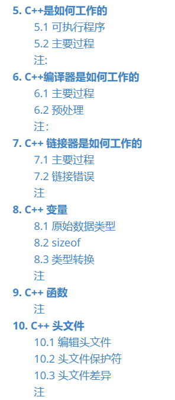
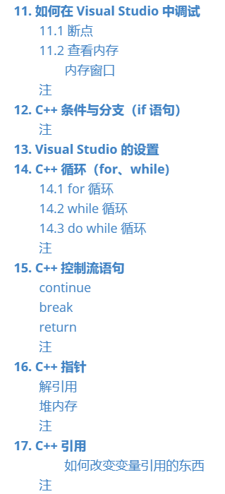
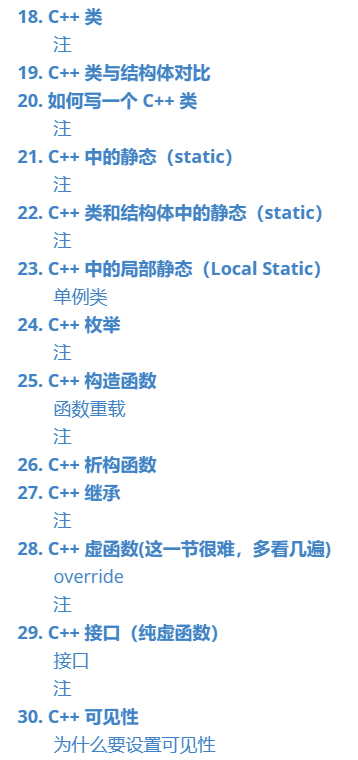
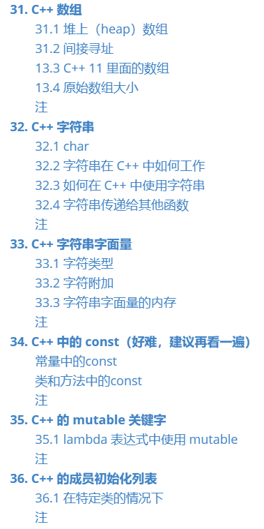
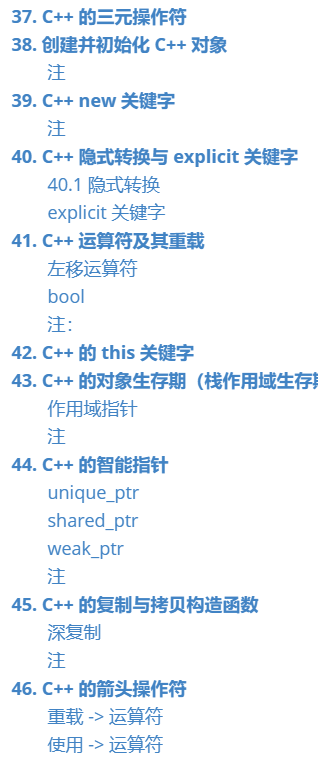
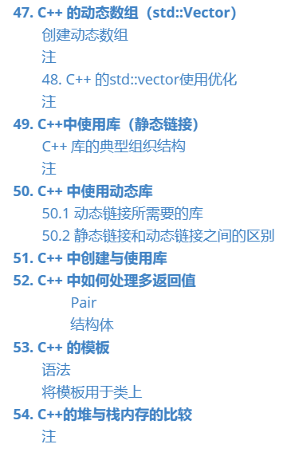

# ccc-fire.github.io

My Personal Blog via GitHub

## [关于CPP](01_cpp/Cherno%20C++.md)

一些关于cpp的基础知识（基础中的基础）：
目录（先用截图代替）

### 页面1的子页面

11111111

## 页面2

2222

### 页面2的子页面

22222222

## [测试doc1链接](doc/doc1.md)

## [测试doc2的内容](doc2/latex.md)